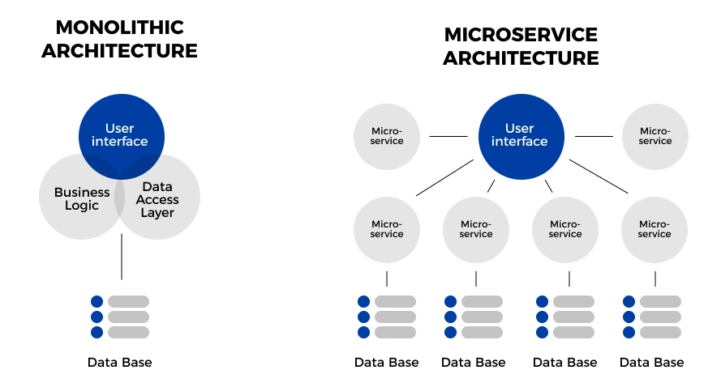

<!--@Kiến trúc nguyên khối-->

Trước khi kiến trúc vi dịch vụ trở nên phổ biến, kiến trúc nguyên khối đã được áp dụng rộng rãi trong kiến trúc phần mềm truyền thống.
Kiến trúc nguyên khối là kiến trúc phần mềm trong đó toàn bộ dự án được xây dựng và triển khai như một đơn vị duy nhất.

Ví dụ: Mô hình MVC (Model-View-Controller) là một trong những dạng của kiến trúc nguyên khối.
Trong mô hình này, ứng dụng được chia thành ba thành phần chính:
Mô hình (Model): Đại diện cho dữ liệu và logic xử lý dữ liệu.
Giao diện (View): Đại diện cho giao diện người dùng.
Bộ điều khiển (Controller): Nhận yêu cầu người dùng thông qua View, sau đó tương tác với Model để làm việc với dữ liệu.

<!--@Kiến trúc vi dịch vụ-->

Kiến trúc vi dịch vụ chia dự án thành các thành phần nhỏ hơn được gọi là các dịch vụ.
Các dịch vụ này chịu trách nhiệm cho một chức năng cụ thể.
Các dịch vụ này độc lập về ngôn ngữ lập trình, CSDL, triển khai, ...
Các dịch vụ này tương tác với nhau qua hạ tầng mạng.

<!--@Một số đặc điểm và ưu điểm của kiến trúc vi dịch vụ-->

Kiến trúc vi dịch vụ có nhiều ưu điểm đặc biệt với các dự án có quy mô lớn và phức tạp.

Kiến trúc vi dịch vụ phân chia dự án thành các dịch vụ nhỏ.
Giúp việc phát triển và quản lý dễ dàng hơn.
Dễ dàng mở rộng hệ thống.
Tận dụng sử dụng tài nguyên cho từng dịch vụ.
Tập trung yêu cầu nghiệp vụ trong dịch vụ dẫn đến tốc độ định giá doanh nghiệp nhanh hơn.

Vì các dịch vụ được phân chia là độc lập.
Các nhóm phát triển riêng dẫn tới tốc độ phát triển thay đổi nhanh.
Giảm thiểu ràng buộc và tăng tính linh hoạt của hệ thống.
Giảm chi phí và thời gian kiểm thử do ít ràng buộc.
Hệ thống có khả năng chịu lỗi cao tăng độ tin cậy.

Kiến trúc vi dịch vụ sử dụng đa ngôn ngữ và công nghệ khác nhau.
Tận dụng hiệu quả thế mạnh của từng ngôn ngữ, công nghệ phù hợp nhất cho yêu cầu nghiệp vụ cụ thể.
Ví dụ: Mỗi dịch vụ sử dụng ngôn ngữ lập trình nhau khác như: NodeJS, Go, Python, Java, CSharp, ...

<!--@Một số nhược điểm và thách thức của kiến trúc vi dịch vụ-->
<!--nhiều thách thức, và việc duy trì sự linh hoạt và tái cấu trúc là quan trọng để đảm bảo sự thành công trong dài hạn.-->

khả năng quản lý mạng,
giao tiếp giữa các dịch vụ,
và việc duy trì tính nhất quán của dữ liệu giữa các dịch vụ khác nhau.

{Khó quản lý mạng lưới dịch vụ: } Khi dự án được chia thành nhiều dịch vụ nhỏ, việc quản lý và giám sát các dịch vụ này trở nên phức tạp hơn. Điều này đòi hỏi hệ thống quản lý mạng lưới dịch vụ phải được triển khai và duy trì một cách chặt chẽ.

{Tăng chi phí khởi đầu: } kiến trúc vi dịch vụ yêu cầu phải triển khai nhiều dịch vụ độc lập và xây dựng các hệ thống quản lý dịch vụ phức tạp. Điều này có thể dẫn đến tăng chi phí khởi đầu cho dự án.

{Rủi ro về bảo mật: } Khi kiến trúc vi dịch vụ triển khai nhiều dịch vụ độc lập, điều này có thể tạo ra các điểm yếu bảo mật trong hệ thống. Điều này yêu cầu tăng cường bảo mật cho từng dịch vụ và sử dụng các biện pháp bảo mật phù hợp.

{Phức tạp trong việc theo dõi và gỡ lỗi: } Khi có sự phân tán và độc lập giữa các dịch vụ, việc theo dõi và gỡ lỗi trong hệ thống trở nên phức tạp hơn. Điều này đòi hỏi hệ thống giám sát và công cụ gỡ lỗi phải được triển khai một cách hiệu quả.

{Khó khăn trong việc quản lý sự thay đổi: } Khi dự án có nhiều dịch vụ, việc thay đổi một dịch vụ có thể ảnh hưởng đến các dịch vụ khác. Điều này đòi hỏi phải có quy trình quản lý sự thay đổi chặt chẽ và kiểm tra tích hợp mạnh mẽ.

- _Quản Lý Lỗi: _ kiến trúc vi dịch cung cấp khả năng quản lý lỗi tốt hơn do lỗi thường chỉ ảnh hưởng đến một hoặc vài kiến trúc vi dịch, trong khi trong kiến trúc nguyên khối, một lỗi có thể ảnh hưởng đến toàn bộ hệ thống.

<!--Vì tương tác với nhau qua giao thức mạng-->
<!--mỗi dịch vụ vi mô sẽ quản lý CSDL riêng dẫn đến sự phức tạp trong việc quản lý tính toàn vẹn dữ liệu.-->
<!--Khả năng transaction (giao dịch) khó khăn-->
<!--việc giám sát và gỡ lỗi các dịch vụ vi mô khó khăn.-->
<!--Và điều này dẫn đến độ phức tạp cao hơn.-->
<!--Bảo mật-->
<!--Chi phí-->
<!--Kĩ thuật công nghệ-->
<!--Đồng bộ ... phân tán-->

<!---->
<!---->
<!---->
<!---->
<!---->
<!---->
<!---->
<!---->
<!---->
<!---->
<!---->

Hiện nay, các tổ chức doanh nghiệp có nhu cầu thay đổi, phát triển liên tục từ đó hoạt động kinh doanh yêu cầu thay đổi và sự đổi mới nhanh chóng hệ thống và dự án với Nhu Cầu và Mong Đợi của Khách Hàng.

<!--Ví dụ-->
<!--Microsoft chuyển từ bán phần mềm đóng gói sang mô hình đăng ký.-->
<!--Amazon từ hiệu sách trực tuyến thành thị trường cho nhà cung cấp khác.-->
<!--Nefifc-->
<!--Baemin-->
<!--hình 1 triệu dịch vụ Amazon và Netflix-->

=> Kiến trúc của Microserrvice giải quyết những thách thức và giúp chuyển đổi nhanh chóng

Một điểm quan trọng cần lưu ý là nhóm kiến ​​trúc dịch vụ vi mô phải tạo ra phạm vi kinh doanh phù hợp cho từng dịch vụ vi mô để duy trì tính độc lập.

<!--Một điều quan trọng cần lưu ý là để tận dụng tối đa kiến ​​trúc dịch vụ vi mô, điều quan trọng đối với nhóm dịch vụ vi mô là phải tạo ra mã nghiệp vụ phù hợp cho từng máy chủ vi mô.-->
<!--Nếu không thực hiện đúng sẽ dẫn đến tình trạng các nhóm phụ thuộc lẫn nhau và điều đó sẽ dẫn đến mất đi lợi thế của kiến ​​trúc dịch vụ vi mô.-->
<!--Và đây là lúc thiết kế Theo nhu cầu xuất hiện. Bối cảnh giới hạn của thiết kế hướng miền là sự thể hiện phạm vi kinh doanh của dịch vụ vi mô.-->

=> mẫu thiết kế hướng miền sử dụng để xây dựng các dịch vụ vi mô.

<!--mỗi dịch vụ vi mô được gán cho một nhóm nhỏ.-->
<!--và các nhóm này được hỗ trợ bởi các chuyên gia tên miền.-->
