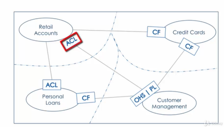

<!--# thiết kế hướng miền: (EventSourcing, Sagas, CQRS)-->
<!--@Chi tiết và áp dụng thiết kế hướng miền-->

<!---->
<!--Trong một miền phức tạp, không thể có một chuyên gia duy nhất có kiến thức tổng thể về tất cả các miền phụ.-->
<!--Phần mềm cần phản ánh đúng miền và hiện thực hóa một cách chính xác quan hệ giữa các miền.-->

<!--V Bối cảnh giới hạn của thiết kế hướng miền là sự thể hiện phạm vi kinh doanh của vi dịch vụ.-->

<!--!-->

**Thiết kế hướng mô hình (model drivern design)**
Thiết kế hướng mô hình cung cấp một khuôn khổ để hiện thực hóa mô hình hệ thống và sử dụng phương pháp thiết kế hướng miền, các mẫu chiến thuật là các khối xây dựng và thiết kế hướng mô hình.
<!---->
**Kiến trúc phân lớp**
Khi phát triển ứng dụng phần mềm, một phần lớn thành phần không liên quan trực tiếp đến nghiệp vụ, nhưng chúng là một phần của hạ tầng. Ví dụ như truy cập CSDL, hạ tầng mạng, ... Trong một ứng dụng hướng đối tượng thuần túy, các đoạn mã lại được nhúng vào trong các hành vi của các đối tượng nghiệp vụ vì nó là cách dễ và nhanh chóng. Tuy nhiên, việc trộn lẫn các đoạn mã liên quan đến nghiệp vụ có thể làm cho việc refactor khó khăn, kém linh hoạt.
=> Cần phân chia một chương trình phức tạp thành các lớp. Theo thiết kế hướng miền có 4 lớp:
<!--Giao diện người dùng (User Interface)-->
Chịu trách nhiệm trình bày thông tin tới người sử dụng và thông dịch lệnh của người dùng.
<!--Lớp ứng dụng (Application Layer)-->
Đây là một lớp mỏng phối hợp các hoạt động của ứng dụng. Nó không chứa logic nghiệp vụ. Nó không lưu giữ trạng thái của các đối tượng nghiệp vụ nhưng nó có thể giữ trạng thái của một tiến trình của ứng dụng.
<!--Lớp miền (Domain Layer)-->
Lớp này chứa thông tin về các lĩnh vực. Đây là trái tim của nghiệp vụ phần mềm. Trạng thái của đối tượng nghiệp vụ được giữ tại đây. Persistence của các đối tượng nghiệp vụ và trạng thái của chúng có thể được ủy quyền cho Lớp hạ tầng.
<!--Lớp hạ tầng (Infrastructure Layer)-->
Lớp này đóng vai trò như một thư viện hỗ trợ cho tất cả các lớp còn lại. Nó cung cấp thông tin liên lạc giữa các lớp, cài đặt persistence cho đối tượng nghiệp vụ, đồng thời chứa các thư viện hỗ trợ cho Lớp giao diện người dùng, ...
**Các đối tượng miền**
**Đối tượng thực thể (Entities)**
Trong các đối tượng của một phần mềm, có một nhóm các đối tượng có định danh riêng.
Định danh này được giữ nguyên xuyên suốt trạng thái hoạt động của phần mềm. Hệ thống phân biệt hai đối tượng với hai định danh khác nhau, hay hai đối tượng chung định danh có thể coi là một.
Các thực thể là những đối tượng rất quan trọng của mô hình miền. Việc xác định xem một đối tượng có phải là thực thể hay không rất quan trọng.
Trong trường hợp CSDL quan hệ, một bảng biểu thị một tập hợp các thực thể. Các quy tắc trong bảng biểu thị các thực thể được xác định duy nhất bằng cột khóa chính.
Hành vi này triển khai logic nghiệp vụ có thể thay đổi trạng thái của thực thể. Các thực thể được lưu trữ lâu dài.
**Đối tượng giá trị (Value Objects)**
Một đối tượng được dùng để mô tả các khía cạnh cố định của một miền và không có định danh.
Đối tượng giá trị không có danh tính duy nhất.
Đối tượng giá trị được tạo trong bộ nhớ tiến trình và sau đó bị hủy sau khi nó đã phục vụ mục đích của nó.
Một điểm khác biệt quan trọng giữa các thực thể và đối tượng giá trị là đối tượng giá trị không tồn tại lâu dài trong CSDL.

<!--VD-->
<!--bạn sẽ đặt logic xác thực cho địa chỉ email ở đâu?-->
<!--xác nhận kỹ thuật không liên quan đến bất kỳ khái niệm kinh doanh nào.-->
<!--tạo một đối tượng giá trị để xác thực địa chỉ email.-->
<!--Kết quả là, thực thể khách hàng sẽ sạch hơn và đơn giản hơn nhiều trong việc thực hiện.-->

<!--Hướng dẫn 7/4-->
<!--Hướng dẫn 7/5-->

**Quản lý vòng đời của các đối tượng miền**
Việc quản lý vòng đời các đối tượng trong miền không hề đơn giản, nếu như làm không đúng sẽ có thể gây ảnh hưởng đến việc mô hình hóa miền.

**Mẫu tổng hợp (Aggregate)**
Mẫu tổng hợp là một nhóm các thực thể và đối tượng giá trị được xem như một tổng thể thống nhất từ ​​góc độ dữ liệu và khái niệm miền.
<!--Hãy để tôi giải thích điều này bằng một minh họa.-->
Một tập hợp bao gồm một nhóm tổng hợp còn được gọi là thực thể gốc.
Thực thể gốc này có một danh tính duy nhất từ ​​phối cảnh miền.
Phần thứ hai của tập hợp là cụm, được hình thành bởi ranh giới của tập hợp.
Trong ranh giới này, có thể không có hoặc nhiều thực thể tổng hợp và đối tượng giá trị. Các đối tượng trong cụm này hoặc đối tượng trong ranh giới được gọi là đối tượng bên trong hoặc đối tượng con.

Aggregate phải cung cấp các giao diện để vận hành trên các đối tượng bên trong.
đảm bảo rằng tất cả hành vi cần thiết để vận hành trên đối tượng bên trong được hiển thị dưới dạng các hàm của đối tượng gốc tổng hợp.

<!--Các nhà máy (factori) là để tạo ra miền phức tạp.-->
<!--Các reporitori được sử dụng để quản lý tính bền vững của các đối tượng miền.-->
<!--Các dịch vụ được sử dụng để mô hình hóa sự tương tác của các đối tượng miền với các đối tượng miền khác, với cơ sở hạ tầng và với các thành phần bên ngoài khác.-->

<!--tổng hợp và mẫu nhà máy (Aggregates & Factories)-->

<!--!Mẫu nhà xưởng (Factory Pattern)-->
<!--Mẫu thiết kế nhà máy là một mẫu phổ biến để xây dựng các tập hợp miền phức tạp. Cách thức hoạt động là bạn xác định một đối tượng có tất cả logic để tạo tổng hợp miền.-->

Nhà máy này hiển thị một chức năng có thể được gọi bằng mã và hiển thị chức năng để tạo các bộ tổng hợp có liên quan trong nhà máy, nhà máy đọc.
Dữ liệu tổng hợp từ bộ lưu trữ liên tục sẽ tạo tổng hợp và trả về cột.
Vì vậy đây là mẫu thiết kế rất phổ biến, không nhất thiết chỉ dành riêng cho các dịch vụ của Mikoto.

<!--Đã đến lúc xem xét nhanh. Tổng hợp có thể chứa các thực thể tổng hợp và đối tượng giá trị khác. Tổng hợp phải gói gọn hành vi để quản lý trong đối tượng bên trong.-->
<!--Tất cả các thay đổi đối với tổng hợp đều được lưu. Các đối tác nguyên tử và nhà máy thường được sử dụng để tạo các tập hợp miền phức tạp.-->

<!--Hướng dẫn 7.7-->
<!--Hướng dẫn 7.8-->

<!---->
<!---->
<!---->
<!---->
<!---->
<!---->
<!---->
<!---->
<!---->
<!---->

<!--mẫu kho lưu trữ (Repository Pattern)-->

các đặc điểm của kho lưu trữ
một số tùy chọn hiện thực hóa cho kho lưu trữ

<!--Đối tượng kho lưu trữ hoạt động như một tập hợp các đối tượng tổng hợp trong bộ nhớ.-->

<!--Tất cả logic để tương tác với bộ lưu trữ dữ liệu được gói gọn bởi đối tượng kho lưu trữ.-->
<!--kho lưu trữ đóng vai trò là nơi chứa tập hợp các đối tượng tổng hợp.-->

<!--đối với mỗi tổng hợp được xác định trong mô hình miền, bạn có một và chỉ một kho lưu trữ.-->
<!--Các đối tượng kho lưu trữ được quản lý như một phần của lớp miền. Ngoài các chức năng thẻ điển hình, kho lưu trữ cũng có thể hiển thị các chức năng cấp cao hơn, chủ yếu dành cho truy vấn.-->

<!--Nhìn chung, lợi ích chính của việc sử dụng kho lưu trữ là nó giữ cho mô hình miền độc lập với lớp lưu trữ.-->

<!--Mô hình miền độc lập với mô hình lưu trữ. Vì vậy, ví dụ: nếu bạn đang sử dụng RDBMS thì mô hình miền không cần phải biết về cấu trúc bảng và cột.-->
<!--Nó giữ cho mô hình miền độc lập với công nghệ bạn có thể đang sử dụng và RDBMS không bằng nhau-->

<!--Kho lưu trữ giữ cho mô hình miền độc lập với cơ sở hạ tầng-->
<!--giúp kiểm tra và mô phỏng đơn vị.-->
<!--Phản hồi CSDL tĩnh được sử dụng rộng rãi làm cơ chế xây dựng mô hình vì nó giúp tôi di chuyển nhanh hơn mà không phụ thuộc vào sự sẵn có của CSDL thực.-->

<!--Việc hiện thực hóa kho lưu trữ yêu cầu nhà phát triển phải ánh xạ giữa đối tượng miền và CSDL và ngược lại.-->

Trong bài học này, bạn đã tìm hiểu về các đối tượng kho lưu trữ mẫu kho lưu trữ làm cho mô hình miền độc lập với lớp CSDL.
Các hoạt động CSDL trên tổng hợp phải là nguyên tử, đối tượng kho lưu trữ và các lực lượng. Các đối tượng kho lưu trữ nguyên tử cũng có thể được sử dụng để thử nghiệm và mô phỏng đơn vị.
Có một số mối quan tâm chung liên quan đến các đối tượng kho lưu trữ, nhưng những mối quan tâm chung này liên quan đến chức năng truy vấn có thể được giải quyết bằng cách hiển thị các hàm truy vấn cấp cao trong đối tượng kho lưu trữ bằng cách sử dụng các giải pháp bộ nhớ đệm như Radice và Memcache cũng như bằng cách tạo và hiển thị các hàm truy vấn bên ngoài của đối tượng kho lưu trữ.

<!--hướng dẫn 7/11-->

<!--@ \07DomainDrivenDesignTacticalPatterns_VVN\000000012.srt-->
<!--Domain Services dịch vụ miền-->
<!--Domain Service Pattern-->
<!--Characteristics of Domain Services đặc điểm-->

<!--Một định nghĩa chính thức hơn về dịch vụ miền là đối tượng miền thực hiện chức năng hoặc khái niệm miền có thể không được mô hình hóa một cách tự nhiên như một hành vi trong bất kỳ dịch vụ miền, thực thể hoặc đối tượng giá trị nào như một phần của mô hình miền, vì có các loại dịch vụ khác nhau.-->

<!--Điều quan trọng là bạn phải hiểu các đặc điểm của dịch vụ tên miền.-->
<!--Dịch vụ miền luôn thực hiện hành vi kinh doanh cho miền.-->
<!--Dịch vụ miền không có trạng thái, dịch vụ miền có tính gắn kết cao.-->
<!--Dịch vụ miền có thể tương tác với các dịch vụ miền khác.-->
<!--Chúng ta hãy đi qua các chi tiết của từng một trong số này. Vì dịch vụ miền có hành vi kinh doanh nên đối tượng dịch vụ miền nhận thức được các đối tượng miền khác.-->

Một dịch vụ miền có thể tương tác với các dịch vụ miền khác.

Trước khi kết thúc bài học này, tôi muốn nhấn mạnh một điểm quan trọng.

Dịch vụ tên miền là bất khả tri về công nghệ. Có một quan niệm sai lầm phổ biến rằng dịch vụ của người bán hàng rong nên được coi là một hoạt động kinh doanh là không đúng.

Dịch vụ miền độc lập với công nghệ được sử dụng để gọi. Ví dụ: hoạt động dịch vụ miền, có thể chỉ là lệnh gọi hàm Java đơn giản hoặc có thể được thực hiện qua giao thức mạng như HTTP hoặc MQ.

Thông tin thêm về chủ đề này khi chúng ta tiến bộ trong suốt khóa học. Đã đến lúc bắt đầu với những điểm chính mà chúng ta đã đề cập trong bài học này.

Tôi đã nói về dịch vụ miền và bạn cần phải biết những đặc điểm của dịch vụ miền giúp phân biệt nó với các loại dịch vụ khác.
Đầu tiên là dịch vụ miền thực hiện hành vi miền không phù hợp một cách tự nhiên với các thực thể và đối tượng giá trị khác trong mô hình miền.
Các đặc điểm khác là dịch vụ miền không có trạng thái, dịch vụ miền có tính Cohasset cao và dịch vụ miền với các dịch vụ miền khác.

<!--@ \07DomainDrivenDesignTacticalPatterns_VVN\000000013.srt-->
<!--Dịch vụ ứng dụng (app sẻvice)-->

Chúng ta hãy xem lại định nghĩa về dịch vụ tên miền. Nó tuyên bố rằng dịch vụ miền là một đối tượng miền thực hiện chức năng miền.
Và vì dịch vụ danh mục khách hàng sẽ không triển khai bất kỳ chức năng miền nào nên chúng tôi không thể triển khai nó dưới dạng dịch vụ miền.
Và đây là nơi các dịch vụ ứng dụng xuất hiện. Đó là một định nghĩa chính thức hơn về một dịch vụ ứng dụng.
Nó là một đối tượng miền không triển khai bất kỳ chức năng miền nào mà phụ thuộc vào các đối tượng miền khác để hiển thị chức năng miền cấp cao cho bên ngoài của người tiêu dùng đối với mô hình.
Sự khác biệt chính giữa dịch vụ miền và dịch vụ ứng dụng là dịch vụ ứng dụng không triển khai bất kỳ loại logic nghiệp vụ hoặc chức năng miền nào.
Sự khác biệt lớn khác là dịch vụ ứng dụng được tiếp xúc với người tiêu dùng bên ngoài như ứng dụng Web, ứng dụng di động hoặc dịch vụ ứng dụng.

Chúng ta hãy đi qua các đặc điểm của một dịch vụ ứng dụng. Dịch vụ ứng dụng không có logic miền và đây là điểm khác biệt chính giữa dịch vụ ứng dụng và dịch vụ miền.
Các dịch vụ ứng dụng như dịch vụ miền đều không có trạng thái. Các dịch vụ ứng dụng có thể xác định giao diện bên ngoài, các dịch vụ ứng dụng được hiển thị hoặc một số loại giao thức mạng.

Chúng ta hãy đi qua các chi tiết của từng trong số này. Một dịch vụ ứng dụng không có logic miền. Nó phụ thuộc vào đối tượng miền khác cho logic miền.

Đây là điểm khác biệt chính giữa dịch vụ miền và dịch vụ ứng dụng. Dịch vụ ứng dụng điều phối việc thực thi logic miền.

Giống như dịch vụ miền và dịch vụ ứng dụng cũng không có trạng thái. Không có quản lý nhà nước được thực hiện trong dịch vụ ứng dụng.

Không có biến trạng thái hoặc sự tồn tại lâu dài của các đối tượng miền được triển khai trong dịch vụ ứng dụng. Dịch vụ ứng dụng phụ thuộc vào đối tượng miền để tồn tại lâu dài và dịch vụ ứng dụng hiển thị giao diện được thế giới bên ngoài sử dụng.

Nói cách khác, lược đồ yêu cầu và phản hồi cho dịch vụ ứng dụng không cần phải liên kết với bất kỳ đối tượng miền nào khác.

Dịch vụ ứng dụng hiển thị giao diện bên ngoài hoặc giao thức mạng trong mô hình miền. Dịch vụ ứng dụng có thể được coi như một đối tượng ranh giới bảo vệ tất cả các đối tượng trong mô hình miền.

Dịch vụ ứng dụng có thể được hiển thị dưới dạng API và API này được các thành phần bên ngoài sử dụng qua giao thức mạng.
Giao thức mạng này, có thể là SCDP, MQ hoặc thậm chí có thể là giao thức độc quyền. Định dạng dữ liệu giữa năng lực bên ngoài và API rất linh hoạt.
Nó có thể là Jason Ximo, CSFI hoặc bất kỳ định dạng nào khác. Tùy thuộc vào việc thực hiện dịch vụ ứng dụng.

Các thành phần bên ngoài có thể có hoặc không có kiến ​​thức về đối tượng miền hoặc cấu trúc của chúng. Tiếp theo, tôi sẽ thảo luận về mối quan hệ giữa dịch vụ ứng dụng và dịch vụ miền và dịch vụ ứng dụng có thể hiển thị dịch vụ miền với thành phần bên ngoài.

Dịch vụ miền để cung cấp giao diện cho các thành phần bên ngoài. Đã đến lúc đi vào những điểm chính trong bài học này bạn đã học về các ứng dụng, dịch vụ, ứng dụng, dịch vụ không triển khai bất kỳ hành vi miền nào.
Chúng cung cấp các dịch vụ cấp cao bằng cách phối hợp thực thi logic miền trong các đối tượng miền.
Các dịch vụ ứng dụng hiển thị giao diện cho các thành phần bên ngoài. Nghĩa là, các thành phần nằm ngoài mô hình miền thông qua giao thức mạng như HTP và NQ.

<!--@ \07DomainDrivenDesignTacticalPatterns_VVN\000000014.srt-->
<!--Dịch vụ cơ sở hạ tầng-->

là dịch vụ tương tác với tài nguyên bên ngoài để giải quyết một vấn đề mối quan tâm không thuộc phạm vi vấn đề chính.
Nó xác định một hợp đồng được các đối tượng miền sử dụng để tương tác với các dịch vụ bên ngoài. Từ khóa ở đây là nguồn lực bên ngoài.
VD:

<!--Logging system e.g., Fluentd, ElastiSearch-->
<!--Ví dụ: thông báo qua email hoặc SMS-->
<!--CSDL bên ngoài hoặc thậm chí là hệ thống tệp-->
<!--Google Map.-->

Dịch vụ cơ sở hạ tầng không có logic miền.

Dịch vụ cơ sở hạ tầng tuân theo nguyên tắc trách nhiệm duy nhất

8
00: 01: 39, 420--> 00: 01: 50, 760

<!--Chúng ta hãy đi qua các chi tiết của từng một trong số này. Dịch vụ cơ sở hạ tầng không có logic miền vì nó cung cấp, như tên cho thấy, dịch vụ cơ sở hạ tầng chứ không phải dịch vụ kinh doanh.-->

9
00: 01: 50, 970--> 00: 02: 08, 000

<!--Nó không có bất kỳ sự phụ thuộc trực tiếp nào vào đối tượng miền và dịch vụ cơ sở hạ tầng được đối tượng miền và các dịch vụ sử dụng để tương tác với các tài nguyên bên ngoài và dịch vụ cơ sở hạ tầng tuân theo nguyên tắc trách nhiệm duy nhất.-->

10
00: 02: 08, 040--> 00: 02: 18, 640

<!--Ý tưởng là dịch vụ này cung cấp chức năng cho một và chỉ một thứ. Mục đích của họ là đơn giản hóa việc triển khai và làm cho dịch vụ trở nên dễ hiểu.-->

11
00: 02: 18, 660--> 00: 02: 29, 100

<!--Ví dụ: chúng tôi có ba dịch vụ này, mỗi dịch vụ chuyên cung cấp một chức năng cụ thể. Ví dụ: dịch vụ email chỉ để gửi email.-->

12
00: 02: 29, 130--> 00: 02: 38, 520

<!--Dịch vụ ghi nhật ký chỉ để ghi nhật ký tin nhắn và dịch vụ CSDL là để tương tác với CSDL và cơ sở hạ tầng.-->

13
00: 02: 38, 520--> 00: 02: 52, 140

<!--Dịch vụ xác định một hợp đồng tiêu chuẩn giữa mô hình và các tài nguyên bên ngoài. Hãy nghĩ về nó giống như một API, dành cho các đối tượng và dịch vụ mô hình sử dụng.-->

14
00: 02: 52, 620--> 00: 03: 03, 990

<!--Và nó cũng sẽ thực hiện bất kỳ loại chuyển đổi nào cần thiết trên dữ liệu. Bây giờ hãy xem cơ chế này làm cho miền độc lập hơn với tài nguyên bên ngoài như thế nào.-->
<!--Giả sử chúng ta phải triển khai một dịch vụ email. Dịch vụ e-mail này sẽ cung cấp chức năng tiêu chuẩn để gửi email.-->
<!--Ban đầu, dịch vụ e-mail được triển khai bằng cách sử dụng sendmail của Linux. Nhưng giả sử trong một khoảng thời gian, số lượng email được gửi đi từ ứng dụng tăng lên và do đó cần có một giải pháp mạnh mẽ hơn và Sendmail đã được thay thế bằng MailChimp.-->

Thay đổi này sẽ chỉ yêu cầu thay đổi trong dịch vụ email và sẽ không có tác động đến bất kỳ dịch vụ miền nào sử dụng dịch vụ email nội dung hiển thị theo hợp đồng tiêu chuẩn và do đó mô hình miền được cách ly khỏi các thay đổi tài nguyên bên ngoài.

Trong bài giảng này, bạn đã tìm hiểu về các dịch vụ cơ sở hạ tầng. Các dịch vụ cơ sở hạ tầng như dịch vụ ứng dụng không thực hiện bất kỳ hành vi miền nào.
Các dịch vụ cơ sở hạ tầng cung cấp các tài nguyên bên ngoài thông qua giao diện tiêu chuẩn hoặc hợp đồng tiêu chuẩn và cơ chế hợp đồng tiêu chuẩn này bảo vệ mô hình miền khỏi những thay đổi trong dịch vụ bên ngoài.

<!--Hướng dẫn 7/15-->
<!--Hướng dẫn 7/16-->

<!--có các mối quan hệ giữa các liên hệ được liên kết. các liên hệ được liên kết này được chuyển thành các vi dịch vụ và các mối quan hệ này được chuyển thành các tương tác giữa các vi dịch vụ.-->

<!--Các vi dịch vụ cũng tạo ra nhiều loại sự kiện khác nhau. Những sự kiện này được sử dụng bởi các vi dịch vụ khác cũng như các thành phần trong bối cảnh liên kết nơi sự kiện được tạo ra.-->

<!--!-->
<!---->

<!--1. **Tạo và Lưu Trữ Hóa Đơn: **-->
<!--2. **Thông Tin Cơ Bản của Hóa Đơn: **-->
<!--3. **Chữ Ký Số và Xác Minh Chữ Ký: **-->
<!--4. **Quản Lý Mẫu Hóa Đơn: **-->
<!--5. **Phân Quyền và Bảo Mật: **-->
<!--6. **Gửi và Nhận Hóa Đơn: **-->
<!--7. **Quản Lý Trạng Thái Hóa Đơn: **-->
<!--8. **Tích Hợp Với Hệ Thống Khác: **-->
<!--9. **Bảo Dưỡng và Backup: **-->
<!--10. **Tương Thích Pháp Luật và Chuẩn Mực: **-->

Repository độc lập miền và lưu trữ sql (dễ tuhaajn tiện Unit testing and Mocking)
Repository trong ORM

<!--https: //images.viblo.asia/fd4b10a0-f1b1-4ed1-9bd1-578c871820ae.png-->

, gprc rabitmq đồng bộ hay k, ít hay nhiều như pub sub

# Service Mesh, CICD, microfe, API gateway, cache redis, log xử lí lỗi,

<!--thiết kế hướng miền-->001 Intro to Events in kiến trúc vi dịch vụ.en

Problem Space
Domain
Sub-Domains

<!---->

thiết kế hướng miền là một cách tiếp cận để phát triển những phần mềm phức tạp thông qua sự kết nối chặt chẽ giữa việc triển khai ứng dụng với sự phát triển của mô hình kinh doanh.

<!--Problem Space / Business Domain: Không gian vấn đề / Lĩnh vực kinh doanh-->

Không gian vấn đề / Lĩnh vực kinh doanh là điểm khởi đầu của hành trình thiết kế hướng miền và nó xác định vấn đề kinh doanh chính mà bạn dự định giải quyết bằng thiết kế hướng miền .

<!--=> Đầu tiên ta cần phải xem xét yêu cầu nghiệp vụ đó là Không gian vấn đề / Lĩnh vực kinh doanh. Bất kì 1 ứng dụng phần mềm kĩ thuật cntt nào đều giải quyết cho 1 vấn đề yêu cầu cụ thể nào đó.-->

<!--Sub-Domains: Tên miền phụ-->

Việc xác định các miền phụ về cơ bản liên quan đến việc chia nhỏ các khả năng kinh doanh khác nhau của miền kinh doanh chính của bạn thành các đơn vị chức năng kinh doanh gắn kết.

<!--Ví dụ: Người dùng Sub-Domain, Thông báo Sub-Domain, Hóa đơn Sub-Domain-->

<!--Bounded Context: Bối cảnh bị ràng buộc là gì?-->

Bối cảnh bị giới hạn là giải pháp thiết kế cho Miền / Miền phụ doanh nghiệp đã được xác định của chúng tôi.

Việc xác định Bối cảnh bị ràng buộc chủ yếu được điều chỉnh bởi sự gắn kết mà bạn cần trong miền kinh doanh và giữa các miền phụ của bạn.

<!--Domain Model: Mô hình miền-->

Mô hình miền là việc triển khai logic nghiệp vụ cốt lõi
trong một Bối cảnh bị ràng buộc cụ thể.

Trong ngôn ngữ kinh doanh, điều này liên quan đến việc xác định:

- Thực thể kinh doanh (Business Entities)
- Quy tắc kinh doanh (Business Rules)
- Quy trình kinh doanh (Business Flows)
- Hoạt động kinh doanh (Business Operations)
- Sự kiện kinh doanh (Business Events)

Theo ngôn ngữ kỹ thuật trong thế giới thiết kế hướng miền, điều này có nghĩa là xác định:

- Tổng hợp/Thực thể/Đối tượng giá trị (Aggregates/Entities/Value Objects)
- Quy tắc tên miền (Domain Rules)
- Sagas (Sagas)
- Lệnh/Truy vấn (Commands/Queries)
- Sự kiện (Events)
<!--=> bảng-->

<!--Aggregates/Entities/Value Objects-->

Tổng hợp là đối tượng kinh doanh trung tâm trong Bối cảnh bị ràng buộc của bạn và xác định phạm vi nhất quán trong bối cảnh bị ràng buộc đó.
Tổng hợp = Mã định danh chính của Bối cảnh bị ràng buộc của bạn

Đối tượng thực thể có bản sắc riêng nhưng không thể
tồn tại nếu không có tập hợp gốc, nghĩa là chúng
được tạo khi tập hợp gốc được tạo và bị hủy khi tập
hợp gốc bị phá hủy.

Đối tượng thực thể = Mã định danh phụ của Bối cảnh bị ràng buộc của bạn

<!---->

Bảng CSDL này được em thu thập dữ liệu từ trang web CƠ SỞ DỮU DANH MỤC DÙNG CHUNG (https: //dmdc.mof.gov.vn/khai-thac-pb/co-quan-thue)

https: //helpsme.misa.vn/2020/kb/quan-ly-hoa-don-dien-tu/

https: //helpsme.misa.vn/2022/kb/quy-trinh-nghiep-vu-hddt-theo-nghi-dinh-123-2020-nd-cp/

https: //www.meinvoice.vn/tin-tuc/3442/nhung-nghiep-vu-co-ban-cua-hoa-don-dien-tu-xac-thuc/

<!---->

Bảng CSDL này được em thu thập dữ liệu từ trang web CƠ SỞ DỮU DANH MỤC DÙNG CHUNG (https: //dmdc.mof.gov.vn/khai-thac-pb/co-quan-thue)

https: //helpsme.misa.vn/2020/kb/quan-ly-hoa-don-dien-tu/

https: //helpsme.misa.vn/2022/kb/quy-trinh-nghiep-vu-hddt-theo-nghi-dinh-123-2020-nd-cp/

https: //www.meinvoice.vn/tin-tuc/3442/nhung-nghiep-vu-co-ban-cua-hoa-don-dien-tu-xac-thuc/

<!--Thay thế = NULL-->
<!--Bị thay thế = NULL-->
<!--quy trình tương tự như lập mới hóa đơn giá trị gia tăng.-->
<!---->

<!--@Chú ý ở đồ án này:-->
<!--Sử dụng hàm ngẫu nhiên (tỉ lệ 10%) cho trường hợp "Mã số thuế không tồn tại."-->
<!--Sử dụng hàm ngẫu nhiên tạo tên cho Tên NNT vì em không có thông tin đăng ký thực tế của NNT.-->
<!--Sử dụng hàm ngẫu nhiên trong bảng CSDL cho "Mã cơ quan thuế quản lý" và "Tên cơ quan thuế quản lý"-->

Bảng CSDL này được em thu thập dữ liệu từ trang web CƠ SỞ DỮU DANH MỤC DÙNG CHUNG (https: //dmdc.mof.gov.vn/khai-thac-pb/co-quan-thue)

<!--! Mã thuế số-chi nhánh-->
<!--Mã captcha không đúng.-->
<!--0107001729-->

dấu chấm cuối câu .
email=>Thư điện tử
Viết tắt NNT...

<!--Validtae-->

Điều kiện

<!---->

Chỉ dùng 1 loại hóa đơn vì em thấy tương tự.
Loại hóa đơn: + Hóa đơn giá trị gia tăng + Hóa đơn bán hàng + Hóa đơn bán tài sản công + Hóa đơn bán hàng dự trữ quốc gia + Hóa đơn khác + Chứng từ điện tử được sử dụng và quản lý như hóa đơn

<!--Nghiệp vụ của bài toán chính-->

Video Viettel

<!--@Chú ý ở đồ án này:-->

Mã giao dịch điện tử = Mã số thuế + Thời gian đăng kí
Sử dụng hàm ngẫu nhiên (tỉ lệ 10%) cho trường hợp từ chối.

<!--Phân tích và thiết kế-->

Xác định các tính năng cần thiết và các yêu cầu kỹ thuật tạo ra một thiết kế hệ thống hoặc kiến trúc đáp ứng.
UML Activity Diagrams
UML Use Case Diagrams
UML Class Diagrams
UML Sequence Diagrams

UML
ORM
SQL

Business Model Canvas

<!--mục đích của bài giảng này là cung cấp cho bạn cái nhìn tổng quan về bức vẽ mô hình kinh doanh.-->

<!--! phân khúc khách hàng (Customer Segments)-->

Các phân khúc khách hàng là lý do doanh nghiệp tồn tại, vì vậy người ta phải suy nghĩ cẩn thận xem khách hàng là ai.

<!--VD: cá nhân, doanh nghiệp-->

<!--! phương án giá trị (Value Propositions)-->

Bây giờ, loại giá trị nào đang mang lại cho mỗi khách hàng này? Đó là điều chúng ta cần phải suy nghĩ.

<!--VD: lợi ích hóa đơn điện tử: nhanh, cháy, .....-->

<!--! nguồn tiềm lực chính (Key Resources)-->

Có nhiều nguồn lực mà doanh nghiệp yêu cầu, nhưng bạn cần suy nghĩ về những nguồn lực cần thiết cho việc đề xuất giá trị.
Nói cách khác, có thể có nhiều nguồn lực mà doanh nghiệp cần, nhưng hãy nghĩ về những nguồn lực quan trọng mà doanh nghiệp không thể tồn tại nếu không có.

<!--Không có tài xế, Uber không thể mang lại giá trị cho khách hàng.-->

<!--! Đối tác chính (Key Partnerships)-->

Tiếp theo là các đối tác chính là nhà cung cấp các nguồn lực chính cho doanh nghiệp.

<!--Trong trường hợp của Uber, chính tài xế là người sở hữu ô tô và những tài xế này trao quyền cho khách hàng. Tiếp theo là các nhà cung cấp công nghệ.-->
<!--Uber không tạo ra tất cả các công nghệ cần thiết cho nền tảng của mình. Nó mua công nghệ từ các nhà cung cấp hoặc đối tác khác, chẳng hạn như nhà cung cấp công nghệ lập bản đồ.-->
<!--Nó cũng phải có được sự cho phép hoạt động từ cơ quan nhà nước. Nếu không có sự cho phép phù hợp, Uber sẽ không được phép hoạt động.-->

<!--! công việc chính (Key Activities)-->

Doanh nghiệp cần thực hiện nhiều hoạt động theo các hoạt động trọng tâm. Bạn cần suy nghĩ về những hoạt động mà doanh nghiệp thực hiện để tạo ra giá trị cho khách hàng.

<!--Uber xây dựng và duy trì nền tảng và phần mềm.
Uber luôn tìm kiếm tài xế mới nên việc tuyển dụng tài xế là một trong những hoạt động trọng tâm.-->
<!--Và sau đó là các vấn đề pháp lý. Ý tôi là, nếu bạn chú ý đến tin tức trên Google, bạn sẽ thấy rằng Uber luôn tham gia vào một số cuộc chiến pháp lý với chính quyền tiểu bang và thành phố.-->

<!--! Quan hệ khách hàng (Customer Relationships)-->

Giữ chân khách hàng là một trong những điều quan trọng nhất đối với bất kỳ doanh nghiệp nào. Và để giữ chân khách hàng, bạn cần đảm bảo rằng khách hàng hài lòng với dịch vụ bạn đang cung cấp và mối quan hệ mà bạn có với họ.
Vì vậy, trong mối quan hệ khách hàng, người ta phải suy nghĩ về loại mối quan hệ được cung cấp cho từng phân khúc khách hàng.

<!--Vì vậy, trong trường hợp đó là ai, hệ thống xếp hạng và phản hồi dành cho khách hàng và tài xế, thì sẽ có một cơ chế tự phục vụ để khách hàng và tài xế có thể nhận được dịch vụ và hỗ trợ từ bên kia.-->
<!--Uber cũng cung cấp hỗ trợ cho khách hàng và tài xế bằng email, thậm chí bằng điện thoại. Ví dụ: tài xế Uber có hỗ trợ qua điện thoại 24/7 bên cạnh vỏ bọc.-->

<!--! Dòng doanh thu (Revenue Stream)-->

Dòng doanh thu dòng tiền mô tả dòng doanh thu của doanh nghiệp. Để làm gì?

<!--Khách hàng đã trả tiền trong trường hợp Uber, đó là khoản hoa hồng phù hợp mà chúng ta sẽ nhận được từ nhau, đúng không.-->
<!--Phí bảo hiểm cho một số loại phù hợp, giá tìm kiếm và phí hủy, cơ cấu chi phí mô tả dòng tiền ra.-->

<!--! Cơ cấu chi phí (Cost Structure)-->

Đây là những chi phí mà doanh nghiệp phải chịu khi thực hiện các hoạt động chính

<!--trong trường hợp Uber. Đó là tiếp thị, pháp lý, phát triển công nghệ, lương nhân viên.-->
<!--Cuối cùng nhưng không kém phần quan trọng, chúng tôi sẽ chi rất nhiều cho hoạt động R&D.-->

<!--! Kênh cung cấp (Channels)-->

Tiếp theo là các kênh mà khách hàng muốn tiếp cận.

<!--Đó là ứng dụng di động mà chúng tôi sẽ cung cấp và một số ứng dụng của bên thứ ba cho phép khách hàng sử dụng các dịch vụ.-->

Xem video hướng dẫn phân tích: 4\3
