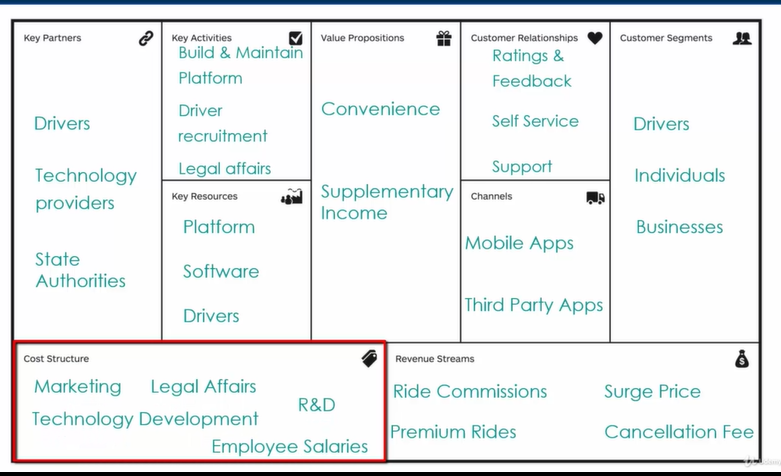

<!--Aggregates/Entities/Value Objects-->

Tổng hợp là đối tượng kinh doanh trung tâm trong Bối cảnh giới hạn của chúng ta và xác định phạm vi nhất quán trong bối cảnh giới hạn đó.
Tổng hợp = Mã định danh chính của Bối cảnh giới hạn của chúng ta

Đối tượng thực thể có bản sắc riêng nhưng không thể
tồn tại nếu không có tập hợp gốc, nghĩa là chúng
được tạo khi tập hợp gốc được tạo và bị hủy khi tập
hợp gốc bị phá hủy.

Đối tượng thực thể = Mã định danh phụ của Bối cảnh giới hạn của chúng ta

<!--@Yêu cầu nghiệp vụ-->

Trình bày nội dung yêu cầu nghiệp vụ

<!--@Các sơ đồ phân tích thiết kế hệ thống-->

<!--@UML Use Case Diagrams-->

<!--@UML Activity Diagrams-->

<!--@UML Sequence Diagrams-->

<!--@UML Class Diagrams-->

<!--@Chi tiết và áp dụng thiết kế hướng miền-->
<!--@Đôi nét về thiết kế hướng miền-->

Thiết kế hướng miền được Eric Evans giới thiệu trong cuốn sách "DomainDrivenDesign: Tackling Complexity in the Heart of Software".

Thiết kế hướng miền (DomainDrivenDesign) là một phương pháp thiết kế phần mềm tập trung vào việc hiểu và mô hình hóa lĩnh vực kinh doanh của một tổ chức.

Thiết kế hướng miền nhấn mạnh việc sử dụng lĩnh vực nghiệp vụ kinh doanh để thảo luận và đề xuất giải pháp đáp ứng nhu cầu. Vì để tạo một phần mềm tốt, chúng ta cần phải hiểu rõ về chính phần mềm đó. Chính vì vậy để đạt được kết quả như mong đợi, chúng ta thường bắt đầu từ yêu cầu nghiệp vụ.

Trong nhiều ứng dụng thường có phần xử lý các công việc không liên quan đến vấn đề nghiệp vụ như truy cập file, hạ tầng mạng, CSDL, ... trong đối tượng nghiệp vụ kinh doanh. Cách này giúp tốc độ hoàn thiện ứng dụng nhanh. Tuy nhiên, cách này làm cho thiết kế bị mất đi tính hướng đối tượng trong thực tế với mức độ doanh nghiệp lớn. Đây là lý do thiết kế hướng miền trở nên quan trọng.

Trong kiến trúc vi dịch vụ, thiết kế hướng miền giúp đảm bảo rằng mỗi dịch vụ được thiết kế phản ánh một phần cụ thể của lĩnh vực kinh doanh. Mỗi dịch vụ được quản lí bởi một nhóm nhỏ được hỗ trợ bởi các chuyên gia ngành.

<!--@Miền (Domain)-->

Phần mềm được tạo ra để xử lý sự phức tạp trong cuộc sống hiện đại. Việc phát triển phần mềm liên kết chặt chẽ với một số khía cạnh cụ thể trong cuộc sống của chúng ta.

Miền (Domain) đề cập đến phạm vi kiến thức và vấn đề mà hệ thống hoặc dự án cụ thể đang xử lý.

Về góc độ kinh doanh: miền đại diện cho một lĩnh vực hoặc ngành mà doanh nghiệp hoạt động.
Về góc độ phần mềm: miền có thể coi là đại diện cho không gian vấn đề của phần mềm đó.

Phần mềm cần phản ánh đúng miền và hiện thực hóa chính xác miền.

<!--$VD: Ở đồ án này, miền được xác định là bài toán giải pháp hóa đơn điện tử.-->
<!--@Miền phụ (Sub-Domain)-->

Miền được tạo thành từ nhiều miền phụ.

<!--$VD: Người dùng Sub-Domain, Thông báo Sub-Domain, Hóa đơn Sub-Domain-->

Trong một miền phức tạp, không thể có một chuyên gia ngành có kiến thức về tất cả các miền phụ.
Việc xác định các miền phụ liên quan đến việc chia nhỏ các khả năng kinh doanh thành các đơn vị kinh doanh gắn kết.

<!--@Phân loại các miền phụ-->

Có 3 loại miền phụ:

<!--@Miền phụ chung (Generic Subdomain)-->

Miền phụ chung cung cấp các giải pháp có sẵn mà doanh nghiệp có thể mua.
Doanh nghiệp không thể đạt được bất kỳ lợi thế cạnh tranh nào bằng cách thực hiện những điều khác biệt trong miền phụ chung.

<!--$? ? ? ? ? VD: Các miền phụ chung như các hoạt động quản lý nhân sự và quản lý cơ sở vật chất không tạo thêm bất kỳ giá trị khác biệt nào cho doanh nghiệp.-->

<!--@Miền phụ cốt lõi (Core Subdomain)-->

Miền phụ cốt lõi là điểm khác biệt quan trọng cho doanh nghiệp.

Thành công của một doanh nghiệp nằm ở miền phụ cốt lõi. Vì mỗi doanh nghiệp trong một ngành cụ thể hoạt động khác nhau trong các miền phụ cốt lõi để đạt được một số lợi thế so với đối thủ cạnh tranh.

=> Doanh nghiệp luôn tìm cách thực hiện những điều khác biệt trong các miền phụ cốt lõi này để có được một số lợi thế cạnh tranh.

<!--$? ? ? ? ? VD:-->

<!--@Miền phụ hỗ trợ (Supporting Subdomain)-->

Các miền phụ cốt lõi phụ thuộc vào các miền phụ hỗ trợ.

Miền phụ hỗ trợ cung cấp các dịch vụ để miền phụ cốt lõi hoạt động hiệu quả.

Miền phụ hỗ trợ không có mức độ phức tạp cao về logic nghiệp vụ.

<!--$? ? ? ? ? VD: miền phụ hỗ trợ chăm sóc khách hàng-->

<!--@Cách xác định các miền phụ-->
<!--Sơ đồ:-->

<!--Mô tả:-->

Bắt đầu bằng cách xem xét nghiệp vụ kinh doanh.

Nếu có sẵn giải pháp đã biết thì có khả năng là miền phụ chung. Ngược lại, chúng ta kiểm tra xem miền phụ đó có thêm giá trị kinh doanh nào không?

Nếu không có giá trị kinh doanh thì chúng ta kiểm tra xem các miền phụ cốt lõi có phụ thuộc vào miền phụ này hay không? Nếu có thì có khả năng là miền phụ hỗ trợ. Nếu không thì đó là miền phụ chung.

Nếu miền phụ có tiềm năng bổ sung một số giá trị kinh doanh thì bước kiểm tra tiếp theo là xem liệu miền doanh nghiệp có độ phức tạp cao hay không?

Nếu miền doanh nghiệp không có độ phức tạp cao thì có khả năng là miền phụ hỗ trợ. Ngược lại thì nó có khả năng là miền phụ cốt lõi.

<!--@Tại sao cần phân loại các miền phụ?-->

Việc phân loại miền phụ giúp doanh nghiệp đưa ra quyết định với từng loại miền phụ khác nhau.

Doanh nghiệp có nguồn lực hạn chế như nguồn nhân lực và kinh phí dành cho các sáng kiến. Việc phân loại các miền phụ giúp ưu tiên các sáng kiến khác nhau.

Các doanh nghiệp mong muốn tối đa hóa lợi nhuận đầu tư. Do đó, các sáng kiến liên quan đến miền phụ cốt lõi sẽ được ưu tiên.

<!--Hướng dẫn: 5/3-->

<!--@Mô hình miền (Domain Models)-->

Để tạo một phần mềm tốt, chúng ta cần phải hiểu rõ về phần mềm đó. Trong thiết kế hướng miền để có thể hiểu miền nhanh, chúng ta tạo ra các mô hình miền.

Mô hình miền là kiến thức có tổ chức và có cấu trúc về miền phù hợp để giải quyết vấn đề kinh doanh.

Mô hình miền không phải là kiến thức của chuyên gia ngành, mà là sự trừu tượng hóa của cả nhóm.

Trong quá trình phát triển, nhóm trao đổi và thảo luận về mô hình của nhóm.

Mô hình miền giúp nhóm hiểu công việc và đồng thuận khi làm việc.

<!--$VD: Ở đồ án này, mô hình miền của em bao gồm các sơ đồ: UML Use Case Diagrams, UML Activity Diagrams, UML Sequence Diagrams, UML Class Diagrams-->
<!--@Các khuôn mẫu trong thiết kế hướng miền-->
<!--Thiết kế hướng miền cung cấp 2 loại mẫu:-->

Các mô hình chiến lược (Strategic Patterns): chia một vấn đề kinh doanh lớn và phức tạp thành các phần nhỏ hơn với ranh giới được xác định rõ ràng.
Các mẫu kỹ thuật (Tactical Patterns): chuyển các mô hình khái niệm sang các thiết kế dịch vụ và ứng dụng phần mềm.

<!--@Các mô hình chiến lược (Strategic Patterns)-->
<!--@Các mô hình chiến lược (Strategic Patterns)-->
<!--@Các mô hình chiến lược (Strategic Patterns)-->
<!--@Các mô hình chiến lược (Strategic Patterns)-->
<!--@Các mô hình chiến lược (Strategic Patterns)-->
<!--@Các mô hình chiến lược (Strategic Patterns)-->
<!--@Các mô hình chiến lược (Strategic Patterns)-->
<!--@Các mô hình chiến lược (Strategic Patterns)-->
<!--@Các mô hình chiến lược (Strategic Patterns)-->
<!--@Các mô hình chiến lược (Strategic Patterns)-->
<!--@Các mô hình chiến lược (Strategic Patterns)-->
<!--@Các mô hình chiến lược (Strategic Patterns)-->
<!--@Các mô hình chiến lược (Strategic Patterns)-->

<!--Sơ đồ về các mô hình chiến lược-->
<!--$ Vẽ lại sau:-->
<!--Bối cảnh giới hạn (Bounded Context)-->
<!--[Giữ cho mô hình thống nhất] Tích hợp Liên tục (Continuous Integration)-->
<!--[Tính nhất quán trong trao đổi] Ngôn ngữ chung (Ubiquitous Language)-->

<!--[Tổng quan mối quan hệ] Bản đồ bối cảnh (Context Maps)-->

<!--Symmetric Relationship: Separate ways, Shared Kernel-->
<!--Asymmetric Relationship: Customer-Supplier, Conformist, Anti Corruption Layer-->
<!---->

<!--One-to-Many Relationship: Open Host Service, Published Language-->

<!--dịch và cách ly đơn phương với-->
<!--[ lớp ] lớp (Context Maps)-->
<!--"Bản đồ bối cảnh dịch chuyển và cách ly một cách đơn phương để tạo thành cấu trúc lớp."-->
<!--Tách biệt-->

<!--$ Vẽ lại sau:-->

<!--@Bối cảnh giới hạn (Bounded Context)-->

Một miền cần chia đủ nhỏ để phù hợp với một nhóm cụ thể. Để đạt được điều này, chúng ta cần xác định rõ ranh giới giữa các ngữ cảnh.

=> Bối cảnh giới hạn (Bounded Context) giúp định rõ các ranh giới, chia miền thành các phần độc lập để giải quyết sự phức tạp trong mô hình doanh nghiệp.

Bối cảnh giới hạn thể hiện phạm vi kinh doanh của dịch vụ.

<!--$VD:-->
<!--Một vài hướng xác định bối cảnh giới hạn:-->

Việc xác định bối cảnh giới hạn được điều chỉnh bởi sự gắn kết giữa các miền phụ trong miền kinh doanh.
Dựa vào sơ đồ cấu trúc tổ chức của doanh nghiệp.
Dựa vào modules của các ứng dụng kiến trúc nguyên khối hiện tại (nếu việc phân chia tốt).
Dựa vào trách nhiệm và hoạt động của chuyên gia ngành.

<!--Một số đặc điểm:-->

Mỗi liên hệ giới hạn phải được thể hiện thông qua một mô hình miền riêng biệt không có sự chia sẻ về mô hình.

<!--$VD: Hình mỗi domain có mô hình riêng ... user(id, name) ở domain1, user(id, name, sdt) ở domain2-->

Những mô hình được tạo và quản lý độc lập bởi các nhóm.

<!--$VD:-->

Mô hình miền được xây dựng cho bối cảnh giới hạn chỉ có tác dụng trong phạm vi giới hạn của nó.

<!--$VD:-->
<!--Hướng dẫn 5/10-->
<!--@Tích hợp Liên tục (Continuous Integration)-->

Tích hợp Liên tục (Continuous Integration): là việc các thành viên trong nhóm phát triển tích hợp mã nguồn vào một hệ thống chung thường xuyên. Khi có mã nguồn mới việc tích hợp liên tục sẽ tự động kiểm thử và xây dựng giảm xung đột giữa các phiên bản mã nguồn khác nhau, giúp phát hiện và sửa lỗi sớm hơn.

Khi một bối cảnh giới hạn đã được xác định, chúng ta cần đảm bảo rằng nó luôn ở trạng thái mới và hoạt động tốt như kỳ vọng. Đáp ứng nhu cầu doanh nghiệp phát triển thay đổi liên tục và nhanh chóng.
Khi cùng vận hành và phát triển xung đột có thể xảy ra ở cùng hoặc khác bối cảnh giới hạn.
=> Vì vậy, cần sử dụng việc tích hợp liên tục tạo ra một quy trình tự động và liên tục từ việc tích hợp mã nguồn, kiểm thử tự động giúp tăng cường chất lượng phần mềm, giảm thời gian và rủi ro trong quá trình phát triển phần mềm.

<!--$VD: jenkins-->
<!--unit test-->
<!--test tích hợp-->
<!--@Ngôn ngữ chung (Ubiquitous Language)-->

Trong quá trình xây dựng mô hình miền, cần có đối thoại trao đổi giữa những người thiết kế phần mềm và chuyên gia ngành để hiểu đúng về miền. Tuy nhiên, nhóm kinh doanh sử dụng ngôn ngữ kinh doanh và nhóm công nghệ có xu hướng sử dụng các thuật ngữ kỹ thuật trong giao tiếp của họ. Người phát triển phần mềm tập trung vào lớp, phương thức, thuật toán, trong khi chuyên gia ngành thường sử dụng ngôn ngữ chuyên ngành của họ. Sự khác biệt về ngôn ngữ giữa các thành viên có thể dẫn đến những thách thức về giao tiếp.

Trong các lĩnh vực kinh doanh khác nhau, một thuật ngữ có thể được sử dụng trong nhiều miền, cùng với ý nghĩa khác nhau gây ra sự nhầm lẫn và hiểu sai cho các người phát triển phần mềm cũng như các chuyên gia ngành.

<!--=> Thiết kế hướng miền đề xuất sử dụng ngôn ngữ chung để giải quyết những thách thức ngôn ngữ.-->

Ngôn ngữ chung (Ubiquitous Language) là một trong những mô hình chiến lược của thiết kế hướng miền, thiết lập một ngôn ngữ chung trong từng bối cảnh kinh doanh.
Ngôn ngữ chung được xác định bởi từ vựng và có định nghĩa rõ ràng về ngữ cảnh từ vựng áp dụng.

<!--Một số đặc điểm:-->

Ngôn ngữ chung được sử dụng bởi cả chuyên gia ngành và chuyên gia công nghệ.
Có nhiều ngôn ngữ chung trong một tổ chức được mỗi nhóm tạo và quản lý một cách độc lập.
Việc tạo ra ngôn ngữ chung là một quá trình liên tục. Ngôn ngữ chung phát triển theo thời gian thông qua sự cộng tác giữa doanh nghiệp và các chuyên gia công nghệ.

Các thành viên phải sử dụng ngôn ngữ chung cho công việc và trong toàn bộ hệ thống như:

Sử dụng trong cuộc thảo luận trao đổi giữa các chuyên gia ngành và các chuyên gia công nghệ
Sử dụng trong các tài liệu phát triển của nhóm
Sử dụng trong sản phẩm và kiểm thử phần mềm

<!--$VD: Ngôn ngữ chung được sử dụng, áp dụng trong toàn bộ hệ thống.-->
<!--Hướng dẫn 5/7-->
<!--@Bản đồ bối cảnh (Context Maps)-->

Trong kiến trúc kiến trúc vi dịch vụ, các dịch vụ phải tương tác quan hệ với nhau, dẫn đến sự xuất hiện của mối quan hệ phụ thuộc. Những mối quan hệ này cần được quản lý chặt chẽ. Nếu không thì các dịch vụ sẽ mất khả năng hoạt động độc lập, tính nhất quán và tính linh hoạt.
=> Do đó, các nhóm phải nỗ lực để ghi lại mối quan hệ giữa các quan hệ thông qua việc sử dụng bản đồ bối cảnh.

Bản đồ bối cảnh (Context Maps) là sự thể hiện trực quan của hệ thống, thể hiện các thành phần, liên kết và mối quan hệ.

<!--$VD: Bản đồ bối cảnh-->
<!--Lợi ích của Bản đồ bối cảnh:-->

Giúp thành viên trong nhóm hiểu rõ hơn về bức tranh toàn cảnh.
Giúp nhận biết sự phụ thuộc lẫn nhau giữa các liên hệ giới hạn .
Giúp các nhóm đánh giá mức độ hợp tác với các nhóm khác.
Giúp sàng lọc các liên hệ giới hạn và các mô hình.
Xác định mối quan hệ giữa các liên hệ giới hạn của mình.

<!--@Mối quan hệ đối xứng (Symmetric Relationship)-->
<!--@Mô hình riêng biệt (Separate Ways)-->

Các liên hệ trong bối cảnh giới hạn thực sự độc lập.
Các liên hệ không có mối quan hệ nào với các liên hệ khác.
Các liên hệ có mô hình độc lập và thực thi riêng biệt.
Các nhóm phát triển không phải cộng tác hay phối hợp cho bất kỳ nhiệm vụ nào.

<!--$VD: trong trường hợp ngân hàng, thẻ tín dụng và khoản vay mua nhà không có mối quan hệ nào.-->
<!--@Mô hình hạt nhân chung (Shared Kernel)-->

Khi các liên hệ trong bối cảnh giới hạn có sự phụ thuộc lẫn nhau. Sự phụ thuộc này dẫn đến mức độ kết hợp cao. Vì vậy, các nhóm phát triển không thể hoạt động độc lập.

Một cách để giải quyết vấn đề này là tạo ranh giới cho các mô hình hạt nhân chung, ranh giới này phải được phân định rõ ràng và chỉ những thay đổi đối với mô hình hạt nhân chung mới cần được các nhóm phối hợp.

Từ đó, tách việc quản lí các mô hình hạt nhân chung này một cách độc lập với phần còn lại của bối cảnh giới hạn. Khi cần đưa ra quyết định thay đổi mà không phải của mô hình hạt nhân chung thì nhóm sẽ đưa ra quyết định hoạt động độc lập.

Thông thường, mô hình hạt nhân chung được hiện thực hóa bằng các thư viện chung. Tuy nhiên, chỉ sử dụng mô hình hạt nhân chung nếu quan hệ của các liên hệ nhỏ nếu không thì sẽ tăng tính phụ thuộc làm phức tạp các dịch vụ.
<!--$VD: hình giao như 2 tập hợp-->

<!--!======================================================-->
<!--các ký hiệu bản đồ ngữ cảnh.-->
<!--!mẫu phù hợp (Conformist Pattern)-->
<!--mô hình tuân thủ-->

Trong trường hợp Upstream hiển thị các mô hình mà không liên quan đến bất kỳ yêu cầu hoặc nhu cầu của Downstream

<!--CF-U-->
<!--!Mẫu lớp chống tham nhũng (Anti Corruption Layer Pattern)-->

chống đổ vỡ
bối cảnh giới hạn xuôi dòng quyết định không tuân theo bối cảnh giới hạn ngược dòng.
quyết định tạo ra mô hình của riêng mình thay vì áp dụng các mô hình cho ngữ cảnh giới hạn .

<!--Trong trường hợp đó, các mô hình từ ngữ cảnh giới hạn sẽ được hiển thị trong ngữ cảnh giới hạn . Nó sẽ yêu cầu một số loại bản dịch để chuyển đổi các mô hình từ bối cảnh giới hạn sang bối cảnh giới hạn .-->

<!--Đề xuất là tách logic dịch thuật này thành một lớp riêng biệt. Cấp độ này của bản dịch được gọi là trực tiếp chống tham nhũng-->

<!--Ý tưởng đằng sau luật sư chống tham nhũng là bảo vệ bối cảnh ngoại quan khỏi tham nhũng.-->
<!--ACL-U-->

trong mỗi bối cảnh liên kết này, có mô hình riêng. Họ không có kiến ​​thức gì về mô hình của nhau.
ACL có kiến ​​thức cần thiết về cả hai mô hình của A và B và thực hiện việc chuyển đổi từ B sang mô hình của A là lớp chống tham nhũng cần phải có kiến ​​thức về cả mô hình hạ nguồn cũng như mô hình thượng nguồn.
Nhưng hạ lưu không có kiến ​​thức về bối cảnh giới hạn thượng nguồn, và đó là cách lớp chống tham nhũng bảo vệ hạ lưu khỏi những thay đổi ở thượng nguồn.
<!--: Customer-Supplier, Conformist, Anti Corruption Layer-->
<!--@Mối quan hệ bất đối xứng (Asymmetric Relationship)-->
Trong mối quan hệ bất đối xứng, một bối cảnh giới hạn có sự phụ thuộc vào một bối cảnh giới hạn khác. Mối quan hệ này được mô tả bằng cách gán vai trò cho bối cảnh giới hạn:

Bối cảnh giới hạn thượng nguồn (Upstream): bối cảnh giới hạn cung cấp cho bối cảnh giới hạn khác.
Bối cảnh giới hạn hạ lưu (Downstream): bối cảnh giới hạn phụ thuộc vào bối cảnh giới hạn khác.
<!--$VD:-->
<!--$VD: A Downstream (D) - B Upstream (U)-->
<!--$VD: Bối cảnh A ràng buộc với bối cảnh B thì:-->
<!--$VD: Bối cảnh A đóng vai trò là bối cảnh giới hạn hạ lưu (Downstream)-->
<!--$VD: Bối cảnh B đóng vai trò là bối cảnh giới hạn thượng nguồn (Upstream)-->
<!--$VD: Bối cảnh giới hạn A có kiến thức về các mô hình trong bối cảnh giới hạn B-->
<!--$VD: Bối cảnh B không có bất kỳ kiến ​​thức nào về mô hình trong bối cảnh giới hạn A-->
<!--@Mô hình khách hàng - nhà cung cấp (Customer - Supplier Pattern)-->
Trong trường hợp bối cảnh giới hạn thượng nguồn đáp ứng     nhu cầu của bối cảnh giới hạn hạ lưu.
 

Từ góc độ hiện thực hóa, nhóm nhà cung cấp luôn tham khảo ý kiến ​​​​của nhóm khách hàng để đảm bảo rằng máy chủ của nhà cung cấp đáp ứng được nhu cầu dịch vụ khách hàng.
<!--@=======================-->

<!--mô hình tuân thủ-->
<!--mô hình lớp chống tham nhũng-->

 <!-- Hãy nghĩ về nó giống như một máy chủ khách, Pachon, trong đó máy chủ tạo ra các giao diện dựa trên nhu cầu của khách hàng. -->

12
00: 02: 31, 260--> 00: 02: 44, 910
<!--Từ góc độ hiện thực hóa, nhóm nhà cung cấp luôn tham khảo ý kiến ​​​​của nhóm khách hàng để đảm bảo rằng máy chủ của nhà cung cấp đáp ứng được nhu cầu dịch vụ khách hàng.-->

13
00: 02: 45, 810--> 00: 02: 57, 060
Hãy thảo luận về tùy chọn số hai, trong đó bối cảnh giới hạn ngược dòng hiển thị các mô hình mà không liên quan đến bất kỳ yêu cầu hoặc nhu cầu nào của bối cảnh giới hạn ngược dòng.

14
00: 02: 57, 210--> 00: 03: 05, 430
Trong kịch bản, bối cảnh giới hạn xuôi dòng ngoại trừ các mô hình được hiển thị bởi bối cảnh giới hạn ngược dòng.

15
00: 03: 05, 550--> 00: 03: 31, 770
Kiểu quan hệ này được gọi là mô hình tuân thủ. Trong mẫu này, bối cảnh ranh giới hạ lưu tuân theo các mô hình bối cảnh giới hạn thượng nguồn để mô tả mối quan hệ này, chữ D bên cạnh bối cảnh giới hạn hạ lưu được thay thế bằng ghế F, do đó, trong bối cảnh giới hạn sơ đồ này, nó phù hợp với các mô hình được biểu thị bởi bối cảnh giới hạn .

16
00: 03: 31, 770--> 00: 03: 40, 800
B Một điểm quan trọng cần lưu ý ở đây là cả hai bối cảnh được giới hạn đều sử dụng cùng một mô hình. Để cho chúng ta một ví dụ từ lĩnh vực ngân hàng.

17
00: 03: 40, 950--> 00: 03: 54, 450
Giả sử có thẻ tín dụng ngữ cảnh giới hạn và bối cảnh giới hạn để quản lý khách hàng. Đội ngũ quản lý khách hàng phát triển và làm chủ mô hình cho khách hàng và ranh giới quản lý khách hàng.

18
00: 03: 54, 460--> 00: 04: 06, 210
Ngữ cảnh đóng vai trò ngược dòng đối với thẻ tín dụng. Nhóm thẻ tín dụng quyết định áp dụng mô hình do nhóm quản lý khách hàng tạo ra và quản lý.

19
00: 04: 06, 540--> 00: 04: 14, 850
Trong trường hợp đó, họ sẽ không cần dịch đối tượng khách hàng giữa các liên hệ được giới hạn.

20
00: 04: 15, 360--> 00: 04: 23, 940
Không xem xét kịch bản trong đó bối cảnh giới hạn xuôi dòng quyết định không tuân theo bối cảnh giới hạn ngược dòng.

21
00: 04: 23, 940--> 00: 04: 32, 580
Nói cách khác, nhóm dành cho bối cảnh giới hạn . Nó quyết định tạo ra mô hình của riêng mình thay vì áp dụng các mô hình cho ngữ cảnh giới hạn .

22
00: 04: 32, 940--> 00: 04: 46, 710
Trong trường hợp đó, các mô hình từ ngữ cảnh giới hạn sẽ được hiển thị trong ngữ cảnh giới hạn . Nó sẽ yêu cầu một số loại bản dịch để chuyển đổi các mô hình từ bối cảnh giới hạn sang bối cảnh giới hạn .

23
00: 04: 47, 070--> 00: 04: 59, 730
Đề xuất là tách logic dịch thuật này thành một lớp riêng biệt. Cấp độ này của bản dịch được gọi là trực tiếp chống tham nhũng và mô hình này còn được gọi là Antichrist.

24
00: 05: 00, 860--> 00: 05: 11, 530
Ý tưởng đằng sau luật sư chống tham nhũng là bảo vệ bối cảnh ngoại quan khỏi tham nhũng. Loại mối quan hệ này được mô tả bằng cách thay thế ACL.

25
00: 05: 11, 600--> 00: 05: 18, 620
Vì vậy, ở đây chúng tôi đang mô tả mối quan hệ giữa A và B trong mỗi bối cảnh liên kết này, có mô hình riêng.

26
00: 05: 18, 620--> 00: 05: 31, 750
Họ không có kiến ​​thức gì về mô hình của nhau ngoại trừ việc ACL có kiến ​​thức cần thiết về cả hai mô hình của A và B và thực hiện việc chuyển đổi từ morou của B sang mô hình của anh ta.

27
00: 05: 32, 120--> 00: 05: 46, 790
Giả sử nhóm quản lý khách hàng quyết định mô tả khách hàng bằng ba thuộc tính này và nhóm thẻ tín dụng quyết định gọi khách hàng là chủ tài khoản trong bối cảnh thẻ tín dụng.

28
00: 05: 47, 030--> 00: 06: 01, 890
Và đây là những thuộc tính mà họ quyết định sử dụng để mô tả nhóm thẻ tín dụng của chủ tài khoản đã quyết định tận dụng một số chức năng từ bộ phận quản lý khách hàng và liên hệ với bộ phận chống tham nhũng.

29
00: 06: 02, 510--> 00: 06: 17, 630
Vì vậy, trong kịch bản này, lớp chống tham nhũng sẽ có logic dịch thuật để chuyển đổi khách hàng từ bối cảnh quản lý khách hàng sang chủ tài khoản trong bối cảnh thẻ tín dụng.

30
00: 06: 17, 930--> 00: 06: 33, 880
Và điều này có nghĩa là ánh xạ các thuộc tính khác nhau, chẳng hạn như tên, họ. Và ở đây, như chúng ta có thể thấy, có một số loại thuộc tính nhận dạng chính phủ được ánh xạ tới SSN hoặc số An sinh xã hội của khách hàng.

31
00: 06: 33, 890--> 00: 06: 46, 050
Và ánh xạ này cũng liên quan đến việc đặt loại nhận dạng thành SSN. Vì vậy, đây là ví dụ về logic dịch thuật được tích hợp trong ACL hoặc lớp chống tham nhũng.

32
00: 06: 46, 460--> 00: 06: 55, 430
Vì vậy, điều đó có nghĩa là lớp chống tham nhũng cần phải có kiến ​​thức về cả mô hình hạ nguồn cũng như mô hình thượng nguồn.

33
00: 06: 55, 760--> 00: 07: 07, 580
Nhưng hạ lưu không có kiến ​​thức về bối cảnh giới hạn thượng nguồn, và đó là cách lớp chống tham nhũng bảo vệ hạ lưu khỏi những thay đổi ở thượng nguồn.

34
00: 07: 08, 720--> 00: 07: 16, 310
Trong bài học này, chúng ta đã tìm hiểu về mối quan hệ bất đối xứng giữa bối cảnh ranh giới và mối quan hệ bất đối xứng.

35
00: 07: 16, 490--> 00: 07: 23, 480
Bối cảnh ranh giới hạ nguồn phụ thuộc vào bối cảnh ranh giới thượng nguồn trong mẫu nhà cung cấp khách hàng.

36
00: 07: 23, 480--> 00: 07: 40, 430
Bối cảnh giới hạn ngược dòng điều chỉnh các mô hình theo nhu cầu của bối cảnh giới hạn xuôi dòng, trong khi ở mẫu tuân thủ, bối cảnh giới hạn ngược dòng không liên quan đến nhu cầu của bối cảnh giới hạn xuôi dòng.

37
00: 07: 40, 430--> 00: 07: 52, 310
Và do đó, bối cảnh ranh giới phía hạ nguồn phù hợp với các mô hình thượng nguồn. Để bảo vệ bối cảnh ranh giới hạ nguồn, các nhóm sẽ quyết định sử dụng lớp chống tham nhũng.

38
00: 07: 52, 470--> 00: 08: 00, 200
Lớp chống tham nhũng này có logic để dịch các mô hình từ định dạng ngược dòng sang định dạng xuôi dòng.

39
00: 08: 00, 200--> 00: 08: 09, 410
Formic, theo hướng đó xuôi dòng. Bối cảnh giới hạn không có kiến ​​thức về bối cảnh mô hình ngược dòng và do đó không có sự phụ thuộc trực tiếp.

<!--@=======================-->

<!--!Trong bài học này, chúng ta đã tìm hiểu về mối quan hệ bất đối xứng giữa bối cảnh ranh giới và mối quan hệ bất đối xứng.-->
<!--!Bối cảnh ranh giới hạ nguồn phụ thuộc vào bối cảnh ranh giới thượng nguồn trong mẫu nhà cung cấp khách hàng.-->
<!--!Bối cảnh giới hạn ngược dòng điều chỉnh các mô hình theo nhu cầu của bối cảnh giới hạn xuôi dòng, trong khi ở mẫu tuân thủ, bối cảnh giới hạn ngược dòng không liên quan đến nhu cầu của bối cảnh giới hạn xuôi dòng.-->
<!--!Và do đó, bối cảnh ranh giới phía hạ nguồn phù hợp với các mô hình thượng nguồn. Để bảo vệ bối cảnh ranh giới hạ nguồn, các nhóm sẽ quyết định sử dụng lớp chống tham nhũng.-->
<!--!Lớp chống tham nhũng này có logic để dịch các mô hình từ định dạng ngược dòng sang định dạng xuôi dòng.-->
<!--!Formic, theo hướng đó xuôi dòng. Bối cảnh giới hạn không có kiến ​​thức về bối cảnh mô hình ngược dòng và do đó không có sự phụ thuộc trực tiếp.-->

<!--// C: \Users\ionships_VVN\000000005.srt-->

<!--  -->
<!--  -->
<!--  -->
<!--  -->
<!--  -->
<!--  -->
<!--  -->
<!--  -->
<!--  -->
<!--  -->
<!--One to Many Relationship-->

Bối cảnh ranh giới cung cấp các dịch vụ chung được gọi là dịch vụ nguồn mở

<!--Mở dịch vụ máy chủ Open Host Service-->

mô tả dịch vụ chung này dưới dạng mẫu được đặt trước bối cảnh giới hạn ngược dòng cung cấp các dịch vụ chung, bối cảnh giới hạn ngược dòng hoặc nhà cung cấp dịch vụ được lưu trữ mở trong mối quan hệ này cung cấp một ngôn ngữ chung để tích hợp.
Đối tác đầu tiên, mẫu dịch vụ được lưu trữ mở, trong đó bối cảnh kết hợp ngược dòng cung cấp một tập hợp các dịch vụ chung hoặc khả năng chung cho bối cảnh giới hạn xuôi dòng.

<!--D-OHS-->
<!--Published Language-->
<!--Ngôn ngữ được xuất bản-->

Ngôn ngữ chung này được các nhóm làm việc trong bối cảnh giới hạn ở hạ lưu chấp nhận. Ngôn ngữ chung này được gọi là ngôn ngữ được xuất bản và mẫu này được gọi là mẫu ngôn ngữ được xuất bản.

<!--D-OHS|PL-->

Ngôn ngữ thứ hai là ngôn ngữ được xuất bản, đi đôi với dịch vụ lưu trữ mở. Trở lại ngược dòng, các liên hệ được giới hạn trên nhà cung cấp dịch vụ được lưu trữ mở sẽ hiển thị ngôn ngữ chung cho các dịch vụ chung và ngôn ngữ này được quản lý bởi nhóm chịu trách nhiệm về dịch vụ được lưu trữ mở, các liên hệ được giới hạn ở hạ nguồn ngoại trừ ngôn ngữ được xuất bản này.

<!--Hướng dẫn 6/6-->
<!---->
<!--!======================================================-->

<!--@Các mẫu kỹ thuật (Tactical Patterns)-->

<!---->

<!---->
<!--CQRS, EventSourcing, Sagas-->

<!--!-->

**Thiết kế hướng mô hình (model drivern design)**
Thiết kế hướng mô hình cung cấp một khuôn khổ để hiện thực hóa mô hình hệ thống và sử dụng phương pháp thiết kế hướng miền, các mẫu chiến thuật là các khối xây dựng và thiết kế hướng mô hình.

<!---->

**Kiến trúc phân lớp**
Khi phát triển ứng dụng phần mềm, một phần lớn thành phần không liên quan trực tiếp đến nghiệp vụ, nhưng chúng là một phần của hạ tầng. Ví dụ như truy cập CSDL, hạ tầng mạng, ... Trong một ứng dụng hướng đối tượng thuần túy, các đoạn mã lại được nhúng vào trong các hành vi của các đối tượng nghiệp vụ vì nó là cách dễ và nhanh chóng. Tuy nhiên, việc trộn lẫn các đoạn mã liên quan đến nghiệp vụ có thể làm cho việc refactor khó khăn, kém linh hoạt.
=> Cần phân chia một chương trình phức tạp thành các lớp. Theo thiết kế hướng miền có 4 lớp:

<!--Giao diện người dùng (User Interface)-->

Chịu trách nhiệm trình bày thông tin tới người sử dụng và thông dịch lệnh của người dùng.

<!--Lớp ứng dụng (Application Layer)-->

Đây là một lớp mỏng phối hợp các hoạt động của ứng dụng. Nó không chứa logic nghiệp vụ. Nó không lưu giữ trạng thái của các đối tượng nghiệp vụ nhưng nó có thể giữ trạng thái của một tiến trình của ứng dụng.

<!--Lớp miền (Domain Layer)-->

Lớp này chứa thông tin về các lĩnh vực. Đây là trái tim của nghiệp vụ phần mềm. Trạng thái của đối tượng nghiệp vụ được giữ tại đây. Persistence của các đối tượng nghiệp vụ và trạng thái của chúng có thể được ủy quyền cho Lớp hạ tầng.

<!--Lớp hạ tầng (Infrastructure Layer)-->

Lớp này đóng vai trò như một thư viện hỗ trợ cho tất cả các lớp còn lại. Nó cung cấp thông tin liên lạc giữa các lớp, cài đặt persistence cho đối tượng nghiệp vụ, đồng thời chứa các thư viện hỗ trợ cho Lớp giao diện người dùng, ...
**Các đối tượng miền**
**Đối tượng thực thể (Entities)**
Trong các đối tượng của một phần mềm, có một nhóm các đối tượng có định danh riêng.
Định danh này được giữ nguyên xuyên suốt trạng thái hoạt động của phần mềm. Hệ thống phân biệt hai đối tượng với hai định danh khác nhau, hay hai đối tượng chung định danh có thể coi là một.
Các thực thể là những đối tượng rất quan trọng của mô hình miền. Việc xác định xem một đối tượng có phải là thực thể hay không rất quan trọng.
Trong trường hợp CSDL quan hệ, một bảng biểu thị một tập hợp các thực thể. Các quy tắc trong bảng biểu thị các thực thể được xác định duy nhất bằng cột khóa chính.
Hành vi này triển khai logic nghiệp vụ có thể thay đổi trạng thái của thực thể. Các thực thể được lưu trữ lâu dài.
**Đối tượng giá trị (Value Objects)**
Một đối tượng được dùng để mô tả các khía cạnh cố định của một miền và không có định danh.
Đối tượng giá trị không có danh tính duy nhất.
Đối tượng giá trị được tạo trong bộ nhớ tiến trình và sau đó bị hủy sau khi nó đã phục vụ mục đích của nó.
Một điểm khác biệt quan trọng giữa các thực thể và đối tượng giá trị là đối tượng giá trị không tồn tại lâu dài trong CSDL.

<!--VD-->
<!--chúng ta sẽ đặt logic xác thực cho địa chỉ email ở đâu?-->
<!--xác nhận kỹ thuật không liên quan đến bất kỳ khái niệm kinh doanh nào.-->
<!--tạo một đối tượng giá trị để xác thực địa chỉ email.-->
<!--Kết quả là, thực thể khách hàng sẽ sạch hơn và đơn giản hơn nhiều trong việc thực hiện.-->

<!--Hướng dẫn 7/4-->
<!--Hướng dẫn 7/5-->

**Quản lý vòng đời của các đối tượng miền**
Việc quản lý vòng đời các đối tượng trong miền không hề đơn giản, nếu như làm không đúng sẽ có thể gây ảnh hưởng đến việc mô hình hóa miền.

**Mẫu tổng hợp (Aggregate)**

<!--Tính tương đồng (Aggregate)-->

Mẫu tổng hợp là một nhóm các thực thể và đối tượng giá trị được xem như một tổng thể thống nhất từ ​​góc độ dữ liệu và khái niệm miền.

<!--Hãy để tôi giải thích điều này bằng một minh họa.-->

Một tập hợp bao gồm một nhóm tổng hợp còn được gọi là thực thể gốc.
Thực thể gốc này có một danh tính duy nhất từ ​​phối cảnh miền.
Phần thứ hai của tập hợp là cụm, được hình thành bởi ranh giới của tập hợp.
Trong ranh giới này, có thể không có hoặc nhiều thực thể tổng hợp và đối tượng giá trị. Các đối tượng trong cụm này hoặc đối tượng trong ranh giới được gọi là đối tượng bên trong hoặc đối tượng con.

Aggregate phải cung cấp các giao diện để vận hành trên các đối tượng bên trong.
đảm bảo rằng tất cả hành vi cần thiết để vận hành trên đối tượng bên trong được hiển thị dưới dạng các hàm của đối tượng gốc tổng hợp.

<!--Các nhà máy (factori) là để tạo ra miền phức tạp.-->
<!--Các reporitori được sử dụng để quản lý tính bền vững của các đối tượng miền.-->
<!--Các dịch vụ được sử dụng để mô hình hóa sự tương tác của các đối tượng miền với các đối tượng miền khác, với cơ sở hạ tầng và với các thành phần bên ngoài khác.-->

<!--tổng hợp và mẫu nhà máy (Aggregates & Factories)-->

<!--!Mẫu nhà xưởng (Factory Pattern)-->
<!--Mẫu thiết kế nhà máy là một mẫu phổ biến để xây dựng các tập hợp miền phức tạp. Cách thức hoạt động là chúng ta xác định một đối tượng có tất cả logic để tạo tổng hợp miền.-->

Nhà máy này hiển thị một chức năng có thể được gọi bằng mã và hiển thị chức năng để tạo các bộ tổng hợp có liên quan trong nhà máy, nhà máy đọc.
Dữ liệu tổng hợp từ bộ lưu trữ liên tục sẽ tạo tổng hợp và trả về cột.
Vì vậy đây là mẫu thiết kế rất phổ biến, không nhất thiết chỉ dành riêng cho các dịch vụ của Mikoto.

<!--Đã đến lúc xem xét nhanh. Tổng hợp có thể chứa các thực thể tổng hợp và đối tượng giá trị khác. Tổng hợp phải gói gọn hành vi để quản lý trong đối tượng bên trong.-->
<!--Tất cả các thay đổi đối với tổng hợp đều được lưu. Các đối tác nguyên tử và nhà máy thường được sử dụng để tạo các tập hợp miền phức tạp.-->

<!--Hướng dẫn 7.7-->
<!--Hướng dẫn 7.8-->

<!---->
<!---->
<!---->
<!---->
<!---->
<!---->
<!---->
<!---->
<!---->
<!---->

<!--mẫu kho lưu trữ (Repository Pattern)-->

các đặc điểm của kho lưu trữ
một số tùy chọn hiện thực hóa cho kho lưu trữ

<!--Đối tượng kho lưu trữ hoạt động như một tập hợp các đối tượng tổng hợp trong bộ nhớ.-->

<!--Tất cả logic để tương tác với bộ lưu trữ dữ liệu được gói gọn bởi đối tượng kho lưu trữ.-->
<!--kho lưu trữ đóng vai trò là nơi chứa tập hợp các đối tượng tổng hợp.-->

<!--đối với mỗi tổng hợp được xác định trong mô hình miền, chúng ta có một và chỉ một kho lưu trữ.-->
<!--Các đối tượng kho lưu trữ được quản lý như một phần của lớp miền. Ngoài các chức năng thẻ điển hình, kho lưu trữ cũng có thể hiển thị các chức năng cấp cao hơn, chủ yếu dành cho truy vấn.-->

<!--Nhìn chung, lợi ích chính của việc sử dụng kho lưu trữ là nó giữ cho mô hình miền độc lập với lớp lưu trữ.-->

<!--Mô hình miền độc lập với mô hình lưu trữ. Vì vậy, ví dụ: nếu chúng ta đang sử dụng RDBMS thì mô hình miền không cần phải biết về cấu trúc bảng và cột.-->
<!--Nó giữ cho mô hình miền độc lập với công nghệ chúng ta có thể đang sử dụng và RDBMS không bằng nhau-->

<!--Kho lưu trữ giữ cho mô hình miền độc lập với cơ sở hạ tầng-->
<!--giúp kiểm tra và mô phỏng đơn vị.-->
<!--Phản hồi CSDL tĩnh được sử dụng rộng rãi làm cơ chế xây dựng mô hình vì nó giúp tôi di chuyển nhanh hơn mà không phụ thuộc vào sự sẵn có của CSDL thực.-->

<!--Việc hiện thực hóa kho lưu trữ yêu cầu nhà phát triển phải ánh xạ giữa đối tượng miền và CSDL và ngược lại.-->

Trong bài học này, chúng ta đã tìm hiểu về các đối tượng kho lưu trữ mẫu kho lưu trữ làm cho mô hình miền độc lập với lớp CSDL.
Các hoạt động CSDL trên tổng hợp phải là nguyên tử, đối tượng kho lưu trữ và các lực lượng. Các đối tượng kho lưu trữ nguyên tử cũng có thể được sử dụng để thử nghiệm và mô phỏng đơn vị.
Có một số mối quan tâm chung liên quan đến các đối tượng kho lưu trữ, nhưng những mối quan tâm chung này liên quan đến chức năng truy vấn có thể được giải quyết bằng cách hiển thị các hàm truy vấn cấp cao trong đối tượng kho lưu trữ bằng cách sử dụng các giải pháp bộ nhớ đệm như Radice và Memcache cũng như bằng cách tạo và hiển thị các hàm truy vấn bên ngoài của đối tượng kho lưu trữ.

<!--hướng dẫn 7/11-->

<!--@\07DomainDrivenDesignTacticalPatterns_VVN\000000012.srt-->
<!--Domain Services dịch vụ miền-->
<!--Domain Service Pattern-->
<!--Characteristics of Domain Services đặc điểm-->

<!--Một định nghĩa chính thức hơn về dịch vụ miền là đối tượng miền thực hiện chức năng hoặc khái niệm miền có thể không được mô hình hóa một cách tự nhiên như một hành vi trong bất kỳ dịch vụ miền, thực thể hoặc đối tượng giá trị nào như một phần của mô hình miền, vì có các loại dịch vụ khác nhau.-->

<!--Điều quan trọng là chúng ta phải hiểu các đặc điểm của dịch vụ miền .-->
<!--Dịch vụ miền luôn thực hiện hành vi kinh doanh cho miền.-->
<!--Dịch vụ miền không có trạng thái, dịch vụ miền có tính gắn kết cao.-->
<!--Dịch vụ miền có thể tương tác với các dịch vụ miền khác.-->
<!--Chúng ta hãy đi qua các chi tiết của từng một trong số này. Vì dịch vụ miền có hành vi kinh doanh nên đối tượng dịch vụ miền nhận thức được các đối tượng miền khác.-->

Một dịch vụ miền có thể tương tác với các dịch vụ miền khác.

Trước khi kết thúc bài học này, tôi muốn nhấn mạnh một điểm quan trọng.

Dịch vụ miền là bất khả tri về công nghệ. Có một quan niệm sai lầm phổ biến rằng dịch vụ của người bán hàng rong nên được coi là một hoạt động kinh doanh là không đúng.

Dịch vụ miền độc lập với công nghệ được sử dụng để gọi. Ví dụ: hoạt động dịch vụ miền, có thể chỉ là lệnh gọi hàm Java đơn giản hoặc có thể được thực hiện qua giao thức mạng như HTTP hoặc MQ.

Thông tin thêm về chủ đề này khi chúng ta tiến bộ trong suốt khóa học. Đã đến lúc bắt đầu với những điểm chính mà chúng ta đã đề cập trong bài học này.

Tôi đã nói về dịch vụ miền và chúng ta cần phải biết những đặc điểm của dịch vụ miền giúp phân biệt nó với các loại dịch vụ khác.
Đầu tiên là dịch vụ miền thực hiện hành vi miền không phù hợp một cách tự nhiên với các thực thể và đối tượng giá trị khác trong mô hình miền.
Các đặc điểm khác là dịch vụ miền không có trạng thái, dịch vụ miền có tính Cohasset cao và dịch vụ miền với các dịch vụ miền khác.

<!--@\07DomainDrivenDesignTacticalPatterns_VVN\000000013.srt-->
<!--Dịch vụ ứng dụng (app sẻvice)-->

Chúng ta hãy xem lại định nghĩa về dịch vụ miền . Nó tuyên bố rằng dịch vụ miền là một đối tượng miền thực hiện chức năng miền.
Và vì dịch vụ danh mục khách hàng sẽ không triển khai bất kỳ chức năng miền nào nên chúng tôi không thể triển khai nó dưới dạng dịch vụ miền.
Và đây là nơi các dịch vụ ứng dụng xuất hiện. Đó là một định nghĩa chính thức hơn về một dịch vụ ứng dụng.
Nó là một đối tượng miền không triển khai bất kỳ chức năng miền nào mà phụ thuộc vào các đối tượng miền khác để hiển thị chức năng miền cấp cao cho bên ngoài của người tiêu dùng đối với mô hình.
Sự khác biệt chính giữa dịch vụ miền và dịch vụ ứng dụng là dịch vụ ứng dụng không triển khai bất kỳ loại logic nghiệp vụ hoặc chức năng miền nào.
Sự khác biệt lớn khác là dịch vụ ứng dụng được tiếp xúc với người tiêu dùng bên ngoài như ứng dụng Web, ứng dụng di động hoặc dịch vụ ứng dụng.

Chúng ta hãy đi qua các đặc điểm của một dịch vụ ứng dụng. Dịch vụ ứng dụng không có logic miền và đây là điểm khác biệt chính giữa dịch vụ ứng dụng và dịch vụ miền.
Các dịch vụ ứng dụng như dịch vụ miền đều không có trạng thái. Các dịch vụ ứng dụng có thể xác định giao diện bên ngoài, các dịch vụ ứng dụng được hiển thị hoặc một số loại giao thức mạng.

Chúng ta hãy đi qua các chi tiết của từng trong số này. Một dịch vụ ứng dụng không có logic miền. Nó phụ thuộc vào đối tượng miền khác cho logic miền.

Đây là điểm khác biệt chính giữa dịch vụ miền và dịch vụ ứng dụng. Dịch vụ ứng dụng điều phối việc thực thi logic miền.

Giống như dịch vụ miền và dịch vụ ứng dụng cũng không có trạng thái. Không có quản lý nhà nước được thực hiện trong dịch vụ ứng dụng.

Không có biến trạng thái hoặc sự tồn tại lâu dài của các đối tượng miền được triển khai trong dịch vụ ứng dụng. Dịch vụ ứng dụng phụ thuộc vào đối tượng miền để tồn tại lâu dài và dịch vụ ứng dụng hiển thị giao diện được thế giới bên ngoài sử dụng.

Nói cách khác, lược đồ yêu cầu và phản hồi cho dịch vụ ứng dụng không cần phải liên kết với bất kỳ đối tượng miền nào khác.

Dịch vụ ứng dụng hiển thị giao diện bên ngoài hoặc giao thức mạng trong mô hình miền. Dịch vụ ứng dụng có thể được coi như một đối tượng ranh giới bảo vệ tất cả các đối tượng trong mô hình miền.

Dịch vụ ứng dụng có thể được hiển thị dưới dạng API và API này được các thành phần bên ngoài sử dụng qua giao thức mạng.
Giao thức mạng này, có thể là SCDP, MQ hoặc thậm chí có thể là giao thức độc quyền. Định dạng dữ liệu giữa năng lực bên ngoài và API rất linh hoạt.
Nó có thể là Jason Ximo, CSFI hoặc bất kỳ định dạng nào khác. Tùy thuộc vào việc thực hiện dịch vụ ứng dụng.

Các thành phần bên ngoài có thể có hoặc không có kiến ​​thức về đối tượng miền hoặc cấu trúc của chúng. Tiếp theo, tôi sẽ thảo luận về mối quan hệ giữa dịch vụ ứng dụng và dịch vụ miền và dịch vụ ứng dụng có thể hiển thị dịch vụ miền với thành phần bên ngoài.

Dịch vụ miền để cung cấp giao diện cho các thành phần bên ngoài. Đã đến lúc đi vào những điểm chính trong bài học này chúng ta đã học về các ứng dụng, dịch vụ, ứng dụng, dịch vụ không triển khai bất kỳ hành vi miền nào.
Chúng cung cấp các dịch vụ cấp cao bằng cách phối hợp thực thi logic miền trong các đối tượng miền.
Các dịch vụ ứng dụng hiển thị giao diện cho các thành phần bên ngoài. Nghĩa là, các thành phần nằm ngoài mô hình miền thông qua giao thức mạng như HTP và NQ.

<!--@\07DomainDrivenDesignTacticalPatterns_VVN\000000014.srt-->
<!--Dịch vụ cơ sở hạ tầng-->

là dịch vụ tương tác với tài nguyên bên ngoài để giải quyết một vấn đề mối quan tâm không thuộc phạm vi vấn đề chính.
Nó xác định một hợp đồng được các đối tượng miền sử dụng để tương tác với các dịch vụ bên ngoài. Từ khóa ở đây là nguồn lực bên ngoài.
VD:

<!--Logging system e.g., Fluentd, ElastiSearch-->
<!--Ví dụ: thông báo qua email hoặc SMS-->
<!--CSDL bên ngoài hoặc thậm chí là hệ thống tệp-->
<!--Google Map.-->

Dịch vụ cơ sở hạ tầng không có logic miền.

Dịch vụ cơ sở hạ tầng tuân theo nguyên tắc trách nhiệm duy nhất

8
00: 01: 39, 420--> 00: 01: 50, 760

<!--Chúng ta hãy đi qua các chi tiết của từng một trong số này. Dịch vụ cơ sở hạ tầng không có logic miền vì nó cung cấp, như tên cho thấy, dịch vụ cơ sở hạ tầng chứ không phải dịch vụ kinh doanh.-->

9
00: 01: 50, 970--> 00: 02: 08, 000

<!--Nó không có bất kỳ sự phụ thuộc trực tiếp nào vào đối tượng miền và dịch vụ cơ sở hạ tầng được đối tượng miền và các dịch vụ sử dụng để tương tác với các tài nguyên bên ngoài và dịch vụ cơ sở hạ tầng tuân theo nguyên tắc trách nhiệm duy nhất.-->

10
00: 02: 08, 040--> 00: 02: 18, 640

<!--Ý tưởng là dịch vụ này cung cấp chức năng cho một và chỉ một thứ. Mục đích của họ là đơn giản hóa việc triển khai và làm cho dịch vụ trở nên dễ hiểu.-->

11
00: 02: 18, 660--> 00: 02: 29, 100

<!--Ví dụ: chúng tôi có ba dịch vụ này, mỗi dịch vụ chuyên cung cấp một chức năng cụ thể. Ví dụ: dịch vụ email chỉ để gửi email.-->

12
00: 02: 29, 130--> 00: 02: 38, 520

<!--Dịch vụ ghi nhật ký chỉ để ghi nhật ký tin nhắn và dịch vụ CSDL là để tương tác với CSDL và cơ sở hạ tầng.-->

13
00: 02: 38, 520--> 00: 02: 52, 140

<!--Dịch vụ xác định một hợp đồng tiêu chuẩn giữa mô hình và các tài nguyên bên ngoài. Hãy nghĩ về nó giống như một API, dành cho các đối tượng và dịch vụ mô hình sử dụng.-->

14
00: 02: 52, 620--> 00: 03: 03, 990

<!--Và nó cũng sẽ thực hiện bất kỳ loại chuyển đổi nào cần thiết trên dữ liệu. Bây giờ hãy xem cơ chế này làm cho miền độc lập hơn với tài nguyên bên ngoài như thế nào.-->
<!--Giả sử chúng ta phải triển khai một dịch vụ email. Dịch vụ e-mail này sẽ cung cấp chức năng tiêu chuẩn để gửi email.-->
<!--Ban đầu, dịch vụ e-mail được triển khai bằng cách sử dụng sendmail của Linux. Nhưng giả sử trong một khoảng thời gian, số lượng email được gửi đi từ ứng dụng tăng lên và do đó cần có một giải pháp mạnh mẽ hơn và Sendmail đã được thay thế bằng MailChimp.-->

Thay đổi này sẽ chỉ yêu cầu thay đổi trong dịch vụ email và sẽ không có tác động đến bất kỳ dịch vụ miền nào sử dụng dịch vụ email nội dung hiển thị theo hợp đồng tiêu chuẩn và do đó mô hình miền được cách ly khỏi các thay đổi tài nguyên bên ngoài.

Trong bài giảng này, chúng ta đã tìm hiểu về các dịch vụ cơ sở hạ tầng. Các dịch vụ cơ sở hạ tầng như dịch vụ ứng dụng không thực hiện bất kỳ hành vi miền nào.
Các dịch vụ cơ sở hạ tầng cung cấp các tài nguyên bên ngoài thông qua giao diện tiêu chuẩn hoặc hợp đồng tiêu chuẩn và cơ chế hợp đồng tiêu chuẩn này bảo vệ mô hình miền khỏi những thay đổi trong dịch vụ bên ngoài.

<!--Hướng dẫn 7/15-->
<!--Hướng dẫn 7/16-->

<!--có các mối quan hệ giữa các liên hệ được liên kết. các liên hệ được liên kết này được chuyển thành các vi dịch vụ và các mối quan hệ này được chuyển thành các tương tác giữa các vi dịch vụ.-->

<!--Các vi dịch vụ cũng tạo ra nhiều loại sự kiện khác nhau. Những sự kiện này được sử dụng bởi các vi dịch vụ khác cũng như các thành phần trong bối cảnh liên kết nơi sự kiện được tạo ra.-->

<!--!-->
<!---->

<!--1. **Tạo và Lưu Trữ Hóa Đơn: **-->
<!--2. **Thông Tin Cơ Bản của Hóa Đơn: **-->
<!--3. **Chữ Ký Số và Xác Minh Chữ Ký: **-->
<!--4. **Quản Lý Mẫu Hóa Đơn: **-->
<!--5. **Phân Quyền và Bảo Mật: **-->
<!--6. **Gửi và Nhận Hóa Đơn: **-->
<!--7. **Quản Lý Trạng Thái Hóa Đơn: **-->
<!--8. **Tích Hợp Với Hệ Thống Khác: **-->
<!--9. **Bảo Dưỡng và Backup: **-->
<!--10. **Tương Thích Pháp Luật và Chuẩn Mực: **-->

Repository độc lập miền và lưu trữ sql (dễ tuhaajn tiện Unit testing and Mocking)
Repository trong ORM

<!--https: //images.viblo.asia/fd4b10a0-f1b1-4ed1-9bd1-578c871820ae.png-->

, gprc rabitmq đồng bộ hay k, ít hay nhiều như pub sub

# Service Mesh, CICD, microfe, API gateway, cache redis, log xử lí lỗi,

<!---->

Bảng CSDL này được em thu thập dữ liệu từ trang web CƠ SỞ DỮU DANH MỤC DÙNG CHUNG (https: //dmdc.mof.gov.vn/khai-thac-pb/co-quan-thue)

https: //helpsme.misa.vn/2020/kb/quan-ly-hoa-don-dien-tu/

https: //helpsme.misa.vn/2022/kb/quy-trinh-nghiep-vu-hddt-theo-nghi-dinh-123-2020-nd-cp/

https: //www.meinvoice.vn/tin-tuc/3442/nhung-nghiep-vu-co-ban-cua-hoa-don-dien-tu-xac-thuc/

<!---->

Bảng CSDL này được em thu thập dữ liệu từ trang web CƠ SỞ DỮU DANH MỤC DÙNG CHUNG (https: //dmdc.mof.gov.vn/khai-thac-pb/co-quan-thue)

https: //helpsme.misa.vn/2020/kb/quan-ly-hoa-don-dien-tu/

https: //helpsme.misa.vn/2022/kb/quy-trinh-nghiep-vu-hddt-theo-nghi-dinh-123-2020-nd-cp/

https: //www.meinvoice.vn/tin-tuc/3442/nhung-nghiep-vu-co-ban-cua-hoa-don-dien-tu-xac-thuc/

<!--Thay thế = NULL-->
<!--Bị thay thế = NULL-->
<!--quy trình tương tự như lập mới hóa đơn giá trị gia tăng.-->
<!---->

<!--@Chú ý ở đồ án này:-->
<!--Sử dụng hàm ngẫu nhiên (tỉ lệ 10%) cho trường hợp "Mã số thuế không tồn tại."-->
<!--Sử dụng hàm ngẫu nhiên tạo tên cho Tên NNT vì em không có thông tin đăng ký thực tế của NNT.-->
<!--Sử dụng hàm ngẫu nhiên trong bảng CSDL cho "Mã cơ quan thuế quản lý" và "Tên cơ quan thuế quản lý"-->

Bảng CSDL này được em thu thập dữ liệu từ trang web CƠ SỞ DỮU DANH MỤC DÙNG CHUNG (https: //dmdc.mof.gov.vn/khai-thac-pb/co-quan-thue)

<!--!Mã thuế số-chi nhánh-->
<!--Mã captcha không đúng.-->
<!--0107001729-->

dấu chấm cuối câu .
email=>Thư điện tử
Viết tắt NNT...

<!--Validtae-->

Điều kiện

<!---->

Chỉ dùng 1 loại hóa đơn vì em thấy tương tự.
Loại hóa đơn: + Hóa đơn giá trị gia tăng + Hóa đơn bán hàng + Hóa đơn bán tài sản công + Hóa đơn bán hàng dự trữ quốc gia + Hóa đơn khác + Chứng từ điện tử được sử dụng và quản lý như hóa đơn

<!--Nghiệp vụ của bài toán chính-->

Video Viettel

<!--@Chú ý ở đồ án này:-->

Mã giao dịch điện tử = Mã số thuế + Thời gian đăng kí
Sử dụng hàm ngẫu nhiên (tỉ lệ 10%) cho trường hợp từ chối.

<!--Phân tích và thiết kế-->

Xác định các tính năng cần thiết và các yêu cầu kỹ thuật tạo ra một thiết kế hệ thống hoặc kiến trúc đáp ứng.

<!---->

<!--Các công nghệ phổ biến trong kiến trúc vi dịch vụ-->

Docker container.....
Docker container.....
Docker container.....
Docker container.....

<!--RxJS-->

https: //www.youtube.com/watch? v=6jSk_J7RA24

https: //www.youtube.com/watch? v=Jc-lGeDuphg

https: //www.youtube.com/watch? v=UXHzxX4png0

https: //www.youtube.com/watch? v=glZs4QFfwbc

https: //www.actioncoachhanoiwest.com/post/business-model-canvas-la-gi-business-model-canvas-mau-cho-doanh-nghiep-moi-nhat-2020

<!--Hãy giúp tôi sửa lỗi chính và ngữ pháp:-->

<!--@Mô hình kinh doanh (Business Model Canvas)-->
<!--Mục đích: cung cấp tổng quan về bức vẽ mô hình kinh doanh.-->
<!--!Phân khúc khách hàng (Customer Segments)-->
<!--Các phân khúc khách hàng là lý do doanh nghiệp tồn tại, vì vậy chúng ta cần phải xem xét cẩn thận khách hàng là ai.-->
<!--$VD: với bài toán hóa đơn điện tử phân khúc khách hàng là cá nhân, doanh nghiệp gọi chung là người nộp thuế-->
<!--!phương án giá trị (Value Propositions)-->
<!--Chúng ta cần phân tích xem giá trị nào mang lại cho mỗi khách hàng.-->
<!--$VD: lợi ích hóa đơn điện tử: nhanh, cháy, .....-->
<!--!nguồn tiềm lực chính (Key Resources)-->
<!--Có thể có nhiều nguồn lực mà doanh nghiệp cần, nhưng chúng ta cần suy nghĩ về những nguồn lực quan trọng mà doanh nghiệp không thể tồn tại nếu không có.-->
<!--$VD: Không có tài xế, Uber không thể mang lại giá trị cho khách hàng.-->
<!--!Đối tác chính (Key Partnerships)-->
<!--Các đối tác chính là nhà cung cấp các nguồn lực chính cho doanh nghiệp.-->
<!--$VD:-->
<!--Trong trường hợp của Uber, chính tài xế là người sở hữu ô tô và những tài xế này trao quyền cho khách hàng. Tiếp theo là các nhà cung cấp công nghệ.-->
<!--Uber không tạo ra tất cả các công nghệ cần thiết cho nền tảng của mình. Nó mua công nghệ từ các nhà cung cấp hoặc đối tác khác, chẳng hạn như nhà cung cấp công nghệ lập bản đồ.-->
<!--Nó cũng phải có được sự cho phép hoạt động từ cơ quan nhà nước. Nếu không có sự cho phép phù hợp, Uber sẽ không được phép hoạt động.-->
<!--!công việc chính (Key Activities)-->
<!--Doanh nghiệp cần thực hiện nhiều hoạt động theo các hoạt động trọng tâm. Chúng ta cần suy nghĩ về những hoạt động mà doanh nghiệp thực hiện để tạo ra giá trị cho khách hàng.-->
<!--$VD:-->
<!--Uber xây dựng và duy trì nền tảng và phần mềm. Uber luôn tìm kiếm tài xế mới nên việc tuyển dụng tài xế là một trong những hoạt động trọng tâm.-->
<!--Và sau đó là các vấn đề pháp lý. Ý tôi là, nếu chúng ta chú ý đến tin tức trên Google, chúng ta sẽ thấy rằng Uber luôn tham gia vào một số cuộc chiến pháp lý với chính quyền tiểu bang và thành phố.-->
<!--!Quan hệ khách hàng (Customer Relationships)-->
<!--Giữ chân khách hàng là một trong những điều quan trọng nhất đối với bất kỳ doanh nghiệp nào. Và để giữ chân khách hàng, chúng ta cần đảm bảo rằng khách hàng hài lòng với dịch vụ chúng ta đang cung cấp và mối quan hệ mà chúng ta có với họ.-->
<!--Vì vậy, trong mối quan hệ khách hàng, người ta phải suy nghĩ về loại mối quan hệ được cung cấp cho từng phân khúc khách hàng.-->
<!--$VD:-->
<!--Vì vậy, trong trường hợp đó là ai, hệ thống xếp hạng và phản hồi dành cho khách hàng và tài xế, thì sẽ có một cơ chế tự phục vụ để khách hàng và tài xế có thể nhận được dịch vụ và hỗ trợ từ bên kia.-->
<!--Uber cũng cung cấp hỗ trợ cho khách hàng và tài xế bằng email, thậm chí bằng điện thoại. Ví dụ: tài xế Uber có hỗ trợ qua điện thoại 24/7 bên cạnh vỏ bọc.-->
<!--!Dòng doanh thu (Revenue Stream)-->
<!--Dòng doanh thu dòng tiền mô tả dòng doanh thu của doanh nghiệp. Để làm gì?-->
<!--Khách hàng đã trả tiền trong trường hợp Uber, đó là khoản hoa hồng phù hợp mà chúng ta sẽ nhận được từ nhau, đúng không.-->
<!--Phí bảo hiểm cho một số loại phù hợp, giá tìm kiếm và phí hủy, cơ cấu chi phí mô tả dòng tiền ra.-->
<!--$VD:-->
<!--!Cơ cấu chi phí (Cost Structure)-->
<!--Đây là những chi phí mà doanh nghiệp phải chịu khi thực hiện các hoạt động chính-->
<!--$VD:-->
<!--trong trường hợp Uber. Đó là tiếp thị, pháp lý, phát triển công nghệ, lương nhân viên.-->
<!--Cuối cùng nhưng không kém phần quan trọng, chúng tôi sẽ chi rất nhiều cho hoạt động R&D.-->
<!--!Kênh cung cấp (Channels)-->
<!--Tiếp theo là các kênh mà khách hàng muốn tiếp cận.-->
<!--Đó là ứng dụng di động mà chúng tôi sẽ cung cấp và một số ứng dụng của bên thứ ba cho phép khách hàng sử dụng các dịch vụ.-->
<!---->
<!--Xem video hướng dẫn phân tích: 4\3-->
<!--https: //www.actioncoachhanoiwest.com/post/business-model-canvas-la-gi-business-model-canvas-mau-cho-doanh-nghiep-moi-nhat-2020-->
