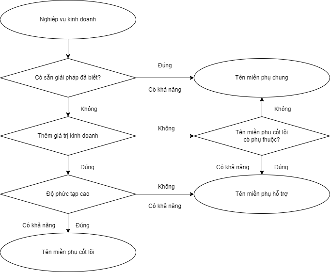
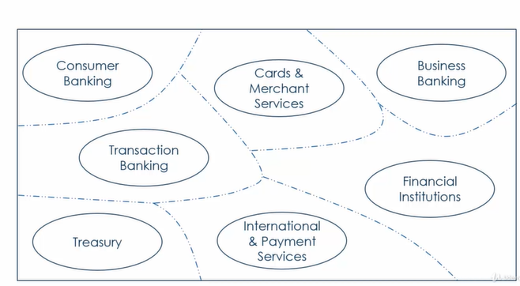

<!--@yêu cầu nghiệp vụ-->

Trình bày nội dung yêu cầu nghiệp vụ

<!--@Chi tiết và áp dụng thiết kế hướng miền-->
<!--@Đôi nét về thiết kế hướng miền-->
<!--@Thiết kế hướng miền là gì?-->

Thiết kế hướng miền được Eric Evans giới thiệu trong cuốn sách “DomainDrivenDesign: Tackling Complexity in the Heart of Software”.

Thiết kế hướng miền là một phương pháp thiết kế phần mềm tập trung vào việc hiểu và mô hình hóa lĩnh vực kinh doanh của một tổ chức.

Thiết kế hướng miền nhấn mạnh việc sử dụng lĩnh vực nghiệp vụ kinh doanh để thảo luận và đề xuất giải pháp đáp ứng nhu cầu. Vì để tạo một phần mềm tốt, bạn cần phải hiểu rõ về chính phần mềm đó. Chính vì vậy mà để đạt được kết quả như mong đợi, chúng ta thường bắt đầu từ yêu cầu nghiệp vụ.

Trong ứng dụng điển hình khó tương thích với lập trình hướng đối tượng vì có nhiều phần code xử lý các công việc không liên quan đến vấn đề nghiệp vụ như truy cập file, hạ tầng mạng, CSDL, ... được nhúng trực tiếp vào đối tượng nghiệp vụ kinh doanh. Cách này giúp tốc độ hoàn thiện ứng dụng nhanh. Tuy nhiên, cách này làm cho thiết kế bị mất đi tính hướng đối tượng trong thực tế với mức độ doanh nghiệp lớn. Đây là lý do thiết kế hướng miền trở nên quan trọng.

Trong kiến trúc vi dịch vụ, thiết kế hướng miền giúp đảm bảo rằng mỗi dịch vụ được thiết kế phản ánh một phần cụ thể của lĩnh vực kinh doanh. Mỗi dịch vụ được quản lí bởi một nhóm nhỏ được hỗ trợ bởi các chuyên gia ngành.

<!--@Miền (Domain)-->

Phần mềm được tạo ra để giúp xử lý sự phức tạp trong cuộc sống hiện đại. Việc phát triển phần mềm liên kết chặt chẽ với một số khía cạnh cụ thể trong cuộc sống của chúng ta.

Miền đề cập đến phạm vi kiến thức và vấn đề mà hệ thống hoặc dự án cụ thể đang xử lý.

Về góc độ kinh doanh: miền đại diện cho một lĩnh vực hoặc ngành mà doanh nghiệp hoạt động.
Về góc độ phần mềm: miền có thể coi là đại diện cho không gian vấn đề của phần mềm đó.

Phần mềm cần phản ánh đúng miền và hiện thực hóa chính xác miền.

<!--$VD: Ở đồ án này, miền được xác định là bài toán giải pháp hóa đơn điện tử .-->

<!--@Tên miền phụ (Sub-Domain)-->
<!---->
<!--Trong một miền phức tạp, không thể có một chuyên gia duy nhất có kiến thức tổng thể về tất cả các miền phụ.-->
<!--Phần mềm cần phản ánh đúng miền và hiện thực hóa một cách chính xác quan hệ giữa các miền.-->

<!--Tên miền được tạo thành từ nhiều tên miền phụ.-->

<!--Hầu như không thể có một chuyên gia về miền biết mọi thứ về miền đó. Kết quả là có nhiều chuyên gia về chủ đề hoặc chuyên gia ngành trong một tên miền hầu hết được liên kết với các tên miền phụ trong tên miền lớn hơn.-->

Tên miền được tạo thành từ nhiều tên miền phụ.

Một miền doanh nghiệp bao gồm nhiều tên miền phụ.
Có nhiều yếu tố khác nhau góp phần tạo nên sự phức tạp của tên miền phụ.

<!--@Phân loại các tên miền phụ.-->

Có ba loại tên miền phụ:

<!--@Tên miền phụ chung (Generic Subdomain)**-->

Tên miền phụ chung cung cấp các giải pháp có sẵn mà doanh nghiệp có thể mua.

Không có gì đặc biệt về những tên miền phụ này và các phương pháp tốt nhất đã sẵn có cho những tên miền này.

Doanh nghiệp không thể đạt được bất kỳ lợi thế cạnh tranh nào bằng cách thực hiện những điều khác biệt trong tên miền phụ chung.

<!--$VD:-->
<!--Ví dụ về các tên miền phụ như vậy là quản lý nguồn nhân lực và cơ sở vật chất. Vì vậy, bất kỳ ngành nào hoặc doanh nghiệp nào, các hoạt động quản lý nhân sự và quản lý cơ sở vật chất đều khá trưởng thành và không tạo thêm bất kỳ giá trị khác biệt nào cho doanh nghiệp.-->

<!--@Tên miền phụ cốt lõi (Core Subdomain)**-->

Tên miền phụ cốt lõi là điểm khác biệt quan trọng cho doanh nghiệp.

Mỗi doanh nghiệp trong một ngành cụ thể hoạt động khác nhau trong các tên miền phụ cốt lõi để đạt được một số lợi thế so với đối thủ cạnh tranh.

Thành công của một doanh nghiệp nằm ở tên miền phụ cốt lõi.

Doanh nghiệp luôn tìm cách thực hiện những điều khác biệt trong các tên miền phụ cốt lõi này để có được một số lợi thế cạnh tranh.

<!--$VD:-->

<!--@Tên miền phụ hỗ trợ (Supporting Subdomain)**-->

Các tên miền phụ cốt lõi phụ thuộc vào các tên miền phụ hỗ trợ.

Tên miền phụ hỗ trợ cung cấp các dịch vụ để tên miền phụ cốt lõi hoạt động hiệu quả.

Tên miền phụ hỗ trợ không có mức độ phức tạp cao về logic nghiệp vụ.

<!--$VD:-->
<!--phụ thuộc rất nhiều vào bộ phận hỗ trợ khách hàng-->
<!---->
<!---->
<!---->
<!--@Cách xác định các tên miền phụ-->

Sơ đồ:

Diễn giải:
Bắt đầu bằng cách xem xét nghiệp vụ kinh doanh.

Nếu có sẵn giải pháp đã biết thì có khả năng là Tên miền phụ chung. Ngược lại, nghiệp vụ đó thêm bất kỳ giá trị kinh doanh nào không.

Nếu không có giá trị kinh doanh thì kiểm tra xem các tên miền phụ cốt lõi có phụ thuộc vào tên miền phụ này hay không? Và câu trả lời đó là có thì có khả năng là tên miền phụ hỗ trợ. Nếu câu trả lời là không thì đó là tên miền phụ chung.

Nếu tên miền phụ có tiềm năng bổ sung một số giá trị kinh doanh thì bước kiểm tra tiếp theo là xem liệu tên miền doanh nghiệp có độ phức tạp cao hay không?

Nếu miền doanh nghiệp không có độ phức tạp cao thì có khả năng là tên miền phụ hỗ trợ. Nếu không thì nó có khả năng là tên miền phụ cốt lõi.

<!--$VD: Sau khi phân tích em có cccccccc-->

<!--@Tại sao cần phân loại các tên miền phụ?-->

Việc phân loại tên miền phụ giúp doanh nghiệp đưa ra quyết định với từng loại tên miền phụ khác nhau.

Doanh nghiệp có nguồn lực hạn chế như nguồn nhân lực và kinh phí dành cho các sáng kiến. Việc phân loại các tên miền phụ giúp ưu tiên các sáng kiến khác nhau.

Các doanh nghiệp mong muốn tối đa hóa lợi nhuận đầu tư. Do đó, các sáng kiến liên quan đến tên miền phụ cốt lõi sẽ được ưu tiên.

<!--$VD:-->
<!--Hướng dẫn: 5/3-->

<!--@Mô hình miền (Domain Models)-->

Để tạo một phần mềm tốt, chúng ta cần phải hiểu rõ về chính phần mềm đó. Trong domain driven design để có thể hiểu miền nhanh, chúng ta tạo ra các mô hình miền.

Mô hình miền là kiến thức có tổ chức và có cấu trúc về miền phù hợp để giải quyết vấn đề kinh doanh.

Mô hình miền không phải là kiến thức của chuyên gia ngành, mà là sự trừu tượng hóa của cả nhóm.

Trong quá trình phát triển, nhóm trao đổi và thảo luận về mô hình của nhóm.

Mô hình miền giúp nhóm hiểu công việc và đồng thuận khi làm việc.

<!--Năm yếu tố tạo nên mô hình miền, miền, từ vựng, thực thể miền, mối quan hệ giữa các thực thể, quy trình làm việc và hoạt động cũng như các khái niệm chính.-->
<!--$VD: Ở đồ án này, mô hình miền là ... các sơ đồ use case, class, activiti, squen-->

<!--@Ngôn ngữ chung (Ubiquitous Language)-->

<!--Và thứ ba là có những thách thức về mặt ngôn ngữ. Khi bạn cố gắng hợp nhất kiến ​​thức về nhiều lĩnh vực vào một mô hình duy nhất, việc thấy cùng một doanh nghiệp là điều rất bình thường.-->
<!--Có ý nghĩa khác nhau trong các tên miền phụ khác nhau trong tổ chức và những thách thức về ngôn ngữ này có thể gây ra sự nhầm lẫn lớn cho các nhóm phát triển phần mềm cũng như các chuyên gia về miền.-->

Trong quá trình xây dựng mô hình miền, cần có đối thoại trao đổi giữa những người thiết kế phần mềm và chuyên gia ngành để hiểu đúng về miền. Tuy nhiên, nhóm kinh doanh sử dụng ngôn ngữ kinh doanh và nhóm công nghệ có xu hướng sử dụng các thuật ngữ kỹ thuật trong giao tiếp của họ. Lập trình viên tập trung vào lớp, phương thức, thuật toán, trong khi chuyên gia ngành thường sử dụng ngôn ngữ chuyên ngành của họ. Sự khác biệt về ngôn ngữ giữa các nhóm có thể dẫn đến những thách thức về giao tiếp.

Thách thức đặt ra khi một thuật ngữ có thể xuất hiện trong bối cảnh của các lĩnh vực kinh doanh khác nhau. Đối với ngôn ngữ kinh doanh được sử dụng trong nhiều miền, cùng một thuật ngữ có thể có ý nghĩa khác nhau gây ra nhầm lẫn.

<!--=> Thiết kế hướng miền đề xuất sử dụng ngôn ngữ chung để giải quyết những thách thức ngôn ngữ này.-->

ngôn ngữ chung là một trong những mô hình chiến lược của thiết kế hướng miền, thiết lập một ngôn ngữ chung trong từng bối cảnh kinh doanh.

<!--Một số đặc điểm:-->

Có nhiều ngôn ngữ chung trong một tổ chức được mỗi nhóm sẽ tạo và quản lý một cách độc lập.

ngôn ngữ chung được sử dụng bởi cả chuyên gia ngành và chuyên gia công nghệ.

ngôn ngữ chung phát triển theo thời gian thông qua sự cộng tác giữa doanh nghiệp và các chuyên gia công nghệ.

Việc tạo ra ngôn ngữ chung là một quá trình liên tục.

Đồng nhất trong mọi phần của hệ thống: Không chỉ giới hạn trong phạm vi của một module hay một thành phần cụ thể, mà được áp dụng đồng nhất trong toàn bộ hệ thống.

<!--Hướng dẫn 5/7-->
<!---->

<!--@Bối cảnh giới hạn (Bounded Context)-->
**Bối cảnh giới hạn (Bounded Context)**

Một mô hình miền cần đủ nhỏ để phù hợp với một nhóm cụ thể. Để đạt được điều này, chúng ta cần xác định rõ ranh giới giữa các ngữ cảnh.
=> Bối cảnh giới hạn giúp định rõ các ranh giới, chia miền thành các phần độc lập để giải quyết sự phức tạp trong mô hình doanh nghiệp.

<!--Một số đặc điểm:-->

Mỗi liên hệ bị giới hạn phải được thể hiện thông qua một mô hình miền riêng biệt không có sự chia sẻ về mô hình.

<!--$VD:--> mỗi domain có mô hình riêng ... user ở domain1, user ở domain2

Những mô hình được tạo ra và quản lý độc lập bởi các nhóm công nghệ được phân công cho từng đơn vị chức năng cụ thể.

<!--$VD:-->

Mô hình miền được xây dựng cho bối cảnh giới hạn chỉ có tác dụng trong phạm vi giới hạn của nó.

<!--$VD:-->

<!--Hướng dẫn 5/10-->

**Tích hợp Liên tục (CI/CD)**

Khi một Bối cảnh giới hạn đã được định nghĩa, chúng ta cần đảm bảo rằng nó luôn mới và hoạt động tốt.

Doanh nghiệp nhu cầu phát triển thay đổi liên tục và nhanh chóng.

Ngay cả khi nhóm làm việc cùng trên một Bối cảnh giới hạn thì vẫn có thể có lỗi.

=> Vì vậy, CI/CD tạo ra một quy trình tự động và liên tục từ việc tích hợp mã nguồn, kiểm thử tự động, đến quá trình triển khai, giúp tăng cường chất lượng phần mềm, giảm thời gian và rủi ro trong quá trình phát triển phần mềm.

**Continuous Integration (CI): ** Đây là một phương pháp phát triển phần mềm mà ở đó, các thành viên trong nhóm phát triển tích hợp mã nguồn của họ vào một hệ thống chung thường xuyên - thường là hàng ngày. Mục tiêu của CI là giảm xung đột giữa các phiên bản mã nguồn khác nhau, giúp phát hiện và sửa lỗi sớm hơn. Khi một nhóm sử dụng CI, mã nguồn mới được tự động kiểm thử và xây dựng mỗi khi tích hợp vào hệ thống.

**Continuous Delivery (CD): ** Sau khi mã nguồn đã được tích hợp, Continuous Delivery tập trung vào việc tự động hóa quá trình triển khai (deployment) để có thể triển khai ứng dụng vào môi trường sản xuất một cách nhanh chóng và đáng tin cậy. Điều này có nghĩa là mọi thay đổi trong mã nguồn có thể tự động triển khai vào môi trường thử nghiệm hoặc môi trường sản xuất mà không cần sự can thiệp thủ công.

<!---->

**Bản đồ bối cảnh (Context Maps)**

Trong kiến trúc kiến trúc vi dịch vụ, các dịch vụ phải tương tác với nhau, dẫn đến sự xuất hiện của mối quan hệ phụ thuộc. Những mối quan hệ này cần được quản lý chặt chẽ.

=> Do đó, các nhóm phải nỗ lực để ghi lại mối quan hệ giữa các điểm tiếp xúc thông qua việc sử dụng Bản đồ bối cảnh.

Bản đồ bối cảnh là sự thể hiện trực quan của hệ thống, thể hiện các thành phần, liên kết và mối quan hệ giữa chúng.

Lợi ích của Bản đồ bối cảnh:

Giúp các thành viên trong nhóm hiểu rõ hơn về bức tranh toàn cảnh.
Giúp việc nhận biết sự phụ thuộc lẫn nhau giữa các liên hệ bị ràng buộc.
Giúp các nhóm đánh giá mức độ hợp tác cần thiết với các nhóm khác.
Giúp sàng lọc các liên hệ được giới hạn và các mô hình.
Xác định mối quan hệ giữa các liên hệ bị ràng buộc của mình.
