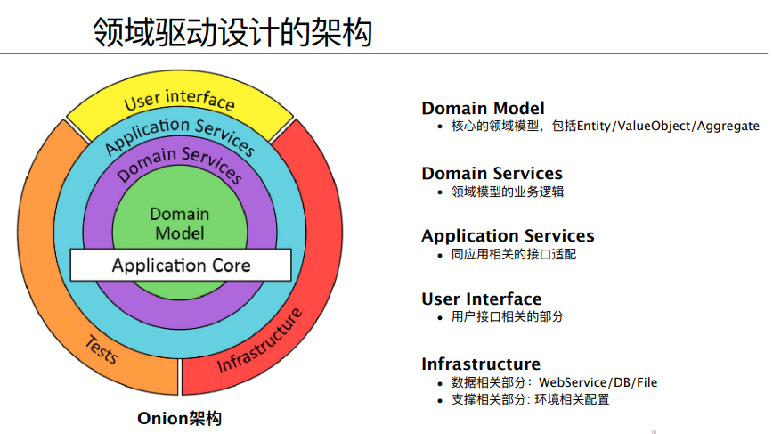

<!-- % Nguồn: TCT: https://hoadondientu.gdt.gov.vn -->
<!-- % https://helpsme.misa.vn/2020/kb/quan - ly - hoa - don - dien - tu -->
<!-- https://ddd-practitioners.com/home/glossary -->
<!-- % https: //www.infoq.com/minibooks/domain - driven - design - quickly -->

Hãy giúp tôi sửa lỗi chính tả và ngữ pháp:

\textbf{\textit{xxxxxxxxxxxxxxxxxxx}}

<!--@============================================== -->
<!--@============================================== -->
<!--@============================================== -->

% % chiều t7

% % chiều t7

% % chiều t7

% % chiều t7

% % chiều t7

% % chiều t7

% % chiều t7

% % chiều t7

% % chiều t7

% % chiều t7

% % chiều t7

% % chiều t7

% % chiều t7

% % chiều t7

% % chiều t7

% % chiều t7

% % chiều t7

% % chiều t7

% % chiều t7

% % chiều t7

% % chiều t7

% %!<! - - @Cách xác định các miền phụ - - >

% %!<! - - Sơ đồ: - - >

% % 

% %!<! - - Mô tả: - - >

% Bắt đầu bằng cách xem xét nghiệp vụ kinh doanh.

% Nếu có sẵn giải pháp đã biết thì có khả năng là miền phụ chung. Ngược lại, chúng ta kiểm tra xem miền phụ đó có thêm giá trị kinh doanh nào không?

% Nếu không có giá trị kinh doanh thì chúng ta kiểm tra xem các miền phụ cốt lõi có phụ thuộc vào miền phụ này hay không? Nếu có thì có khả năng là miền phụ hỗ trợ. Nếu không thì đó là miền phụ chung.

% Nếu miền phụ có tiềm năng bổ sung một số giá trị kinh doanh thì bước kiểm tra tiếp theo là xem liệu miền doanh nghiệp có độ phức tạp cao hay không?

% Nếu miền doanh nghiệp không có độ phức tạp cao thì có khả năng là miền phụ hỗ trợ. Ngược lại thì nó có khả năng là miền phụ cốt lõi.

% %!<! - - @Tại sao cần phân loại các miền phụ? - - >

% Việc phân loại miền phụ giúp doanh nghiệp đưa ra quyết định với từng loại miền phụ khác nhau.

% Doanh nghiệp có nguồn lực hạn chế như nguồn nhân lực và kinh phí dành cho các sáng kiến. Việc phân loại các miền phụ giúp ưu tiên các sáng kiến khác nhau.

% Các doanh nghiệp mong muốn tối đa hóa lợi nhuận đầu tư. Do đó, các sáng kiến liên quan đến miền phụ cốt lõi sẽ được ưu tiên.

% %!<! - - Hướng dẫn: 5/3 - - >

% %

% %!<! - - - - >

% %!<! - - - - >

% %!<! - - - - >

% % %!<! - - Core Domain https:// thiết kế hướng miền - practitioners.com/home/glossary/domain/core - domain/ - - >

% % %!<! - - Core Domain https:// thiết kế hướng miền - practitioners.com/home/glossary/domain/core - domain/ - - >

% Trang chủTrang chủBảng chú giảiLãnh địa Miền cốt lõi

% Miền cốt lõi

% Miền lõi hoặc miền phụ trong thiết kế hướng miền (Thiết kế theo hướng miền) là một phần của hệ thống phần mềm chứa logic và quy trình kinh doanh chính, thể hiện trung tâm chức năng của ứng dụng. Đây là phần quan trọng và có giá trị nhất của hệ thống và việc triển khai nó có ý nghĩa quyết định đối với sự thành công của phần mềm. Miền cốt lõi được xác định thông qua phân tích cẩn thận về miền vấn đề cũng như các quy tắc và quy trình kinh doanh tương ứng của nó và nó phải được xác định rõ ràng, theo mô - đun và có thể bảo trì được. Trong thiết kế hướng miền, miền lõi thường được gói gọn trong một tập hợp các đối tượng gắn kết và liên kết lỏng lẻo, được gọi là mô hình miền, mô hình hóa các khái niệm, quy tắc và quy trình kinh doanh của miền vấn đề.

% Ví dụ

% Dưới đây là danh sách các miền phụ cốt lõi có thể có cho một doanh nghiệp hoạt động trong miền thẻ tín dụng :

% Phát hành thẻ : Subdomain này chịu trách nhiệm về quá trình phát hành thẻ tín dụng mới cho khách hàng. Nó bao gồm các nhiệm vụ như thu thập thông tin khách hàng, thực hiện kiểm tra tín dụng, in và giao thẻ vật lý cũng như kích hoạt thẻ.

% Thanh toán bằng thẻ : Miền phụ này xử lý việc xử lý các giao dịch thẻ tín dụng. Nó bao gồm các nhiệm vụ như ủy quyền thanh toán, thu hồi thanh toán, thanh toán tiền cho người bán và quản lý khoản bồi hoàn.

% Phát hiện gian lận : Miền phụ này tập trung vào việc phát hiện và ngăn chặn hoạt động gian lận trên tài khoản thẻ tín dụng. Nó bao gồm các nhiệm vụ như phân tích dữ liệu giao dịch, giám sát các mẫu đáng ngờ và bắt đầu điều tra gian lận.

% Chương trình phần thưởng : Miền phụ này quản lý các chương trình khách hàng thân thiết cung cấp phần thưởng cho khách hàng khi sử dụng thẻ tín dụng của họ. Nó bao gồm các nhiệm vụ như xác định cấu trúc phần thưởng, theo dõi điểm và phần thưởng của khách hàng cũng như quản lý việc quy đổi phần thưởng.

% Dịch vụ khách hàng : Miền phụ này xử lý các yêu cầu và hỗ trợ của khách hàng liên quan đến tài khoản thẻ tín dụng. Nó bao gồm các nhiệm vụ như trả lời các câu hỏi về số dư tài khoản, hỗ trợ các tranh chấp về thanh toán và giải quyết các vấn đề kỹ thuật khi sử dụng thẻ.

% Tuân thủ : Miền phụ này đảm bảo rằng hoạt động kinh doanh thẻ tín dụng hoạt động phù hợp với luật pháp và quy định có liên quan. Nó bao gồm các nhiệm vụ như giám sát các vi phạm tuân thủ, duy trì tài liệu quy định và thực hiện các thay đổi cần thiết để luôn tuân thủ.

% Cần lưu ý rằng ý tưởng về miền phụ cốt lõi, hỗ trợ và chung có thể khác nhau ngay cả đối với các doanh nghiệp hoạt động trong cùng một miền. Điều này là do các miền phụ và vai trò của chúng được xác định theo nhu cầu kinh doanh và bối cảnh cụ thể của mỗi tổ chức. Ví dụ: trong miền thẻ tín dụng, một công ty tập trung vào các chương trình phần thưởng thẻ tín dụng có thể coi miền phụ của chương trình phần thưởng là cốt lõi, trong khi một công ty khác có trọng tâm khác có thể coi nó là hỗ trợ hoặc chung chung. Tương tự, một công ty tập trung mạnh vào việc ngăn chặn gian lận có thể coi miền phụ phát hiện gian lận là cốt lõi, trong khi một công ty khác có thể coi nó là miền hỗ trợ hoặc chung chung. Do đó, điều quan trọng là mỗi tổ chức phải xác định và ưu tiên các miền phụ cụ thể dựa trên nhu cầu và mục tiêu kinh doanh riêng của họ.

% % %!<! - - Core Domain https:// thiết kế hướng miền - practitioners.com/home/glossary/domain/core - domain/ - - >

% % %!<! - - Core Domain https:// thiết kế hướng miền - practitioners.com/home/glossary/domain/core - domain/ - - >

% % %!<! - - Core Domain https:// thiết kế hướng miền - practitioners.com/home/glossary/domain/core - domain/ - - >

% Cần lưu ý rằng ý tưởng về miền phụ cốt lõi, hỗ trợ và chung có thể khác nhau ngay cả đối với các doanh nghiệp hoạt động trong cùng một miền. Điều này là do các miền phụ và vai trò của chúng được xác định theo nhu cầu kinh doanh và bối cảnh cụ thể của mỗi tổ chức. Ví dụ:

% % %!<! - - Highlighted Core : https:// thiết kế hướng miền - practitioners.com/highlighted - core - - >

% % %!<! - - Highlighted Core : https:// thiết kế hướng miền - practitioners.com/highlighted - core - - >

% Trang chủTrang chủBảng chú giảiLãnh địa Miền cốt lõiCốt lõi nổi bật

% Cốt lõi nổi bật

% Trong ngữ cảnh của thiết kế hướng miền, phần cốt lõi được đánh dấu đề cập đến phần quan trọng và phức tạp nhất của hệ thống phần mềm, thể hiện logic miền cốt lõi và mang lại giá trị cao nhất cho doanh nghiệp. Phần lõi này phải được tách biệt khỏi các miền phụ hỗ trợ và chung, đồng thời phải được phát triển và duy trì bởi các chuyên gia và nhà phát triển miền có hiểu biết sâu sắc về doanh nghiệp cũng như các yêu cầu của nó. Lõi được đánh dấu phải được bảo vệ và cách ly khỏi những thay đổi và sửa đổi không liên quan trực tiếp đến miền lõi, điều này đạt được thông qua việc sử dụng các bối cảnh giới hạn, các sự kiện miền và các khái niệm thiết kế hướng miền khác. Bằng cách giữ phần lõi được đánh dấu tách biệt khỏi các miền phụ hỗ trợ và chung, hệ thống có thể duy trì mức độ gắn kết và mô đun hóa cao, giúp dễ hiểu, duy trì và phát triển hơn theo thời gian.

% % %!<! - - Highlighted Core : https:// thiết kế hướng miền - practitioners.com/highlighted - core - - >

% % %!<! - - Highlighted Core : https:// thiết kế hướng miền - practitioners.com/highlighted - core - - >

% % %!<! - - Highlighted Core : https:// thiết kế hướng miền - practitioners.com/highlighted - core - - >

% % %!<! - - Segregated Core : https:// thiết kế hướng miền - practitioners.com/?page_id = 378 - - >

% % %!<! - - Segregated Core : https:// thiết kế hướng miền - practitioners.com/?page_id = 378 - - >

% Trang chủTrang chủBảng chú giảiLãnh địa Miền cốt lõiLõi tách biệt

% Lõi tách biệt

% Lõi tách biệt là một mẫu thiết kế hướng miền bao gồm việc tách miền lõi thành các phần hoặc mô - đun nhỏ hơn, độc lập, mỗi phần có bối cảnh giới hạn riêng. Điều này cho phép tính linh hoạt và khả năng mở rộng cao hơn trong việc thiết kế các hệ thống phức tạp, cũng như cải thiện tính mô - đun và khả năng bảo trì. Ý tưởng là để tránh việc có một miền cốt lõi nguyên khối, được liên kết chặt chẽ, có thể trở nên khó thay đổi hoặc duy trì theo thời gian. Bằng cách tách phần cốt lõi thành các phần nhỏ hơn, tập trung, mỗi phần có bối cảnh và trách nhiệm riêng, các nhóm có thể làm việc hiệu quả hơn và thực hiện các thay đổi dễ dàng hơn. Mẫu lõi tách biệt thường được sử dụng kết hợp với các mẫu thiết kế hướng miền khác, chẳng hạn như bối cảnh giới hạn và bản đồ bối cảnh, để tạo ra kiến trúc có cấu trúc tốt và linh hoạt cho các hệ thống quy mô lớn.

% % %!<! - - Segregated Core : https:// thiết kế hướng miền - practitioners.com/?page_id = 378 - - >

% % %!<! - - Segregated Core : https:// thiết kế hướng miền - practitioners.com/?page_id = 378 - - >

% % %!<! - - Segregated Core : https:// thiết kế hướng miền - practitioners.com/?page_id = 378 - - >

% % %!<! - - Generic Subdomain : https:// thiết kế hướng miền - practitioners.com/generic - subdomain - - >

% % %!<! - - Generic Subdomain : https:// thiết kế hướng miền - practitioners.com/generic - subdomain - - >

% Trang chủTrang chủBảng chú giảiLãnh địa Miền phụ chung

% Miền phụ chung

% Trong Thiết kế hướng miền (thiết kế hướng miền), miền phụ chung là loại miền phụ không có bất kỳ đặc điểm cụ thể hoặc duy nhất nào so với các miền khác trong cùng lĩnh vực. Đó là một miền phụ có thể được tìm thấy trên nhiều ngành, thay vì dành riêng cho một ngành hoặc miền.

% Mặc dù các miền phụ chung có thể không phải là duy nhất hoặc dành riêng cho một miền nhưng chúng vẫn cần được xác định rõ ràng và hiểu rõ để triển khai hiệu quả trong hệ thống.

% Ví dụ

% Xác thực và ủy quyền: Miền phụ này xử lý việc quản lý danh tính người dùng và quyền truy cập vào tài nguyên trong hệ thống. Thông thường, cần có một giải pháp chung cho miền phụ này để có thể sử dụng lại trên nhiều hệ thống.

% Thông báo : Miền phụ này xử lý việc gửi thông báo cho người dùng, chẳng hạn như thông báo qua email hoặc SMS. Tương tự như xác thực và ủy quyền, việc có một giải pháp chung cho miền phụ này có thể được sử dụng lại trên nhiều hệ thống thường rất hữu ích.

% Thanh toán : Miền phụ này xử lý các khoản thanh toán, bao gồm thu thập thông tin thanh toán, tính phí thẻ tín dụng và xử lý tiền hoàn lại. Tương tự như các ví dụ trên, giải pháp thanh toán chung có thể được sử dụng lại trên nhiều hệ thống.

% Định vị địa lý : Miền phụ này xử lý việc ánh xạ các vị trí thực tế tới các biểu diễn kỹ thuật số. Một giải pháp định vị địa lý chung có thể được sử dụng trong nhiều hệ thống, chẳng hạn như ánh xạ địa chỉ tới tọa độ GPS hoặc tính toán khoảng cách giữa các vị trí.

% % %!<! - - Generic Subdomain : https:// thiết kế hướng miền - practitioners.com/generic - subdomain - - >

% % %!<! - - Generic Subdomain : https:// thiết kế hướng miền - practitioners.com/generic - subdomain - - >

% % %!<! - - Generic Subdomain : https:// thiết kế hướng miền - practitioners.com/generic - subdomain - - >

% % %!<! - - Supporting Subdomain : https:// thiết kế hướng miền - practitioners.com/supporting - subdomain - - >

% % %!<! - - Supporting Subdomain : https:// thiết kế hướng miền - practitioners.com/supporting - subdomain - - >

% Trang chủTrang chủBảng chú giảiHỗ trợ miền phụ

% Hỗ trợ miền phụ

% Trong thiết kế hướng miền, miền phụ hỗ trợ đề cập đến miền phụ hỗ trợ miền phụ cốt lõi để đạt được mục tiêu của nó. Nó bao gồm các chức năng như quản trị, bảo mật, giám sát và báo cáo, cùng nhiều chức năng khác. Miền phụ hỗ trợ rất quan trọng trong việc cung cấp các dịch vụ thiết yếu cho miền phụ cốt lõi, có thể cho phép miền phụ đạt được mục tiêu hiệu quả hơn. Tuy nhiên, nó không được thống trị hoặc làm lu mờ miền phụ cốt lõi, vì nó chỉ nhằm mục đích tạo điều kiện thuận lợi cho hoạt động của nó.

% % %!<! - - Supporting Subdomain : https:// thiết kế hướng miền - practitioners.com/supporting - subdomain - - >

% % %!<! - - Supporting Subdomain : https:// thiết kế hướng miền - practitioners.com/supporting - subdomain - - >

% % %!<! - - Supporting Subdomain : https:// thiết kế hướng miền - practitioners.com/supporting - subdomain - - >

% % %!<! - - - - >

% % %!<! - - - - >

% % %!<! - - - - >

% % %!<! - - - - >
<!--@============================================== -->
<!--@============================================== -->

<!--@============================================== -->
<!-- Layered Architecture : https://ddd-practitioners.com/layered-architecture -->
<!-- [[Layered Architecture]] A technique for separating the concerns of a software system, isolating a domain layer, among other things. -->

<!-- Quản lí vòng đời -->
<!-- [[Life Cycle]] A sequence of states an object can take on between creation and deletion, typically with constraints to ensure integrity when changing from one state to another. May include migration of an [[Entity]] between systems and different [[Bounded Contexts]]. -->

<!-- % Aggregate -->
<!-- Aggregate: https://ddd-practitioners.com/home/glossary/aggregate/ -->
<!-- [[Aggregate]] A cluster of associated objects that are treated as a unit for the purpose of data changes. External references are restricted to one member of the AGGREGATE, designated as the root. A set of consistency rules applies within the AGGREGATE’S boundaries. -->
<!-- State Stored Aggregates : https://ddd-practitioners.com/state-stored-aggregate -->

<!-- Consistency Boundary : https://ddd-practitioners.com/glossary/consistency-boundary -->

<!-- & Factory - -->
<!-- Factory : https://ddd-practitioners.com/factory -->
<!-- [[Factory]] A mechanism for encapsulating complex creation logic and abstracting the type of a created object for the sake of a client. -->
https://refactoring.guru/design-patterns/factory-method
https://refactoring.guru/design-patterns/abstract-factory
https://culttt.com/2014/12/24/factories-domain-driven-design

<!-- % Repository Object - -->
<!-- Repository : https://ddd-practitioners.com/?page_id=555 -->
<!-- [[Repository]] A mechanism for encapsulating storage, retrieval, and search behavior which emulates a collection of objects. -->

<!-- Module : https://ddd-practitioners.com/?page_id=618 -->

<!-- % Domain Service - -->
<!-- Domain Services: https://ddd-practitioners.com/home/glossary/domain-services -->

<!-- % Application Services - -->
<!-- Application Service : https://ddd-practitioners.com/application-service -->

<!-- % Infrastructure Services - -->
<!-- Infrastructure Service : https://ddd-practitioners.com/infrastructure-service -->

<!--@============================================== -->
<!--@============================================== -->
<!--@============================================== -->
<!--@============================================== -->
<!--@============================================== -->
<!--@============================================== -->

<!--!======================================================-->

<!--!======================================================-->
<!--@Các mẫu kỹ thuật (Tactical Patterns)-->
<!--@Các mẫu kỹ thuật (Tactical Patterns)-->
<!--@Các mẫu kỹ thuật (Tactical Patterns)-->
<!--@Các mẫu kỹ thuật (Tactical Patterns)-->

<!---->

**Kiến trúc phân lớp**
Khi phát triển ứng dụng phần mềm, một phần lớn thành phần không liên quan trực tiếp đến nghiệp vụ, nhưng chúng là một phần của hạ tầng. Ví dụ như truy cập CSDL, hạ tầng mạng, ... Trong một ứng dụng hướng đối tượng thuần túy, các đoạn mã lại được nhúng vào trong các hành vi của các đối tượng nghiệp vụ vì nó là cách dễ và nhanh chóng. Tuy nhiên, việc trộn lẫn các đoạn mã liên quan đến nghiệp vụ có thể làm cho việc refactor khó khăn, kém linh hoạt.
=> Cần phân chia một chương trình phức tạp thành các lớp. Theo thiết kế hướng miền có 4 lớp:

<!--Giao diện người dùng (User Interface)-->

Chịu trách nhiệm trình bày thông tin tới người sử dụng và thông dịch lệnh của người dùng.

<!--Lớp ứng dụng (Application Layer)-->

Đây là một lớp mỏng phối hợp các hoạt động của ứng dụng. Nó không chứa logic nghiệp vụ. Nó không lưu giữ trạng thái của các đối tượng nghiệp vụ nhưng nó có thể giữ trạng thái của một tiến trình của ứng dụng.

<!--Lớp miền (Domain Layer)-->

Lớp này chứa thông tin về các lĩnh vực. Đây là trái tim của nghiệp vụ phần mềm. Trạng thái của đối tượng nghiệp vụ được giữ tại đây. Persistence của các đối tượng nghiệp vụ và trạng thái của chúng có thể được ủy quyền cho Lớp hạ tầng.

<!--Lớp hạ tầng (Infrastructure Layer)-->

Lớp này đóng vai trò như một thư viện hỗ trợ cho tất cả các lớp còn lại. Nó cung cấp thông tin liên lạc giữa các lớp, cài đặt persistence cho đối tượng nghiệp vụ, đồng thời chứa các thư viện hỗ trợ cho Lớp giao diện người dùng, ...

**Quản lý vòng đời của các đối tượng miền**
Việc quản lý vòng đời các đối tượng trong miền không hề đơn giản, nếu như làm không đúng sẽ có thể gây ảnh hưởng đến việc mô hình hóa miền.

**Mẫu tổng hợp (Aggregate)**

<!--Tính tương đồng (Aggregate)-->

Mẫu tổng hợp là một nhóm các thực thể và đối tượng giá trị được xem như một tổng thể thống nhất từ ​​góc độ dữ liệu và khái niệm miền.

<!--Hãy để tôi giải thích điều này bằng một minh họa.-->

Một tập hợp bao gồm một nhóm tổng hợp còn được gọi là thực thể gốc.
Thực thể gốc này có một danh tính duy nhất từ ​​phối cảnh miền.
Phần thứ hai của tập hợp là cụm, được hình thành bởi ranh giới của tập hợp.
Trong ranh giới này, có thể không có hoặc nhiều thực thể tổng hợp và đối tượng giá trị. Các đối tượng trong cụm này hoặc đối tượng trong ranh giới được gọi là đối tượng bên trong hoặc đối tượng con.

Aggregate phải cung cấp các giao diện để vận hành trên các đối tượng bên trong.
đảm bảo rằng tất cả hành vi cần thiết để vận hành trên đối tượng bên trong được hiển thị dưới dạng các hàm của đối tượng gốc tổng hợp.

<!--Các nhà máy (Factory) là để tạo ra miền phức tạp.-->
<!--Các reporitori được sử dụng để quản lý tính bền vững của các đối tượng miền.-->
<!--Các dịch vụ được sử dụng để mô hình hóa sự tương tác của các đối tượng miền với các đối tượng miền khác, với cơ sở hạ tầng và với các thành phần bên ngoài khác.-->

<!--tổng hợp và mẫu nhà máy (Aggregates & Factories)-->

<!--!Mẫu nhà xưởng (Factory Pattern)-->
<!--Mẫu thiết kế nhà máy là một mẫu phổ biến để xây dựng các tập hợp miền phức tạp. Cách thức hoạt động là chúng ta xác định một đối tượng có tất cả logic để tạo tổng hợp miền.-->

Nhà máy này hiển thị một chức năng có thể được gọi bằng mã và hiển thị chức năng để tạo các bộ tổng hợp có liên quan trong nhà máy, nhà máy đọc.
Dữ liệu tổng hợp từ bộ lưu trữ liên tục sẽ tạo tổng hợp và trả về cột.
Vì vậy đây là mẫu thiết kế rất phổ biến, không nhất thiết chỉ dành riêng cho các dịch vụ của Mikoto.

<!--Đã đến lúc xem xét nhanh. Tổng hợp có thể chứa các thực thể tổng hợp và đối tượng giá trị khác. Tổng hợp phải gói gọn hành vi để quản lý trong đối tượng bên trong.-->
<!--Tất cả các thay đổi đối với tổng hợp đều được lưu. Các đối tác nguyên tử và nhà máy thường được sử dụng để tạo các tập hợp miền phức tạp.-->

<!--Hướng dẫn 7.7-->
<!--Hướng dẫn 7.8-->

<!---->
<!---->
<!---->
<!---->
<!---->
<!---->
<!---->
<!---->
<!---->
<!---->

<!--mẫu kho lưu trữ (Repository Pattern)-->

các đặc điểm của kho lưu trữ
một số tùy chọn hiện thực hóa cho kho lưu trữ

<!--Đối tượng kho lưu trữ hoạt động như một tập hợp các đối tượng tổng hợp trong bộ nhớ.-->

<!--Tất cả logic để tương tác với bộ lưu trữ dữ liệu được gói gọn bởi đối tượng kho lưu trữ.-->
<!--kho lưu trữ đóng vai trò là nơi chứa tập hợp các đối tượng tổng hợp.-->

<!--đối với mỗi tổng hợp được xác định trong mô hình miền, chúng ta có một và chỉ một kho lưu trữ.-->
<!--Các đối tượng kho lưu trữ được quản lý như một phần của lớp miền. Ngoài các chức năng thẻ điển hình, kho lưu trữ cũng có thể hiển thị các chức năng cấp cao hơn, chủ yếu dành cho truy vấn.-->

<!--Nhìn chung, lợi ích chính của việc sử dụng kho lưu trữ là nó giữ cho mô hình miền độc lập với lớp lưu trữ.-->

<!--Mô hình miền độc lập với mô hình lưu trữ. Vì vậy, ví dụ: nếu chúng ta đang sử dụng RDBMS thì mô hình miền không cần phải biết về cấu trúc bảng và cột.-->
<!--Nó giữ cho mô hình miền độc lập với công nghệ chúng ta có thể đang sử dụng và RDBMS không bằng nhau-->

<!--Kho lưu trữ giữ cho mô hình miền độc lập với cơ sở hạ tầng-->
<!--giúp kiểm tra và mô phỏng đơn vị.-->
<!--Phản hồi CSDL tĩnh được sử dụng rộng rãi làm cơ chế xây dựng mô hình vì nó giúp tôi di chuyển nhanh hơn mà không phụ thuộc vào sự sẵn có của CSDL thực.-->

<!--Việc hiện thực hóa kho lưu trữ yêu cầu nhà phát triển phải ánh xạ giữa đối tượng miền và CSDL và ngược lại.-->

Trong bài học này, chúng ta đã tìm hiểu về các đối tượng kho lưu trữ mẫu kho lưu trữ làm cho mô hình miền độc lập với lớp CSDL.
Các hoạt động CSDL trên tổng hợp phải là nguyên tử, đối tượng kho lưu trữ và các lực lượng. Các đối tượng kho lưu trữ nguyên tử cũng có thể được sử dụng để thử nghiệm và mô phỏng đơn vị.
Có một số mối quan tâm chung liên quan đến các đối tượng kho lưu trữ, nhưng những mối quan tâm chung này liên quan đến chức năng truy vấn có thể được giải quyết bằng cách hiển thị các hàm truy vấn cấp cao trong đối tượng kho lưu trữ bằng cách sử dụng các giải pháp bộ nhớ đệm như Radice và Memcache cũng như bằng cách tạo và hiển thị các hàm truy vấn bên ngoài của đối tượng kho lưu trữ.

<!--hướng dẫn 7/11-->

<!--@\07DomainDrivenDesignTacticalPatterns_VVN\000000012.srt-->
<!--Domain Services dịch vụ miền-->
<!--Domain Service Pattern-->
<!--Characteristics of Domain Services đặc điểm-->

<!--Một định nghĩa chính thức hơn về dịch vụ miền là đối tượng miền thực hiện chức năng hoặc khái niệm miền có thể không được mô hình hóa một cách tự nhiên như một hành vi trong bất kỳ dịch vụ miền, thực thể hoặc đối tượng giá trị nào như một phần của mô hình miền, vì có các loại dịch vụ khác nhau.-->

<!--Điều quan trọng là chúng ta phải hiểu các đặc điểm của dịch vụ miền .-->
<!--Dịch vụ miền luôn thực hiện hành vi kinh doanh cho miền.-->
<!--Dịch vụ miền không có trạng thái, dịch vụ miền có tính gắn kết cao.-->
<!--Dịch vụ miền có thể tương tác với các dịch vụ miền khác.-->
<!--Chúng ta hãy đi qua các chi tiết của từng một trong số này. Vì dịch vụ miền có hành vi kinh doanh nên đối tượng dịch vụ miền nhận thức được các đối tượng miền khác.-->

Một dịch vụ miền có thể tương tác với các dịch vụ miền khác.

Trước khi kết thúc bài học này, tôi muốn nhấn mạnh một điểm quan trọng.

Dịch vụ miền là bất khả tri về công nghệ. Có một quan niệm sai lầm phổ biến rằng dịch vụ của người bán hàng rong nên được coi là một hoạt động kinh doanh là không đúng.

Dịch vụ miền độc lập với công nghệ được sử dụng để gọi. Ví dụ: hoạt động dịch vụ miền, có thể chỉ là lệnh gọi hàm Java đơn giản hoặc có thể được thực hiện qua giao thức mạng như HTTP hoặc MQ.

Thông tin thêm về chủ đề này khi chúng ta tiến bộ trong suốt khóa học. Đã đến lúc bắt đầu với những điểm chính mà chúng ta đã đề cập trong bài học này.

Tôi đã nói về dịch vụ miền và chúng ta cần phải biết những đặc điểm của dịch vụ miền giúp phân biệt nó với các loại dịch vụ khác.
Đầu tiên là dịch vụ miền thực hiện hành vi miền không phù hợp một cách tự nhiên với các thực thể và đối tượng giá trị khác trong mô hình miền.
Các đặc điểm khác là dịch vụ miền không có trạng thái, dịch vụ miền có tính Cohasset cao và dịch vụ miền với các dịch vụ miền khác.

<!--@\07DomainDrivenDesignTacticalPatterns_VVN\000000013.srt-->
<!--Dịch vụ ứng dụng (app sẻvice)-->

Chúng ta hãy xem lại định nghĩa về dịch vụ miền . Nó tuyên bố rằng dịch vụ miền là một đối tượng miền thực hiện chức năng miền.
Và vì dịch vụ danh mục khách hàng sẽ không triển khai bất kỳ chức năng miền nào nên chúng tôi không thể triển khai nó dưới dạng dịch vụ miền.
Và đây là nơi các dịch vụ ứng dụng xuất hiện. Đó là một định nghĩa chính thức hơn về một dịch vụ ứng dụng.
Nó là một đối tượng miền không triển khai bất kỳ chức năng miền nào mà phụ thuộc vào các đối tượng miền khác để hiển thị chức năng miền cấp cao cho bên ngoài của người tiêu dùng đối với mô hình.
Sự khác biệt chính giữa dịch vụ miền và dịch vụ ứng dụng là dịch vụ ứng dụng không triển khai bất kỳ loại logic nghiệp vụ hoặc chức năng miền nào.
Sự khác biệt lớn khác là dịch vụ ứng dụng được tiếp xúc với người tiêu dùng bên ngoài như ứng dụng Web, ứng dụng di động hoặc dịch vụ ứng dụng.

Chúng ta hãy đi qua các đặc điểm của một dịch vụ ứng dụng. Dịch vụ ứng dụng không có logic miền và đây là điểm khác biệt chính giữa dịch vụ ứng dụng và dịch vụ miền.
Các dịch vụ ứng dụng như dịch vụ miền đều không có trạng thái. Các dịch vụ ứng dụng có thể xác định giao diện bên ngoài, các dịch vụ ứng dụng được hiển thị hoặc một số loại giao thức mạng.

Chúng ta hãy đi qua các chi tiết của từng trong số này. Một dịch vụ ứng dụng không có logic miền. Nó phụ thuộc vào đối tượng miền khác cho logic miền.

Đây là điểm khác biệt chính giữa dịch vụ miền và dịch vụ ứng dụng. Dịch vụ ứng dụng điều phối việc thực thi logic miền.

Giống như dịch vụ miền và dịch vụ ứng dụng cũng không có trạng thái. Không có quản lý nhà nước được thực hiện trong dịch vụ ứng dụng.

Không có biến trạng thái hoặc sự tồn tại lâu dài của các đối tượng miền được triển khai trong dịch vụ ứng dụng. Dịch vụ ứng dụng phụ thuộc vào đối tượng miền để tồn tại lâu dài và dịch vụ ứng dụng hiển thị giao diện được thế giới bên ngoài sử dụng.

Nói cách khác, lược đồ yêu cầu và phản hồi cho dịch vụ ứng dụng không cần phải liên kết với bất kỳ đối tượng miền nào khác.

Dịch vụ ứng dụng hiển thị giao diện bên ngoài hoặc giao thức mạng trong mô hình miền. Dịch vụ ứng dụng có thể được coi như một đối tượng ranh giới bảo vệ tất cả các đối tượng trong mô hình miền.

Dịch vụ ứng dụng có thể được hiển thị dưới dạng API và API này được các thành phần bên ngoài sử dụng qua giao thức mạng.
Giao thức mạng này, có thể là SCDP, MQ hoặc thậm chí có thể là giao thức độc quyền. Định dạng dữ liệu giữa năng lực bên ngoài và API rất linh hoạt.
Nó có thể là Jason Ximo, CSFI hoặc bất kỳ định dạng nào khác. Tùy thuộc vào việc thực hiện dịch vụ ứng dụng.

Các thành phần bên ngoài có thể có hoặc không có kiến ​​thức về đối tượng miền hoặc cấu trúc của chúng. Tiếp theo, tôi sẽ thảo luận về mối quan hệ giữa dịch vụ ứng dụng và dịch vụ miền và dịch vụ ứng dụng có thể hiển thị dịch vụ miền với thành phần bên ngoài.

Dịch vụ miền để cung cấp giao diện cho các thành phần bên ngoài. Đã đến lúc đi vào những điểm chính trong bài học này chúng ta đã học về các ứng dụng, dịch vụ, ứng dụng, dịch vụ không triển khai bất kỳ hành vi miền nào.
Chúng cung cấp các dịch vụ cấp cao bằng cách phối hợp thực thi logic miền trong các đối tượng miền.
Các dịch vụ ứng dụng hiển thị giao diện cho các thành phần bên ngoài. Nghĩa là, các thành phần nằm ngoài mô hình miền thông qua giao thức mạng như HTP và NQ.

<!--@\07DomainDrivenDesignTacticalPatterns_VVN\000000014.srt-->
<!--Dịch vụ cơ sở hạ tầng-->

là dịch vụ tương tác với tài nguyên bên ngoài để giải quyết một vấn đề mối quan tâm không thuộc phạm vi vấn đề chính.
Nó xác định một hợp đồng được các đối tượng miền sử dụng để tương tác với các dịch vụ bên ngoài. Từ khóa ở đây là nguồn lực bên ngoài.
VD:

<!--Logging system e.g., Fluentd, ElastiSearch-->
<!--Ví dụ: thông báo qua email hoặc SMS-->
<!--CSDL bên ngoài hoặc thậm chí là hệ thống tệp-->
<!--Google Map.-->

Dịch vụ cơ sở hạ tầng không có logic miền.

Dịch vụ cơ sở hạ tầng tuân theo nguyên tắc trách nhiệm duy nhất

8
00: 01: 39, 420--> 00: 01: 50, 760

<!--Chúng ta hãy đi qua các chi tiết của từng một trong số này. Dịch vụ cơ sở hạ tầng không có logic miền vì nó cung cấp, như tên cho thấy, dịch vụ cơ sở hạ tầng chứ không phải dịch vụ kinh doanh.-->

9
00: 01: 50, 970--> 00: 02: 08, 000

<!--Nó không có bất kỳ sự phụ thuộc trực tiếp nào vào đối tượng miền và dịch vụ cơ sở hạ tầng được đối tượng miền và các dịch vụ sử dụng để tương tác với các tài nguyên bên ngoài và dịch vụ cơ sở hạ tầng tuân theo nguyên tắc trách nhiệm duy nhất.-->

10
00: 02: 08, 040--> 00: 02: 18, 640

<!--Ý tưởng là dịch vụ này cung cấp chức năng cho một và chỉ một thứ. Mục đích của họ là đơn giản hóa việc triển khai và làm cho dịch vụ trở nên dễ hiểu.-->

11
00: 02: 18, 660--> 00: 02: 29, 100

<!--Ví dụ: chúng tôi có ba dịch vụ này, mỗi dịch vụ chuyên cung cấp một chức năng cụ thể. Ví dụ: dịch vụ email chỉ để gửi email.-->

12
00: 02: 29, 130--> 00: 02: 38, 520

<!--Dịch vụ ghi nhật ký chỉ để ghi nhật ký tin nhắn và dịch vụ CSDL là để tương tác với CSDL và cơ sở hạ tầng.-->

13
00: 02: 38, 520--> 00: 02: 52, 140

<!--Dịch vụ xác định một hợp đồng tiêu chuẩn giữa mô hình và các tài nguyên bên ngoài. Hãy nghĩ về nó giống như một API, dành cho các đối tượng và dịch vụ mô hình sử dụng.-->

14
00: 02: 52, 620--> 00: 03: 03, 990

<!--Và nó cũng sẽ thực hiện bất kỳ loại chuyển đổi nào cần thiết trên dữ liệu. Bây giờ hãy xem cơ chế này làm cho miền độc lập hơn với tài nguyên bên ngoài như thế nào.-->
<!--Giả sử chúng ta phải triển khai một dịch vụ email. Dịch vụ e-mail này sẽ cung cấp chức năng tiêu chuẩn để gửi email.-->
<!--Ban đầu, dịch vụ e-mail được triển khai bằng cách sử dụng sendmail của Linux. Nhưng giả sử trong một khoảng thời gian, số lượng email được gửi đi từ ứng dụng tăng lên và do đó cần có một giải pháp mạnh mẽ hơn và Sendmail đã được thay thế bằng MailChimp.-->

Thay đổi này sẽ chỉ yêu cầu thay đổi trong dịch vụ email và sẽ không có tác động đến bất kỳ dịch vụ miền nào sử dụng dịch vụ email nội dung hiển thị theo hợp đồng tiêu chuẩn và do đó mô hình miền được cách ly khỏi các thay đổi tài nguyên bên ngoài.

Trong bài giảng này, chúng ta đã tìm hiểu về các dịch vụ cơ sở hạ tầng. Các dịch vụ cơ sở hạ tầng như dịch vụ ứng dụng không thực hiện bất kỳ hành vi miền nào.
Các dịch vụ cơ sở hạ tầng cung cấp các tài nguyên bên ngoài thông qua giao diện tiêu chuẩn hoặc hợp đồng tiêu chuẩn và cơ chế hợp đồng tiêu chuẩn này bảo vệ mô hình miền khỏi những thay đổi trong dịch vụ bên ngoài.

<!--Hướng dẫn 7/15-->
<!--Hướng dẫn 7/16-->

<!--@ Xong DDD -->
<!--@ Xong DDD -->
<!--@ Xong DDD -->
<!--@ Xong DDD -->
<!--@ Xong DDD -->
<!--@ Xong DDD -->
<!--@ Xong DDD -->
<!--@ Xong DDD -->
<!--@ Xong DDD -->
<!--@ Xong DDD -->
<!--@ Xong DDD -->
<!--@ Xong DDD -->
<!--@ Xong DDD -->
<!--@ Xong DDD -->

<!--@============================================== -->
<!--@============================================== -->
<!--@============================================== -->
<!--@============================================== -->
<!--@============================================== -->
<!--@============================================== -->
<!--@============================================== -->
<!--@============================================== -->
<!--@============================================== -->
<!--@============================================== -->
<!--@============================================== -->
tối nay phair xong ddd
nếu có thể thì làm cái nghiệp vụ
xem video itiso
latex ctg htpt ttss
<!-- -->
<!-- -->
<!-- -->
<!-- -->
<!-- -->
<!--! Hãy sử dụng Ngôn ngữ chung (Ubiquitous Language) trong domain driven design (DDD) với nội dung nghiệp vụ kinh doanh sau: -->

<!-- 1. **Khách hàng (Customer):** -->
<!-- - **Mô tả:** Người sử dụng dịch vụ, có thể là cá nhân hoặc tổ chức. -->

<!-- 2. **Hóa đơn điện tử (Electronic Invoice):** -->
<!-- - **Mô tả:** Hóa đơn được tạo và quản lý điện tử thay vì truyền thống trên giấy. -->
<!--@ -->
<!--@ -->

<!--@ -->
<!--@ -->

https://viblo.asia/p/domain-driven-design-phan-2-MgNeWoZAeYx

https://culttt.com/search
https://culttt.com/2014/04/09/use-exception
https://culttt.com/2014/08/18/encapsulating-applications-business-rules
https://culttt.com/2014/09/29/creating-domain-services
https://culttt.com/2014/12/08/creating-domain-objects-recap
https://culttt.com/2014/12/17/aggregates-domain-driven-design
https://culttt.com/2014/12/24/factories-domain-driven-design
https://culttt.com/2014/12/29/enforcing-business-rules-aggregate-instantiation
https://culttt.com/2014/04/30/difference-entities-value-objects
https://culttt.com/2015/01/05/using-aggregates-gateway-functionality
https://culttt.com/2015/01/07/service-oriented-architecture
https://culttt.com/2015/01/14/command-query-responsibility-segregation-cqrs
https://culttt.com/2015/11/11/what-is-active-model

<!--@ -->
<!--@ -->
<!--@ -->
<!--@ -->
<!--@ -->
<!--@ -->

<!-- Trình bày về Relationship trong domain driven design -->
<!--@ -->
<!--@ -->
<!--@============================================== -->
<!--@============================================== -->
<!--@saga -->
<!--@saga -->
<!--@saga -->
<!--@saga -->
<!--@saga -->
<!--@saga -->
<!--@saga -->
<!--@saga -->
<!--@saga -->
<!--@saga -->
<!--@saga -->
<!--@saga -->
<!--@saga -->
<!--@saga -->
<!--@saga -->
<!--@saga -->
<!--@saga -->
<!--@saga -->
<!--@saga -->
<!--@saga -->

<!---->

<!--!-->
<!--@CQRS (Command Query Responsibility Segregation): -->
<!--CQRS, EventSourcing, Sagas-->
<!--@Event Sourcing: -->
<!-- Strong Consistency : https://ddd-practitioners.com/?page_id=421 -->
<!-- Snapshots : https://ddd-practitioners.com/snapshots -->
<!-- Saga : https://ddd-practitioners.com/home/glossary/saga -->
<!-- Outbox Pattern -->
<!-- Optimistic Concurrency Control : https://ddd-practitioners.com/?page_id=609 -->

<!-- https://www.linkedin.com/pulse/api-strategy-conways-law-inverse-conway-manoeuvre-mikael-wall%C3%A9n/ -->

Một mô hình lưu trữ dữ liệu, trong đó tất cả các thay đổi trạng thái của hệ thống được biểu diễn dưới dạng sự kiện (event).

<!-- EventStorming : https://ddd-practitioners.com/home/glossary/eventstorming -->
<!-- Domain Storytelling : https://ddd-practitioners.com/?page_id=1005 -->

<!-- CQRS : https://ddd-practitioners.com/?page_id=574 -->

CQRS chia để thoải mái, chặt chẽ

Là một nguyên tắc trong DDD, CQRS tách biệt giữa phần xử lý câu lệnh (Command) và phần truy vấn dữ liệu (Query).
Command đại diện cho các thao tác cập nhật dữ liệu, trong khi Query đại diện cho các thao tác truy vấn dữ liệu.

<!-- Event-Driven Architecture : https://ddd-practitioners.com/home/glossary/event-driven-architecture -->

<!-- Event Modeling : https://ddd-practitioners.com/?page_id=994 -->

<!-- Event Replay : https://ddd-practitioners.com/?page_id=585 -->

<!-- Event Sourced Aggregates : https://ddd-practitioners.com/event-sourcing -->

<!-- Event Sourcing : https://ddd-practitioners.com/?page_id=581 -->

<!-- Eventual Consistency : https://ddd-practitioners.com/?page_id=419 -->

<!-- Change Data Capture: https://en.wikipedia.org/wiki/CAP_theorem -->

<!-- ACID Transaction : https://ddd-practitioners.com/?page_id=415 -->

ACID (Atomicity, Consistency, Isolation, Durability)

<!-- BASE Transaction -->

BASE là viết tắt của "Basically Available, Soft state, Eventually consistent," và đối lập với ACID

<!-- Command : https://ddd-practitioners.com/?page_id=596 -->
<!-- Command Handler : https://ddd-practitioners.com/?page_id=599 -->
<!-- Compensating Action : https://ddd-practitioners.com/compensating-action -->
<!-- Compensating Transaction : https://ddd-practitioners.com/compensating-transaction -->
<!-- Compensating Workflow : https://ddd-practitioners.com/compensating-workflow -->

<!-- Domain Event : https://ddd-practitioners.com/domain-event -->
<!--@ Dependency Inversion Principle -->

SOLID : https://ddd-practitioners.com/home/glossary/solid
Single Responsibility Principle : https://ddd-practitioners.com/single-responsibility-principle
Open-Closed Principle
Liskov Substitution Principle : https://ddd-practitioners.com/home/glossary/liskov-substitution-principle
Interface Segregation Principle : https://ddd-practitioners.com/?page_id=817

<!--!========================================================== -->
<!--!========================================================== -->
<!--!========================================================== -->
<!--!========================================================== -->
<!--!========================================================== -->
<!--!========================================================== -->
<!--!========================================================== -->
<!-- mỗi dịch vụ xuất bản và đăng ký các sự kiện nếu cần. Cách tiếp cận này có thể mở rộng và linh hoạt hơn so với điều phối, nhưng cũng phức tạp hơn trong việc triển khai và bảo trì. Tuy nhiên, nó cũng có thể linh hoạt hơn vì mỗi dịch vụ có thể phát triển độc lập và lỗi trong một dịch vụ không nhất thiết ảnh hưởng đến toàn bộ hệ thống. -->
<!-- PublishSubscribe : https://www.enterpriseintegrationpatterns.com/patterns/messaging/PublishSubscribeChannel.html -->
<!--@gRPC -->
<!--@gRPC -->
<!--@gRPC -->
<!--@gRPC -->
<!--@gRPC -->
<!--@gRPC -->
<!--@gRPC -->
<!--@gRPC -->
<!--@gRPC -->
<!--@gRPC -->
<!--@gRPC -->