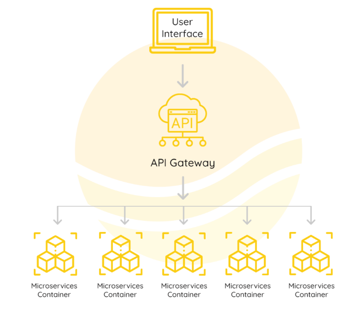

\newpage
\thispagestyle{empty}

\tableofcontents

<!---->
<!--Tóm tắt nội dung đồ án-->
<!---->
<!--Đánh giá và thảo luận-->
<!---->

<!---->

<!---->

<!---->

<!---->

<!---->

Phân tích thiết kế hệ thống
Mô tả yêu cầu nghiệp vụ

Kiến trúc kiến trúc nguyên khối, dù đã phục vụ hiệu quả trong quá khứ, nhưng nó bắt đầu gặp khó khăn đối mặt với sự phức tạp, khả năng mở rộng hạn chế, và khả năng đáp ứng linh hoạt với thay đổi nhanh chóng trong yêu cầu kinh doanh.

<!--RJSX-->

<!---->
<!---->
<!---->
<!---->
<!---->

Hiện nay, các tổ chức doanh nghiệp có nhu cầu thay đổi, phát triển liên tục từ đó hoạt động kinh doanh yêu cầu thay đổi và sự đổi mới nhanh chóng hệ thống và dự án với Nhu Cầu và Mong Đợi của Khách Hàng.

<!--Ví dụ-->
<!--Microsoft chuyển từ bán phần mềm đóng gói sang mô hình đăng ký.-->
<!--Amazon từ hiệu sách trực tuyến thành thị trường cho nhà cung cấp khác.-->
<!--Nefifc-->
<!--Baemin-->
<!--hình 1 triệu dịch vụ Amazon và Netflix-->

=> Kiến trúc của Microserrvice giải quyết những thách thức và giúp chuyển đổi nhanh chóng

Một điểm quan trọng cần lưu ý là nhóm kiến ​​trúc dịch vụ vi mô phải tạo ra phạm vi kinh doanh phù hợp cho từng dịch vụ vi mô để duy trì tính độc lập.

<!--Một điều quan trọng cần lưu ý là để tận dụng tối đa kiến ​​trúc dịch vụ vi mô, điều quan trọng đối với nhóm dịch vụ vi mô là phải tạo ra mã nghiệp vụ phù hợp cho từng máy chủ vi mô.-->
<!--Nếu không thực hiện đúng sẽ dẫn đến tình trạng các nhóm phụ thuộc lẫn nhau và điều đó sẽ dẫn đến mất đi lợi thế của kiến ​​trúc dịch vụ vi mô.-->
<!--Và đây là lúc thiết kế Theo nhu cầu xuất hiện. Bối cảnh giới hạn của thiết kế hướng miền là sự thể hiện phạm vi kinh doanh của dịch vụ vi mô.-->

=> mẫu thiết kế hướng miền sử dụng để xây dựng các dịch vụ vi mô.

<!--mỗi dịch vụ vi mô được gán cho một nhóm nhỏ.-->
<!--và các nhóm này được hỗ trợ bởi các chuyên gia tên miền.-->

<!--Bằng cách này, sự kết hợp giữa thiết kế hướng miền và kiến trúc vi dịch vụ giúp xác định và phân loại các chức năng cụ thể của quy trình hóa đơn điện tử, đảm bảo tính nhất quán, linh hoạt, và hiệu suất trong việc đáp ứng yêu cầu nghiệp vụ liên quan.-->
<!---->
<!---->
<!---->
<!---->
<!---->
<!---->
<!---->
<!---->
<!---->
<!---->
<!---->
<!---->
<!---->

<!--1. **Tạo và Lưu Trữ Hóa Đơn: **-->
<!--2. **Thông Tin Cơ Bản của Hóa Đơn: **-->
<!--3. **Chữ Ký Số và Xác Minh Chữ Ký: **-->
<!--4. **Quản Lý Mẫu Hóa Đơn: **-->
<!--5. **Phân Quyền và Bảo Mật: **-->
<!--6. **Gửi và Nhận Hóa Đơn: **-->
<!--7. **Quản Lý Trạng Thái Hóa Đơn: **-->
<!--8. **Tích Hợp Với Hệ Thống Khác: **-->
<!--9. **Bảo Dưỡng và Backup: **-->
<!--10. **Tương Thích Pháp Luật và Chuẩn Mực: **-->
