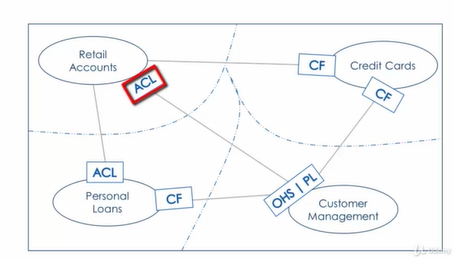

\newpage
\thispagestyle{empty}

\tableofcontents

<!---->
<!--Tóm tắt nội dung đồ án-->
<!---->
<!--Đánh giá và thảo luận-->
<!---->

<!---->

<!---->

<!---->

Kiến trúc kiến trúc nguyên khối, dù đã phục vụ hiệu quả trong quá khứ, nhưng nó bắt đầu gặp khó khăn đối mặt với sự phức tạp, khả năng mở rộng hạn chế, và khả năng đáp ứng linh hoạt với thay đổi nhanh chóng trong yêu cầu kinh doanh.

<!--RJSX-->

<!---->
<!---->
<!---->
<!---->
<!---->

Hiện nay, các tổ chức doanh nghiệp có nhu cầu thay đổi, phát triển liên tục từ đó hoạt động kinh doanh yêu cầu thay đổi và sự đổi mới nhanh chóng hệ thống và dự án với Nhu Cầu và Mong Đợi của Khách Hàng.

<!--Ví dụ-->
<!--Microsoft chuyển từ bán phần mềm đóng gói sang mô hình đăng ký.-->
<!--Amazon từ hiệu sách trực tuyến thành thị trường cho nhà cung cấp khác.-->
<!--Nefifc-->
<!--Baemin-->
<!--hình 1 triệu dịch vụ Amazon và Netflix-->

=> Kiến trúc của Microserrvice giải quyết những thách thức và giúp chuyển đổi nhanh chóng

Một điểm quan trọng cần lưu ý là nhóm kiến ​​trúc dịch vụ vi mô phải tạo ra phạm vi kinh doanh phù hợp cho từng dịch vụ vi mô để duy trì tính độc lập.

<!--Một điều quan trọng cần lưu ý là để tận dụng tối đa kiến ​​trúc dịch vụ vi mô, điều quan trọng đối với nhóm dịch vụ vi mô là phải tạo ra mã nghiệp vụ phù hợp cho từng máy chủ vi mô.-->
<!--Nếu không thực hiện đúng sẽ dẫn đến tình trạng các nhóm phụ thuộc lẫn nhau và điều đó sẽ dẫn đến mất đi lợi thế của kiến ​​trúc dịch vụ vi mô.-->
<!--Và đây là lúc thiết kế Theo nhu cầu xuất hiện. Bối cảnh giới hạn của thiết kế hướng miền là sự thể hiện phạm vi kinh doanh của dịch vụ vi mô.-->

=> mẫu thiết kế hướng miền sử dụng để xây dựng các dịch vụ vi mô.

<!--mỗi dịch vụ vi mô được gán cho một nhóm nhỏ.-->
<!--và các nhóm này được hỗ trợ bởi các chuyên gia tên miền.-->

<!--Bằng cách này, sự kết hợp giữa thiết kế hướng miền và kiến trúc vi dịch vụ giúp xác định và phân loại các chức năng cụ thể của quy trình hóa đơn điện tử, đảm bảo tính nhất quán, linh hoạt, và hiệu suất trong việc đáp ứng yêu cầu nghiệp vụ liên quan.-->
<!---->
<!---->
<!---->
<!---->
<!---->
<!---->
<!---->
<!---->
<!---->
<!---->
<!---->
<!---->
<!---->

<!--1. **Tạo và Lưu Trữ Hóa Đơn: **-->
<!--2. **Thông Tin Cơ Bản của Hóa Đơn: **-->
<!--3. **Chữ Ký Số và Xác Minh Chữ Ký: **-->
<!--4. **Quản Lý Mẫu Hóa Đơn: **-->
<!--5. **Phân Quyền và Bảo Mật: **-->
<!--6. **Gửi và Nhận Hóa Đơn: **-->
<!--7. **Quản Lý Trạng Thái Hóa Đơn: **-->
<!--8. **Tích Hợp Với Hệ Thống Khác: **-->
<!--9. **Bảo Dưỡng và Backup: **-->
<!--10. **Tương Thích Pháp Luật và Chuẩn Mực: **-->

https: //www.youtube.com/watch? v=6jSk_J7RA24

https: //www.youtube.com/watch? v=Jc-lGeDuphg

https: //www.youtube.com/watch? v=UXHzxX4png0

https: //www.youtube.com/watch? v=glZs4QFfwbc

https: //www.actioncoachhanoiwest.com/post/business-model-canvas-la-gi-business-model-canvas-mau-cho-doanh-nghiep-moi-nhat-2020

Business Model Canvas

<!--mục đích của bài giảng này là cung cấp cho bạn cái nhìn tổng quan về bức vẽ mô hình kinh doanh.-->

<!--! phân khúc khách hàng (Customer Segments)-->

Các phân khúc khách hàng là lý do doanh nghiệp tồn tại, vì vậy người ta phải suy nghĩ cẩn thận xem khách hàng là ai.

<!--VD: cá nhân, doanh nghiệp-->

<!--! phương án giá trị (Value Propositions)-->

Bây giờ, loại giá trị nào đang mang lại cho mỗi khách hàng này? Đó là điều chúng ta cần phải suy nghĩ.

<!--VD: lợi ích hóa đơn điện tử: nhanh, cháy, .....-->

<!--! nguồn tiềm lực chính (Key Resources)-->

Có nhiều nguồn lực mà doanh nghiệp yêu cầu, nhưng bạn cần suy nghĩ về những nguồn lực cần thiết cho việc đề xuất giá trị.
Nói cách khác, có thể có nhiều nguồn lực mà doanh nghiệp cần, nhưng hãy nghĩ về những nguồn lực quan trọng mà doanh nghiệp không thể tồn tại nếu không có.

<!--Không có tài xế, Uber không thể mang lại giá trị cho khách hàng.-->

<!--! Đối tác chính (Key Partnerships)-->

Tiếp theo là các đối tác chính là nhà cung cấp các nguồn lực chính cho doanh nghiệp.

<!--Trong trường hợp của Uber, chính tài xế là người sở hữu ô tô và những tài xế này trao quyền cho khách hàng. Tiếp theo là các nhà cung cấp công nghệ.-->
<!--Uber không tạo ra tất cả các công nghệ cần thiết cho nền tảng của mình. Nó mua công nghệ từ các nhà cung cấp hoặc đối tác khác, chẳng hạn như nhà cung cấp công nghệ lập bản đồ.-->
<!--Nó cũng phải có được sự cho phép hoạt động từ cơ quan nhà nước. Nếu không có sự cho phép phù hợp, Uber sẽ không được phép hoạt động.-->

<!--! công việc chính (Key Activities)-->

Doanh nghiệp cần thực hiện nhiều hoạt động theo các hoạt động trọng tâm. Bạn cần suy nghĩ về những hoạt động mà doanh nghiệp thực hiện để tạo ra giá trị cho khách hàng.

<!--Uber xây dựng và duy trì nền tảng và phần mềm.
Uber luôn tìm kiếm tài xế mới nên việc tuyển dụng tài xế là một trong những hoạt động trọng tâm.-->
<!--Và sau đó là các vấn đề pháp lý. Ý tôi là, nếu bạn chú ý đến tin tức trên Google, bạn sẽ thấy rằng Uber luôn tham gia vào một số cuộc chiến pháp lý với chính quyền tiểu bang và thành phố.-->

<!--! Quan hệ khách hàng (Customer Relationships)-->

Giữ chân khách hàng là một trong những điều quan trọng nhất đối với bất kỳ doanh nghiệp nào. Và để giữ chân khách hàng, bạn cần đảm bảo rằng khách hàng hài lòng với dịch vụ bạn đang cung cấp và mối quan hệ mà bạn có với họ.
Vì vậy, trong mối quan hệ khách hàng, người ta phải suy nghĩ về loại mối quan hệ được cung cấp cho từng phân khúc khách hàng.

<!--Vì vậy, trong trường hợp đó là ai, hệ thống xếp hạng và phản hồi dành cho khách hàng và tài xế, thì sẽ có một cơ chế tự phục vụ để khách hàng và tài xế có thể nhận được dịch vụ và hỗ trợ từ bên kia.-->
<!--Uber cũng cung cấp hỗ trợ cho khách hàng và tài xế bằng email, thậm chí bằng điện thoại. Ví dụ: tài xế Uber có hỗ trợ qua điện thoại 24/7 bên cạnh vỏ bọc.-->

<!--! Dòng doanh thu (Revenue Stream)-->

Dòng doanh thu dòng tiền mô tả dòng doanh thu của doanh nghiệp. Để làm gì?

<!--Khách hàng đã trả tiền trong trường hợp Uber, đó là khoản hoa hồng phù hợp mà chúng ta sẽ nhận được từ nhau, đúng không.-->
<!--Phí bảo hiểm cho một số loại phù hợp, giá tìm kiếm và phí hủy, cơ cấu chi phí mô tả dòng tiền ra.-->

<!--! Cơ cấu chi phí (Cost Structure)-->

Đây là những chi phí mà doanh nghiệp phải chịu khi thực hiện các hoạt động chính

<!--trong trường hợp Uber. Đó là tiếp thị, pháp lý, phát triển công nghệ, lương nhân viên.-->
<!--Cuối cùng nhưng không kém phần quan trọng, chúng tôi sẽ chi rất nhiều cho hoạt động R&D.-->

<!--! Kênh cung cấp (Channels)-->

Tiếp theo là các kênh mà khách hàng muốn tiếp cận.

<!--Đó là ứng dụng di động mà chúng tôi sẽ cung cấp và một số ứng dụng của bên thứ ba cho phép khách hàng sử dụng các dịch vụ.-->

Xem video hướng dẫn phân tích: 4\3
