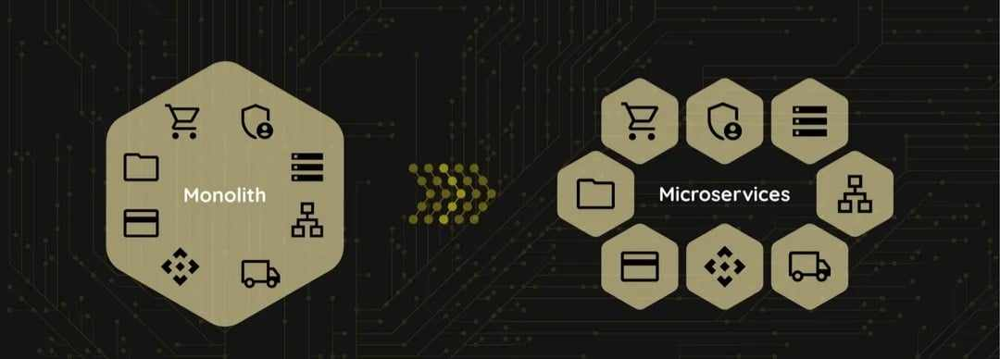
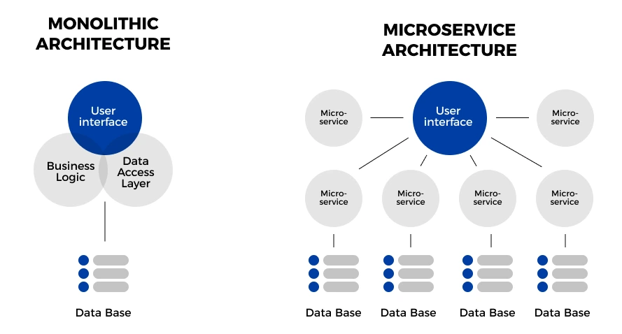
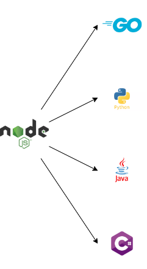
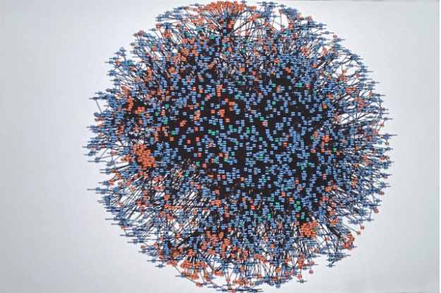
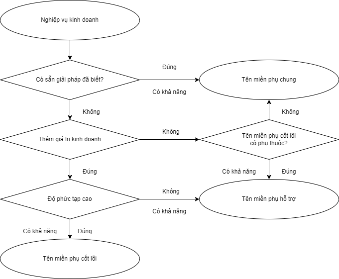
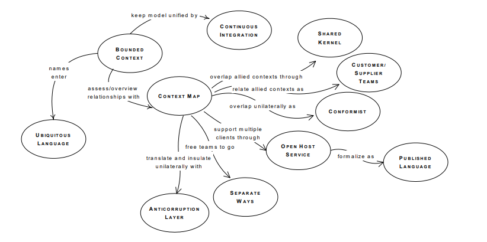
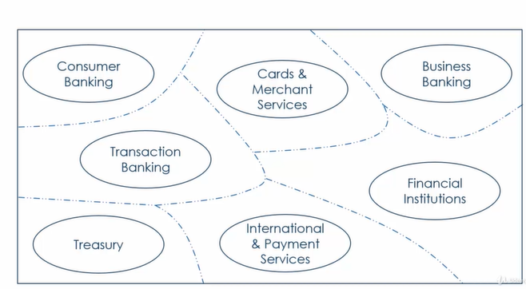
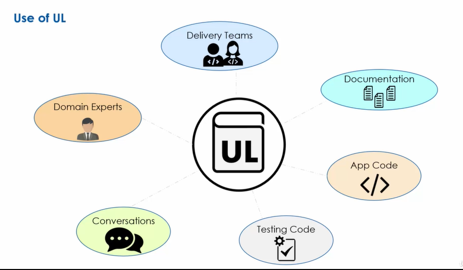
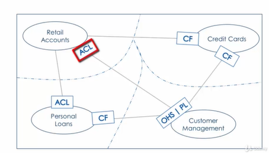
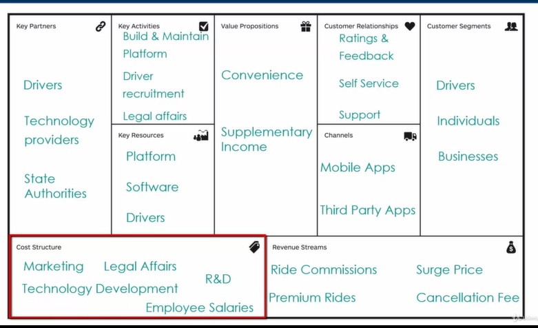

# 2. Giới thiệu chung

Trong thời đại ngày nay, nhu cầu phát triển ứng dụng và hệ thống ngày càng tăng, đặt ra thách thức đối với kiến trúc phần mềm. Kiến trúc nguyên khối đã phục vụ hiệu quả trong quá khứ, nhưng kiến trúc này bắt đầu gặp khó khăn đối mặt với sự phức tạp, khả năng mở rộng và khả năng đáp ứng linh hoạt với thay đổi nhanh chóng trong yêu cầu kinh doanh.

Kiến trúc vi dịch vụ là giải pháp cho những thách thức này. Kiến trúc vi dịch vụ chia dự án thành những dịch vụ nhỏ độc lập, mỗi dịch vụ chịu trách nhiệm về một chức năng cụ thể. Từ đó, giảm sự phức tạp của dự án tăng tính linh hoạt và dễ dàng quản lý.

Việc vận dụng kết hợp giữa kiến trúc vi dịch vụ và thiết kế hướng miền là một cách tiếp cận toàn diện, giúp xác định và tổ chức các dịch vụ dựa trên việc hiểu rõ về lĩnh vực kinh doanh. Thiết kế hướng miền giúp xây dựng mô hình dựa trên yêu cầu nghiệp vụ thực tế, giúp dự án phản ánh đúng các quy trình kinh doanh.

## 2.1. Giới thiệu về bài toán hóa đơn điện tử

Bài toán hóa đơn điện tử là một phần quan trọng của quá trình chuyển đổi số. Trong quá khứ, mọi người thường sử dụng hóa đơn giấy truyền thống. Ngày nay, khi có quy định kế toán và quản lý tài chính, hóa đơn điện tử đã trở nên phổ biến giúp giảm bớt sự phụ thuộc vào giấy tờ. Cùng với sự phát triển của công nghệ đã giúp hiệu quả công việc và tối ưu hóa quy trình kế toán và tài chính.

Theo em tìm hiểu có các căn cứ pháp lý liên quan sau đây:

### 2.1.1. Hóa đơn

> Theo quy định tại khoản 1 Điều 3 Nghị định 123/2020/NĐ-CP:

Hóa đơn là chứng từ kế toán do tổ chức, cá nhân bán hàng hóa, cung cấp dịch vụ lập, ghi nhận thông tin bán hàng hóa, cung cấp dịch vụ. Hóa đơn được thể hiện theo hình thức hóa đơn điện tử hoặc hóa đơn do cơ quan thuế đặt in.

### 2.1.2. Hóa đơn điện tử

> Theo quy định tại khoản 2 Điều 3 Nghị định 123/2020/NĐ-CP:

Hóa đơn điện tử là hóa đơn có mã hoặc không có mã của cơ quan thuế được thể hiện ở dạng dữ liệu điện tử do tổ chức, cá nhân bán hàng hóa, cung cấp dịch vụ lập bằng phương tiện điện tử để ghi nhận thông tin bán hàng hóa, cung cấp dịch vụ theo quy định của pháp luật về kế toán, pháp luật về thuế, bao gồm cả trường hợp hóa đơn được khởi tạo từ máy tính tiền có kết nối chuyển dữ liệu điện tử với cơ quan thuế, trong đó:

a. Hóa đơn điện tử có mã của cơ quan thuế là hóa đơn điện tử được cơ quan thuế cấp mã trước khi tổ chức, cá nhân bán hàng hóa, cung cấp dịch vụ gửi cho người mua. Mã của cơ quan thuế trên hóa đơn điện tử bao gồm số giao dịch là một dãy số duy nhất do hệ thống của cơ quan thuế tạo ra và một chuỗi ký tự được cơ quan thuế mã hóa dựa trên thông tin của người bán lập trên hóa đơn.

b. Hóa đơn điện tử không có mã của cơ quan thuế là hóa đơn điện tử do tổ chức bán hàng hóa, cung cấp dịch vụ gửi cho người mua không có mã của cơ quan thuế.

### 2.1.3. Bắt buộc sử dụng hóa đơn điện tử từ 01/07/2022.

> Theo quy định tại khoản 1 Điều 59 Nghị định 123/2020/NĐ-CP:

Nghị định này có hiệu lực thi hành kể từ ngày 01 tháng 7 năm 2022, khuyến khích cơ quan, tổ chức, cá nhân đáp ứng điều kiện về hạ tầng công nghệ thông tin áp dụng quy định về hóa đơn, chứng từ điện tử của Nghị định này trước ngày 01 tháng 7 năm 2022.

=> Theo quy định của Chính phủ và Bộ Tài Chính, tất cả các doanh nghiệp, tổ chức và hộ kinh doanh đều bắt buộc phải chuyển từ sử dụng hóa đơn giấy sang hóa đơn điện tử kể từ tháng 07/2022. Vì vậy, nhu cầu sử dụng và xử lý hóa đơn điện tử trở nên rất lớn. Do đó, em đã chọn chủ đề:

<!--!"Xây dựng kiến trúc vi dịch vụ cho hệ thống quản lý hóa đơn điện tử".-->

### 2.1.4. Bản thể hiện của hóa đơn điện tử:

### 2.1.5. Lưu trữ hóa đơn điện tử

> Theo quy định tại khoản 1 Điều 11 Thông tư 32/2011/TT-BTC:

Người bán, người mua hàng hoá, dịch vụ sử dụng hóa đơn điện tử để ghi sổ kế toán, lập báo cáo tài chính phải lưu trữ hóa đơn điện tử theo thời hạn quy định của Luật Kế toán. Trường hợp hóa đơn điện tử được khởi tạo từ hệ thống của tổ chức trung gian cung cấp giải pháp hóa đơn điện tử thì tổ chức trung gian này cũng phải thực hiện lưu trữ hóa đơn điện tử theo thời hạn nêu trên.

> Theo quy định tại khoản 5 Điều 41 Luật số 88/2015/QH13

1. Tài liệu kế toán phải được lưu trữ theo thời hạn sau đây:

a. Ít nhất là 05 năm đối với tài liệu kế toán dùng cho quản lý, điều hành của đơn vị kế toán, gồm cả chứng từ kế toán không sử dụng trực tiếp để ghi sổ kế toán và lập báo cáo tài chính.

b. Ít nhất là 10 năm đối với chứng từ kế toán sử dụng trực tiếp để ghi sổ kế toán và lập báo cáo tài chính, sổ kế toán và báo cáo tài chính năm, trừ trường hợp pháp luật có quy định khác.

c. Lưu trữ vĩnh viễn đối với tài liệu kế toán có tính sử liệu, có ý nghĩa quan trọng về kinh tế, an ninh, quốc phòng.

=> Như vậy, hóa đơn điện tử dạng tệp XML sẽ được lưu trữ trên hệ thống hóa đơn điện tử của nhà cung cấp hoặc doanh nghiệp có thể tải về để tự lưu trữ. Thời gian lưu trữ là 10 năm theo quy định của pháp luật.

### 2.1.6. Một số lợi ích của hóa đơn điện tử:

Giúp tiết kiệm chi phí in ấn, lưu trữ và bảo quản.
Loại bỏ rủi ro cháy, hỏng hoặc mất và dễ dàng sao lưu.
Dễ dàng linh hoạt trong việc tra cứu, phát hành, quản lý và tạo báo cáo.
Tối ưu hóa quá trình kế toán (giảm sai sót và tiết kiệm thời gian) và giảm thủ tục giấy tờ.
Theo dõi tình hình tài chính của công ty (doanh thu, chi phí, lợi nhuận).
Tuân thủ các quy định về thuế và pháp luật.
Thể hiện tính minh bạch trong quá trình kinh doanh (bảo vệ quyền lợi của cả người mua và người bán).

## 2.2. Giới thiệu về kiến trúc vi dịch vụ

### 2.2.1. Kiến trúc nguyên khối

Trước khi kiến trúc vi dịch vụ trở nên phổ biến, kiến trúc nguyên khối đã được áp dụng rộng rãi trong kiến trúc phần mềm truyền thống. Kiến trúc nguyên khối là kiến trúc phần mềm trong đó toàn bộ dự án được xây dựng và triển khai như một đơn vị duy nhất.

Ví dụ: Mô hình MVC (Model-View-Controller) là một trong những dạng của kiến trúc nguyên khối.
Trong mô hình này, ứng dụng được chia thành ba thành phần chính:
Mô hình (Model): Đại diện cho dữ liệu và logic xử lý dữ liệu.
Giao diện (View): Đại diện cho giao diện người dùng.
Bộ điều khiển (Controller): Nhận yêu cầu người dùng thông qua View, sau đó tương tác với Model để làm việc với dữ liệu.

### 2.2.2. Kiến trúc vi dịch vụ

Kiến trúc vi dịch vụ chia dự án thành các thành phần nhỏ hơn được gọi là các dịch vụ.
Các dịch vụ này chịu trách nhiệm cho một chức năng cụ thể nhằm hiện thực hóa khả năng kinh doanh cụ thể.

Các dịch vụ này độc lập về ngôn ngữ lập trình, CSDL, triển khai, ...
Các dịch vụ này tương tác với nhau qua hạ tầng mạng.




### 2.2.3. Một số đặc điểm và ưu điểm của kiến trúc vi dịch vụ

Kiến trúc vi dịch vụ có nhiều ưu điểm đặc biệt với các dự án có quy mô lớn và phức tạp.

Kiến trúc vi dịch vụ phân chia dự án thành các dịch vụ nhỏ.
Giúp việc phát triển và quản lý dễ dàng hơn.
Dễ dàng mở rộng hệ thống.
Tận dụng sử dụng tài nguyên cho từng dịch vụ.
Tập trung yêu cầu nghiệp vụ trong dịch vụ dẫn đến tốc độ định giá doanh nghiệp nhanh hơn.

Vì các dịch vụ được phân chia là độc lập.

<!--Nhìn chung, điều đó có nghĩa là I.T. các nhóm không cần phải đi sâu vào mọi khả năng kinh doanh. Họ có thể tập trung vào năng lực kinh doanh mà họ đang xây dựng trong vi dịch vụ của mình.-->
<!--Nhưng giả sử hoạt động kinh doanh cho vay và thế chấp đang trải qua một sự chuyển đổi nghiêm trọng nào đó, trong trường hợp đó, nhóm cho vay và thế chấp có thể quyết định phát hành vi dịch vụ của họ mỗi ngày.-->

Các nhóm phát triển riêng dẫn tới tốc độ phát triển thay đổi nhanh.
Giảm thiểu ràng buộc và tăng tính linh hoạt của hệ thống.
Giảm chi phí và thời gian kiểm thử do ít ràng buộc.
Hệ thống có khả năng chịu lỗi cao tăng độ tin cậy.

Kiến trúc vi dịch vụ sử dụng đa ngôn ngữ và công nghệ khác nhau.
Tận dụng hiệu quả thế mạnh của từng ngôn ngữ, công nghệ phù hợp nhất cho yêu cầu nghiệp vụ cụ thể.

Ví dụ: Mỗi dịch vụ sử dụng ngôn ngữ lập trình nhau khác như: NodeJS, Go, Python, Java, CSharp, ...



### 2.2.4. Một số nhược điểm và thách thức của kiến trúc vi dịch vụ

Tuy nhiên, kiến trúc vi dịch vụ cũng có nhiều thách thức.

<!--Chịu ảnh hưởng của đường truyền mạng.-->

<!--Khả năng kiểm soát giao dịch (transaction).-->

<!--Tính nhất quán và toàn vẹn của dữ liệu giữa các dịch vụ.-->

Giám sát giữa các dịch vụ.

Bảo mật giao tiếp giữa các dịch vụ.

<!--Phát hiện lỗi và sửa lỗi khó khăn.-->

Ràng buộc về thứ tự sự kiện.
Đồng bộ đồng hồ thời gian.

<!--Chi phí xây dựng, quản lí vận hành lớn.-->

<!--@Có thể thêm phần truyền thông trực tiếp, gián tiếp-->

## 2.3. Giới thiệu về thiết kế hướng miền

<!--Lý do tiếp theo là một trong những lý do lớn nhất khiến tổ chức cần chuyển đổi nhu cầu và mong đợi của khách hàng liên tục thay đổi để duy trì và mở rộng cơ sở khách hàng của mình.-->
<!--Các tổ chức cần điều chỉnh hoạt động kinh doanh của mình để đáp ứng nhu cầu và mong đợi của khách hàng. Các doanh nghiệp bỏ qua kỳ vọng của khách hàng có xu hướng thua đối thủ cạnh tranh.-->
<!--Vì vậy, điều xảy ra với những doanh nghiệp không chuyển đổi, câu trả lời ngắn gọn cho câu hỏi này là những doanh nghiệp không chuyển đổi sẽ không thể tồn tại.-->

<!--Một điểm quan trọng cần ghi nhớ là chuyển đổi không phải là sáng kiến ​​hay nhiệm vụ chỉ diễn ra một lần. Các doanh nghiệp cần thay đổi liên tục và điều này đòi hỏi những thay đổi nhanh chóng đối với hệ thống và ứng dụng của họ.-->

<!--Một thách thức chung mà các doanh nghiệp phải đối mặt trong hành trình chuyển đổi là cách xây dựng phần mềm cũ cản trở hoặc gây khó khăn cho các tổ chức trong việc chuyển đổi.-->

Trong quá trình hoạt động, không phải mọi doanh nghiệp đều sẽ giữ nguyên mô hình kinh doanh được đưa ra ban đầu của mình. Khi quy mô thị trường thay đổi thì việc chuyển đổi mô hình kinh doanh là điều cần thiết. Chuyển đổi kinh doanh như một công cụ linh hoạt giúp các doanh nghiệp có thể phát triển và tồn tại giữa các đối thủ của mình.

Ví dụ:
Amazon từ hiệu sách trực tuyến thành thị trường cho nhà cung cấp khác như: Thương mại điện tử (E-commerce), Dịch vụ đám mây (Cloud Computing), ...

<!--!Thêm google-->




<!--Hình kiến trúc vi dịch vụ của Amazon-->
<!--!Thêm google-->

Gần đây, Baemin dịch vụ giao đồ ăn đã rời khỏi thị trường Việt Nam cũng do sức ép từ các đối thủ khác khiến Baemin khó cạnh tranh trong mảng kinh doanh cốt lõi là giao đồ ăn. Các đối thủ này không chỉ cung cấp dịch vụ giao đồ ăn mà còn có đặt xe, giao hàng, ...


<!--Hình Baemin đã rời khỏi thị trường Việt Nam-->

=> Hiện nay, các tổ chức doanh nghiệp có nhu cầu phát triển chuyển đổi kinh doanh để có thể tồn tại và phát triển khi thị trường thay đổi. Từ đó, đáp ứng nhu cầu của khách hàng, giúp mang đến ưu thế cạnh tranh so với các đối thủ. Do đó cần hệ thống chuyển đổi nhanh chóng đáp ứng nhu cầu của dự án và mong đợi của khách hàng.
=> Kiến trúc vi dịch vụ giải quyết những thách thức và hỗ trợ doanh nghiệp chuyển đổi dễ dàng.

Tuy nhiên, để xây dựng được kiến ​​trúc vi dịch vụ tốt cần phải tạo ra các dịch vụ nhỏ phù hợp và duy trì tính độc lập. Nếu không thực hiện đúng các nhóm phụ thuộc lẫn nhau và mất đi lợi thế của kiến ​​trúc vi dịch vụ.

Và từ đó, mẫu thiết kế hướng miền sử dụng để phân tích xây dựng kiến ​​trúc vi dịch vụ.
Thiết kế hướng miền xác định và tổ chức các dịch vụ dựa trên việc hiểu rõ về lĩnh vực kinh doanh, giúp dự án phản ánh đúng các quy trình và quy tắc kinh doanh.

# 3. Yêu cầu nghiệp vụ

Trình bày nội dung yêu cầu nghiệp vụ

# Yêu cầu nghiệp vụ

Yêu cầu nghiệp vụ Xác định nội dung, phạm vi, mục tiêu và chức năng mong muốn của hệ thống.

## Yêu cầu nghiệp vụ của bài toán phụ

Trang web "https: //hoadondientu.gdt.gov.vn" là trang web do Tổng Cục Thuế quản lý và sử dụng để thực hiện các quy trình liên quan đến thuế điện tử. Thực tế, yêu cầu đăng ký chính thức từ Tổng Cục Thuế dành cho cá nhân và doanh nghiệp. Vì em không có tài khoản chính thức nên ở đồ án này, em sẽ tạo Tổng Cục Thuế Demo - một phiên bản giả lập của hệ thống chính thức, dành cho mục đích học tập phục vụ cho bài toán chính là "Xây dựng kiến trúc vi dịch vụ cho bài toán hóa đơn điện tử".

<!---->

Các chức năng tổng quan của Tổng Cục Thuế Demo

Để đơn giản hóa bài toán, các chức năng trong đồ án này đã thay đổi so với bài toán thực tế trong tài liệu hướng dẫn sử dụng cổng thông tin điện tử của Tổng Cục Thuế cho hóa đơn điện tử:

<!--Bỏ qua xxxxxxxx-->
<!--Bỏ qua xxxxxxxx-->
<!--Bỏ qua xxxxxxxx-->

<!--Hình thức hóa đơn:-->

Có mã của cơ quan thuế
Không có mã của cơ quan thuế

<!--Loại hóa đơn khác nhau:-->

Hóa đơn điện tử giá trị gia tăng
Hóa đơn bán hàng
Hóa đơn bán tài sản công
Hóa đơn bán hàng dự trữ quốc gia
...

<!--Ký số: thông tin chứng thư số là chữ ký số theo đúng quy định của Bộ Thông tin và Truyền thông.-->

<!--Ký hiệu hóa đơn-->

<!--Chức năng: "Lập hóa đơn điều chỉnh"-->

<!--Không có phê duyệt hóa đơn-->

<!--Đọc hóa đơn XML-->

<!--Có mã của cơ quan thuế-->
<!--Không có mã của cơ quan thuế-->

<!--Phát hành hóa đơn điện tử-->

<!--CHƯƠNG V. THÔNG BÁO HÓA ĐƠN CÓ SAI SÓT.............................. 130-->
<!--CHƯƠNG VI. ĐỀ NGHỊ CẤP HÓA ĐƠN THEO LẦN PHÁT SINH ..... 143-->
<!--CHƯƠNG VII. QUẢN LÝ HÓA ĐƠN PHÁT SINH........................-->
<!---->

## Mẫu mail

<!--// NNT nhận được thư điện tử của CQT thông báo tiếp nhận tờ khai đăng ký-->

Trong thời gian 15 phút kể từ khi nhận được tờ khai đăng ký của NNT, Cổng điện tử gửi thư điện tử thông báo về việc tiếp nhận/không tiếp nhận tờ khai đăng ký của NNT.

Nội dung mẫu:

```
Tiêu đề: (Tổng cục thuế Demo) Thông báo về việc tiếp nhận tờ khai đăng ký sử dụng hóa đơn điện tử
Kính gửi: {{Tên NNT}}
Mã số thuế: {{Mã số thuế}}

Căn cứ Tờ khai đăng ký sử dụng hóa đơn điện tử - Ban hành kèm theo Nghị định số 123/2020/NĐ-CP của người nộp thuế (NNT) gửi tới cơ quan thuế ngày {{Ngày nhận}}, cơ quan thuế tiếp nhận Tờ khai đăng ký sử dụng hóa đơn điện tử của NNT, cụ thể như sau:
Tên tờ khai: Tờ khai đăng ký sử dụng hóa đơn điện tử
Mã giao dịch điện tử: {{Mã số thuế + Thời gian}}

Cơ quan thuế thông báo để NNT được biết và thực hiện.
```

<!--NNT nhận được thư điện tử của CQT chấp nhận/không chấp nhận đăng ký sử dụng HĐĐT-->

Trong thời gian 01 ngày làm việc kể từ ngày Cổng điện tử gửi thông báo về việc tiếp nhận, cơ quan thuế quản lý sẽ gửi thông báo về việc chấp nhận/không chấp nhận đăng ký sử dụng hóa đơn điện tử.

Nội dung mẫu chấp nhận đăng ký sử dụng HĐĐT:

```
Tiêu đề: (Tổng cục thuế Demo) Thông báo về việc chấp nhận đăng ký sử dụng hóa đơn điện tử
Kính gửi: {{Tên NNT}}
Mã số thuế: {{Mã số thuế}}

Sau khi xem xét tờ khai đăng ký sử dụng hóa đơn điện tử của NNT gửi đến cơ quan thuế ngày {{Ngày nhận}}.
Cơ quan thuế thông báo chấp nhận đề nghị đăng ký sử dụng hóa đơn điện tử của NNT.

Cơ quan thuế thông báo để NNT được biết và thực hiện.
```

Nội dung mẫu không chấp nhận đăng ký sử dụng HĐĐT:

```
Tiêu đề: (Tổng cục thuế Demo) Thông báo về việc không chấp nhận đăng ký sử dụng hóa đơn điện tử
Kính gửi: {{Tên NNT}}
Mã số thuế: {{Mã số thuế}}

Sau khi xem xét tờ khai đăng ký sử dụng hóa đơn điện tử của NNT gửi đến cơ quan thuế ngày {{Ngày nhận}}.
Cơ quan thuế thông báo không chấp nhận đề nghị đăng ký sử dụng hóa đơn điện tử của NNT.

Cơ quan thuế thông báo để NNT được biết và thực hiện.
```

<!--NNT nhận được Thông báo tài khoản sử dụng tra cứu HĐĐT trên cổng thông tin điện tử của TCT-->

Sau khi NNT nhận được thông báo về việc chấp nhận đăng ký sử dụng hóa đơn điện tử, cơ quan thuế gửi thông báo tài khoản sử dụng của NNT qua thư điện tử bao gồm Tên tài khoản và Mật khẩu.

Nội dung mẫu:

```
Tiêu đề: (Tổng cục thuế Demo) Thông báo tài khoản sử dụng tra cứu HĐĐT trên cổng thông tin điện tử của TCT
Kính gửi: {{Tên NNT}}
Mã số thuế: {{Mã số thuế}}

Sau khi xem xét tờ khai đăng ký sử dụng hóa đơn điện tử cơ quan thuế tiếp nhận ngày {{Ngày nhận}}.
Cơ quan thuế thông báo chấp nhận đề nghị đăng ký sử dụng hóa đơn điện tử của NNT và gửi thông tin tài khoản sử dụng tra cứu HĐĐT trên cổng thông tin điện tử của TCT như sau:
Tên tài khoản: {{admin + Mã số thuế}}
Mật khẩu: {{Mật khẩu}}

Cơ quan thuế thông báo để NNT được biết và thực hiện.
```

<!---->
<!---->
<!---->
<!---->
<!---->
<!---->
<!---->
<!---->
<!---->
<!---->

<!--NNT nhận được thư điện tử của CQT thông báo tiếp nhận tờ khai đăng ký thay đổi-->

Trong thời gian 15 phút kể từ khi nhận được tờ khai đăng ký của NNT, Cổng điện tử gửi thư điện tử thông báo về việc tiếp nhận/không tiếp nhận tờ khai đăng ký thay đổi thông tin đăng ký sử dụng của NNT.

Nội dung mẫu:

```
Tiêu đề: (Tổng cục thuế Demo) Thông báo về việc tiếp nhận tờ khai đăng ký thay đổi thông tin đăng ký sử dụng của NNT
Kính gửi: {{Tên NNT}}
Mã số thuế: {{Mã số thuế}}

Căn cứ Tờ khai đăng ký thay đổi thông tin đăng ký sử dụng của NNT gửi tới cơ quan thuế ngày {{Ngày nhận}}, cơ quan thuế tiếp nhận Tờ khai đăng ký sử dụng hóa đơn điện tử của NNT, cụ thể như sau:
Tên tờ khai: Tờ khai đăng ký thay đổi thông tin đăng ký sử dụng của NNT
Mã giao dịch điện tử: {{Mã số thuế + Thời gian}}

Cơ quan thuế thông báo để NNT được biết và thực hiện.
```

<!--NNT nhận được thư điện tử của CQT chấp nhận/không chấp nhận đăng ký sử dụng HĐĐT-->

Trong thời gian 01 ngày làm việc kể từ ngày Cổng điện tử gửi thông báo về việc tiếp nhận, cơ quan thuế quản lý sẽ gửi thông báo về việc chấp nhận/không chấp nhận đăng ký thay đổi thông tin đăng ký sử dụng của NNT.

Nội dung mẫu chấp nhận đăng ký thay đổi thông tin đăng ký sử dụng của NNT

```
Tiêu đề: (Tổng cục thuế Demo) Thông báo về việc chấp nhận đăng ký thay đổi thông tin đăng ký sử dụng của NNT
Kính gửi: {{Tên NNT}}
Mã số thuế: {{Mã số thuế}}

Sau khi xem xét tờ khai đăng ký thay đổi thông tin đăng ký sử dụng của NNT gửi đến cơ quan thuế ngày {{Ngày nhận}}.
Cơ quan thuế thông báo chấp nhận đề nghị đăng ký thay đổi thông tin đăng ký sử dụng của NNT.

Cơ quan thuế thông báo để NNT được biết và thực hiện.
```

Nội dung mẫu không chấp nhận đăng ký thay đổi thông tin đăng ký sử dụng của NNT

```
Tiêu đề: (Tổng cục thuế Demo) Thông báo về việc không chấp nhận đăng ký thay đổi thông tin đăng ký sử dụng của NNT
Kính gửi: {{Tên NNT}}
Mã số thuế: {{Mã số thuế}}

Sau khi xem xét tờ khai đăng ký thay đổi thông tin đăng ký sử dụng của NNT gửi đến cơ quan thuế ngày {{Ngày nhận}}.
Cơ quan thuế thông báo không chấp nhận đề nghị đăng ký thay đổi thông tin đăng ký sử dụng của NNT.

Cơ quan thuế thông báo để NNT được biết và thực hiện.
```

<!---->
<!---->
<!---->
<!---->
<!---->
<!---->
<!---->

<!--Sau khi gửi yêu cầu lấy lại mật khẩu NNT sẽ nhận được thông báo của CQT qua gửi thư điện tử-->

Nội dung mẫu:

```
Tiêu đề: (Tổng cục thuế Demo) Thông báo về việc lấy lại mật khẩu
Kính gửi: {{Tên NNT}}
Mã số thuế: {{Mã số thuế}}

Sau khi xem xét yêu cầu lấy lại mật khẩu của NNT gửi đến cơ quan thuế ngày {{Ngày nhận}}.
Cơ quan thuế gửi thông tin tài khoản sử dụng tra cứu HĐĐT trên cổng thông tin điện tử của TCT như sau:
Tên tài khoản: {{Tên tài khoản}}
Mật khẩu mới: {{Mật khẩu mới}}

Cơ quan thuế thông báo để NNT được biết và thực hiện.
```

Các chức năng tổng quan của Tổng Cục Thuế Demo bao gồm:

<!--QUẢN LÝ TÀI KHOẢN-->

Đăng ký sử dụng hóa đơn điện tử
Thay đổi đăng ký sử dụng hóa đơn điện tử
Đăng nhập tài khoản
Đăng xuất tài khoản
Đổi mật khẩu
Quên mật khẩu

<!--QUẢN LÝ HỆ THỐNG-->

Quản lý vai trò
Quản lý người dùng

<!--QUẢN LÝ DANH MỤC-->

Danh mục khách hàng
Danh mục hàng hóa

<!--QUẢN LÝ HÓA ĐƠN ĐIỆN TỬ-->

Lập hóa đơn mới
Lập hóa đơn thay thế
Hủy hóa đơn

<!--TRA CỨU HÓA ĐƠN-->

Tra cứu hóa đơn khi NNT chưa đăng nhập
Tra cứu hóa đơn khi NNT đã đăng nhập

<!--GỬI PHẢN HỒI QUA THƯ ĐIỆN TỬ-->

Gửi thông tin của TCT đến NNT

# Chi tiết các chức năng của Tổng cục thuế Demo:

Chi tiết các chức năng của Tổng cục thuế Demo:

QUẢN LÝ TÀI KHOẢN

Quản lý tài khoản là một chức năng phổ biến trong nhiều ứng dụng. Chức năng này đảm bảo tính bảo mật và an toàn trong việc sử dụng tài khoản.

<!--Chức năng: "Đăng ký sử dụng hóa đơn điện tử"-->

NNT nhập MST có 10 ký tự cho cá nhân, doanh nghiệp hoặc 14 ký tự cho chi nhánh của doanh nghiệp với định dạng "Mã số thuế doanh nghiệp-Mã chi nhánh".
Ví dụ:
Mã số thuế 10 ký tự: 0123456789
Mã số thuế 14 ký tự: 0123456789-001

Hệ thống tự động hiển thị thông tin Đăng ký thuế của NNT bao gồm "Tên của NNT", "Mã cơ quan thuế quản lý" và "Tên cơ quan thuế quản lý".

Tiếp theo, NNT nhập các thông tin hợp lệ: "Người liên hệ", "Điện thoại liên hệ", "Địa chỉ liên hệ", "Thư điện tử".

Cuối cùng, NNT gửi đăng ký với thông tin "Ngày thực hiện" là ngày NNT đang đăng ký hóa đơn điện tử.

Sau khi gửi thông tin đăng kí NNT sẽ nhận được thông báo làm việc của CQT qua gửi thư điện tử về việc tiếp nhận và chấp nhận đăng ký, cùng với tài khoản và mật khẩu cho NNT.

<!--// Nếu mã số thuế không đúng định dạng, hệ thống sẽ thông báo: "Mã số thuế phải có độ dài 10 hoặc 14 ký tự và đúng định dạng".-->
<!--// Nếu mã số thuế tồn tại, hệ thống kiểm tra xem NNT đã đăng ký sử dụng hóa đơn điện tử khác chưa. Nếu đã tồn tại tờ khai đăng ký, hệ thống thông báo: "Đã tồn tại tờ khai đăng ký sử dụng hóa đơn điện tử khác của NNT đã được cơ quan thuế chấp nhận".-->

<!--// Người liên hệ: phải chứa một chuỗi kí tự và không được để trống.-->
<!--// Điện thoại liên hệ: phải chứa một chuỗi kí tự số và dấu "+" ở đầu chuỗi (nếu có) và không được để trống.-->
<!--// Địa chỉ liên hệ: phải chứa một chuỗi kí tự và không được để trống.-->
<!--// Thư điện tử: phải chứa một chuỗi kí tự có định dạng email và không được để trống.-->

<!--// Khi NNT nhấn nút "Ký gửi", hệ thống sẽ hiển thị thông báo hỏi "Xác nhận ký gửi" với hai lựa chọn là "Đồng ý" hoặc "Hủy bỏ".-->
<!--// Nếu NNT chọn "Đồng ý", hệ thống sẽ thông báo: "Gửi thông tin đăng ký sử dụng hóa đơn điện tử cho cơ quan thuế thành công".-->

<!---->
<!--Chức năng: "Thay đổi đăng ký sử dụng hóa đơn điện tử"-->

Trong quá trình sử dụng hóa đơn điện tử, khi NNT muốn thay đổi đăng ký sử dụng hóa đơn, họ có thể sử dụng chức năng "Thay đổi đăng ký sử dụng hóa đơn điện tử".

NNT Nhập thông tin có thể thay đổi, bao gồm: Tên NNT, Người liên hệ, Điện thoại liên hệ, Địa chỉ liên hệ, Thư điện tử.
Cuối cùng, NNT gửi đăng ký thay đổi với thông tin "Ngày thực hiện" là ngày NNT đang đăng ký thay đổi hóa đơn điện tử.

Sau khi gửi thông tin thay đổi đăng ký, NNT sẽ nhận được thông báo làm việc từ cơ quan thuế qua thư điện tử về việc tiếp nhận và chấp nhận thay đổi đăng ký cho NNT.

<!--Chức năng: "Đăng nhập tài khoản"-->

Sau khi CQT gửi thư điện tử chứa tài khoản và mật khẩu cho NNT, NNT thực hiện nhập đầy đủ thông tin bao gồm: Tên đăng nhập, Mật khẩu để thực hiện việc đăng nhập vào tài khoản.

<!--Chức năng: "Đăng xuất tài khoản"-->

Chức năng để NNT đăng xuất tài khoản.

<!--Chức năng: "Đổi mật khẩu"-->

NNT cung cấp đầy đủ thông tin bao gồm: Mật khẩu cũ, Mật khẩu mới và Nhập lại mật khẩu mới để thực hiện việc thay đổi mật khẩu.

<!--Chức năng: "Quên mật khẩu"-->

NNT cung cấp đầy đủ thông tin bao gồm: Tên đăng nhập, Thư điện tử. Sau đó, nhấn "Quên mật khẩu" để khôi phục mật khẩu. CQT gửi mật khẩu mới về email của NNT.

<!--QUẢN LÝ HỆ THỐNG-->

<!--Chức năng: "Quản lý vai trò"-->

Người quản trị hệ thống (admin) là một vai trò cố định được phép sử dụng tất cả các chức năng trên Cổng điện tử.
Người quản trị hệ thống có thể thực hiện CRUD "Vai trò" với các thông tin bao gồm: "ID", "Tên vai trò" và "Quyền".

Các quyền bao gồm:
Thay đổi đăng ký sử dụng hóa đơn điện tử
Quản lý vai trò
Quản lý người dùng
Quản lí danh mục
Quản lí hóa đơn
Tra cứu hóa đơn

<!--Chức năng: "Quản lý người dùng"-->

Người quản trị hệ thống có thể thực hiện CRUD "Người dùng" với các thông tin bao gồm: "Tên người dùng", "Mật khẩu", "Điện thoại", "Thư điện tử" và "Vai trò".

<!--QUẢN LÝ DANH MỤC-->

<!--Chức năng: "Danh mục khách hàng"-->

Chức năng này thực hiện CRUD "Khách hàng" có các thông tin: "Mã khách hàng", "Tên khách hàng", "Mã số thuế", "Tên NNT", "Địa chỉ", "SĐT khách hàng", Số tài khoản, Ngân hàng

<!--Chức năng: "Danh mục hàng hóa"-->

Chức năng này thực hiện CRUD "Hàng hóa" có các thông tin: "Mã hàng hóa, dịch vụ", "Tên hàng hóa, dịch vụ", "Đơn vị tính", "Đơn giá", "Thuế suất".

<!--QUẢN LÝ HÓA ĐƠN ĐIỆN TỬ-->

<!--Chức năng: "Lập hóa đơn mới"-->

Nhập thông tin người bán: MST người bán, Tên người bán, Địa chỉ người bán, Số điện thoại người bán.

Nhập thông tin người mua: Mã khách hàng, Tên khách hàng, Mã số thuế, Địa chỉ khách hàng, SĐT khách hàng.

Nhập thông tin hàng hóa, dịch vụ: "Số thứ tự", "Mã hàng hóa, dịch vụ", "Tên hàng hóa, dịch vụ", "Đơn vị tính", "Đơn giá", "Thuế suất" và "Số lượng".

Hệ thống tự động tính toán:

- Ngày lập hóa đơn sẽ tự động là ngày hiện tại khi người lập tạo hóa đơn mới.

- Tổng tiền trước thuế.

- Tổng tiền sau thuế.

<!--Chức năng: "Lập hóa đơn thay thế"-->

Chức năng này cho phép thay đổi các thông tin trong hóa đơn gốc.

Lưu ý:

- Hãy lưu trữ thông tin ID của hóa đơn thay thế trong trạng thái "Bị thay thế" của hóa đơn gốc.

- Hãy lưu trữ thông tin ID của hóa đơn gốc trong trạng thái "Thay thế" của hóa đơn thay thế.

<!--Chức năng: "Hủy hóa đơn"-->

Chức năng này cho phép xóa hóa đơn và các hóa đơn thay thế liên quan.

<!--TRA CỨU HÓA ĐƠN-->

Người sử dụng có thể thực hiện tra cứu hóa đơn trên cổng thông tin điện tử theo 2 cách:
Cách 1: Tra cứu hóa đơn khi NNT chưa đăng nhập
Cách 2: Tra cứu hóa đơn khi NNT đã đăng nhập

<!--Chức năng: "Tra cứu hóa đơn khi NNT chưa đăng nhập"-->

<!--Tra cứu thông tin hóa đơn-->

Người tra cứu nhập thông tin bao gồm: Mã số thuế người bán, Số hóa đơn, Tổng tiền thuế, Tổng tiền thanh toán, Ngày lập hóa đơn.

<!--Kết quả:-->
<!--- Nếu hóa đơn điện tử không hợp lệ, hệ thống sẽ hiển thị thông báo: "Không tồn tại hóa đơn có thông tin trùng khớp với các thông tin tổ chức, cá nhân tìm kiếm”.-->
<!--- Nếu hóa đơn điện tử hợp lệ, hệ thống sẽ hiển thị thông báo: "Tồn tại hóa đơn có thông tin trùng khớp với các thông tin tổ chức, cá nhân tìm kiếm".-->
<!--- Nếu hóa đơn tìm kiếm là hóa đơn thay thế, bị thay thế hệ thống sẽ hiển thị thông tin bổ sung về hóa đơn liên quan: "Hóa đơn này là hóa đơn thay thế cho hóa đơn có ID: {{ID}}" hoặc "Hóa đơn này là hóa đơn bị thay thế của hóa đơn có ID: {{ID}}".-->

<!--Tra cứu thông tin "Mã số thuế"-->

Người tra cứu nhập thông tin bao gồm: Mã số thuế.

<!--Kết quả:-->
<!--- Nếu đã đăng kí, hệ thống sẽ hiển thị thông báo: “MST 0107001729 đã đăng ký sử dụng hóa đơn điện tử theo Nghị định 123/2020/NĐ-CP".-->
<!--- Nếu NNT chưa đăng kí hoặc đã đăng kí nhưng cơ quan thuế có thông báo về việc không được chấp nhận đăng kí sử dụng hóa đơn điện tử, hệ thống sẽ hiển thị thông báo: “MST 0107001728 chưa sử dụng hóa đơn điện tử theo Nghị định 123/2020/NĐ-CP".-->
<!--Chức năng: "Tra cứu hóa đơn khi NNT đã đăng nhập"-->

Cổng điện tử hỗ trợ tra cứu 2 loại hóa đơn là hóa đơn bán ra và hóa đơn mua vào.

Người tra cứu nhập thông tin tra cứu bao gồm: Mã số thuế người bán, Ngày lập hóa đơn và Số hóa đơn.

Cổng điện tử hỗ trợ các chức năng sau: Xem thông tin hóa đơn, In hóa đơn và Xuất hóa đơn (định dạng Excel, XML, PDF).

<!--GỬI PHẢN HỒI QUA THƯ ĐIỆN TỬ-->

<!--- Gửi thông tin làm việc của TCT cho yêu cầu của NNT-->

<!--$ NNT nhận được thư điện tử của CQT thông báo tiếp nhận tờ khai đăng ký-->

<!--$ NNT nhận được thư điện tử của CQT chấp nhận/không chấp nhận đăng ký sử dụng HĐĐT-->

<!--$ NNT nhận được Thông báo tài khoản sử dụng tra cứu HĐĐT trên cổng thông tin điện tử của TCT-->

<!--$ NNT nhận được thư điện tử của CQT thông báo tiếp nhận tờ khai đăng ký thay đổi-->

<!--$ NNT nhận được thư điện tử của CQT chấp nhận/không chấp nhận đăng ký sử dụng HĐĐT-->
<!--Yêu cầu nghiệp vụ của bài toán chính-->

<!--Các chức năng của bài toán chính-->

<!--THÔNG BÁO-->

Chức năng CRUD "Thông báo" bao gồm các thông tin: ID, tiêu đề, nội dung, thời gian.

<!--QUẢN LÝ TÀI KHOẢN-->

Tương tự "Tổng Cục Thuế Demo" với các chức năng sau:

Đăng ký
Đăng nhập
Đăng xuất
Quên mật khẩu
Xem thông tin
Thay đổi thông tin
Đổi mật khẩu

<!--CẤU HÌNH EMAIL-->

Cấu hình bao gồm:

Địa chỉ email
Mật khẩu email

Loại email gửi:

Xác nhận tài khoản mới
Quên mật khẩu
Gửi thông tin hóa đơn cho khách hàng

<!--QUẢN LÝ DANH MỤC-->

Tương tự "Tổng Cục Thuế Demo" bao gồm:

Danh mục khách hàng
Danh mục hàng hóa

<!--QUẢN LÝ HỆ THỐNG-->

Tương tự "Tổng Cục Thuế Demo" nhưng có thêm quyền "Cấu hình Email".

<!--QUẢN LÝ HÓA ĐƠN ĐIỆN TỬ-->

Tương tự "Tổng Cục Thuế Demo"

<!--TRA CỨU HÓA ĐƠN-->

Có 3 cách tra cứu:

Tra cứu 1 hóa đơn theo "Mã hóa đơn"
Tra cứu tất cả hóa đơn bán ra
Tra cứu tất cả hóa đơn mua vào

<!--BÁO CÁO VÀ PHÂN TÍCH HÓA ĐƠN-->

Các chức năng bao gồm:

Số lượng hóa đơn đã sử dụng
Tổng tiền trước thuế
Tổng tiền sau thuế
Tổng số tiền thuế
Số lượng khách hàng
Số lượng sản phẩm

# Tự động

Nghiệp vụ của bài toán chính
Các chức năng của bài toán chính
THÔNG BÁO
CRUD thông báo có (id, tiêu đề, nội dung, thời gian)
TÀI KHOẢN
Sử dụng tài khoản của "Tổng cục Thuế Demo" với các chức năng tương tự Đăng ký, Đăng nhập, Đăng xuất, Quên mật khẩu, Xem thông tin, Thay đổi thông tin, Đổi mật khẩu
CẤU HÌNH EMAIL ĐỂ GỬI HÓA ĐƠN CHO KHÁCH HÀNG

Địa chỉ email
Mật khẩu email
CHỨC NĂNG DANH MỤC
Giống với "Tổng cục Thuế Demo" gồm "Danh mục khách hàng" và "Danh mục hàng hóa"
TRA CỨU HÓA ĐƠN:
Có 3 cách tra cứu:
Tra cứu 1 hóa đơn theo "Mã hóa đơn".
Tra cứu tất cả hóa đơn bán ra.
Tra cứu tất cả hóa đơn mua vào.
BÁO CÁO VÀ PHÂN TÍCH HÓA ĐƠN

Số lượng hóa đơn đã sử dụng
Tổng trước thuế
Tổng sau thuế
Tổng số tiền thuế
Số lượng khách hàng
Số lượng sản phẩm

<!---->
<!--Phân quyền-->
<!--Thay đổi-->
<!--Lập hóa đơn mới-->
<!--Tra cứu-->
<!--mail-->

# 4. Các sơ đồ phân tích thiết kế hệ thống

## 4.1. UML Use Case Diagrams

## 4.2. UML Activity Diagrams

## 4.3. UML Sequence Diagrams

## 4.4. UML Class Diagrams

<!--!======================================================-->
<!--Aggregates/Entities/Value Objects-->

Tổng hợp là đối tượng kinh doanh trung tâm trong Bối cảnh giới hạn của chúng ta và xác định phạm vi nhất quán trong bối cảnh giới hạn đó.
Tổng hợp = Mã định danh chính của Bối cảnh giới hạn của chúng ta

Đối tượng thực thể có bản sắc riêng nhưng không thể
tồn tại nếu không có tập hợp gốc, nghĩa là chúng
được tạo khi tập hợp gốc được tạo và bị hủy khi tập
hợp gốc bị phá hủy.

Đối tượng thực thể = Mã định danh phụ của Bối cảnh giới hạn của chúng ta

<!--@Chi tiết và áp dụng thiết kế hướng miền-->
<!--@Đôi nét về thiết kế hướng miền-->

Thiết kế hướng miền được Eric Evans giới thiệu trong cuốn sách "DomainDrivenDesign: Tackling Complexity in the Heart of Software".

Thiết kế hướng miền (DomainDrivenDesign) là một phương pháp thiết kế phần mềm tập trung vào việc hiểu và mô hình hóa lĩnh vực kinh doanh của một tổ chức.

Thiết kế hướng miền nhấn mạnh việc sử dụng lĩnh vực nghiệp vụ kinh doanh để thảo luận và đề xuất giải pháp đáp ứng nhu cầu. Vì để tạo một phần mềm tốt, chúng ta cần phải hiểu rõ về chính phần mềm đó. Chính vì vậy để đạt được kết quả như mong đợi, chúng ta thường bắt đầu từ yêu cầu nghiệp vụ.

Trong nhiều ứng dụng thường có phần xử lý các công việc không liên quan đến vấn đề nghiệp vụ như truy cập file, hạ tầng mạng, CSDL, ... trong đối tượng nghiệp vụ kinh doanh. Cách này giúp tốc độ hoàn thiện ứng dụng nhanh. Tuy nhiên, cách này làm cho thiết kế bị mất đi tính hướng đối tượng trong thực tế với mức độ doanh nghiệp lớn. Đây là lý do thiết kế hướng miền trở nên quan trọng.

Trong kiến trúc vi dịch vụ, thiết kế hướng miền giúp đảm bảo rằng mỗi dịch vụ được thiết kế phản ánh một phần cụ thể của lĩnh vực kinh doanh. Mỗi dịch vụ được quản lí bởi một nhóm nhỏ được hỗ trợ bởi các chuyên gia ngành.

<!--@Miền (Domain)-->

Phần mềm được tạo ra để xử lý sự phức tạp trong cuộc sống hiện đại. Việc phát triển phần mềm liên kết chặt chẽ với một số khía cạnh cụ thể trong cuộc sống của chúng ta.

Miền (Domain) đề cập đến phạm vi kiến thức và vấn đề mà hệ thống hoặc dự án cụ thể đang xử lý.

Về góc độ kinh doanh: miền đại diện cho một lĩnh vực hoặc ngành mà doanh nghiệp hoạt động.
Về góc độ phần mềm: miền có thể coi là đại diện cho không gian vấn đề của phần mềm đó.

Phần mềm cần phản ánh đúng miền và hiện thực hóa chính xác miền.

<!--$VD: Ở đồ án này, miền được xác định là bài toán giải pháp hóa đơn điện tử.-->
<!--@Miền phụ (Sub-Domain)-->

Miền được tạo thành từ nhiều miền phụ.

<!--$VD: Người dùng Sub-Domain, Thông báo Sub-Domain, Hóa đơn Sub-Domain-->

Trong một miền phức tạp, không thể có một chuyên gia ngành có kiến thức về tất cả các miền phụ.
Việc xác định các miền phụ liên quan đến việc chia nhỏ các khả năng kinh doanh thành các đơn vị kinh doanh gắn kết.

<!--@Phân loại các miền phụ-->

Có 3 loại miền phụ:

<!--@Miền phụ chung (Generic Subdomain)-->

Miền phụ chung cung cấp các giải pháp có sẵn mà doanh nghiệp có thể mua.
Doanh nghiệp không thể đạt được bất kỳ lợi thế cạnh tranh nào bằng cách thực hiện những điều khác biệt trong miền phụ chung.

<!--$? ? ? ? ? VD: Các miền phụ chung như các hoạt động quản lý nhân sự và quản lý cơ sở vật chất không tạo thêm bất kỳ giá trị khác biệt nào cho doanh nghiệp.-->

<!--@Miền phụ cốt lõi (Core Subdomain)-->

Miền phụ cốt lõi là điểm khác biệt quan trọng cho doanh nghiệp.

Thành công của một doanh nghiệp nằm ở miền phụ cốt lõi. Vì mỗi doanh nghiệp trong một ngành cụ thể hoạt động khác nhau trong các miền phụ cốt lõi để đạt được một số lợi thế so với đối thủ cạnh tranh.

=> Doanh nghiệp luôn tìm cách thực hiện những điều khác biệt trong các miền phụ cốt lõi này để có được một số lợi thế cạnh tranh.

<!--$? ? ? ? ? VD:-->

<!--@Miền phụ hỗ trợ (Supporting Subdomain)-->

Các miền phụ cốt lõi phụ thuộc vào các miền phụ hỗ trợ.

Miền phụ hỗ trợ cung cấp các dịch vụ để miền phụ cốt lõi hoạt động hiệu quả.

Miền phụ hỗ trợ không có mức độ phức tạp cao về logic nghiệp vụ.

<!--$? ? ? ? ? VD: miền phụ hỗ trợ chăm sóc khách hàng-->

<!--@Cách xác định các miền phụ-->
<!--Sơ đồ:-->



<!--Mô tả:-->

Bắt đầu bằng cách xem xét nghiệp vụ kinh doanh.

Nếu có sẵn giải pháp đã biết thì có khả năng là miền phụ chung. Ngược lại, chúng ta kiểm tra xem miền phụ đó có thêm giá trị kinh doanh nào không? 

Nếu không có giá trị kinh doanh thì chúng ta kiểm tra xem các miền phụ cốt lõi có phụ thuộc vào miền phụ này hay không? Nếu có thì có khả năng là miền phụ hỗ trợ. Nếu không thì đó là miền phụ chung.

Nếu miền phụ có tiềm năng bổ sung một số giá trị kinh doanh thì bước kiểm tra tiếp theo là xem liệu miền doanh nghiệp có độ phức tạp cao hay không? 

Nếu miền doanh nghiệp không có độ phức tạp cao thì có khả năng là miền phụ hỗ trợ. Ngược lại thì nó có khả năng là miền phụ cốt lõi.

<!--@Tại sao cần phân loại các miền phụ?-->

Việc phân loại miền phụ giúp doanh nghiệp đưa ra quyết định với từng loại miền phụ khác nhau.

Doanh nghiệp có nguồn lực hạn chế như nguồn nhân lực và kinh phí dành cho các sáng kiến. Việc phân loại các miền phụ giúp ưu tiên các sáng kiến khác nhau.

Các doanh nghiệp mong muốn tối đa hóa lợi nhuận đầu tư. Do đó, các sáng kiến liên quan đến miền phụ cốt lõi sẽ được ưu tiên.

<!--Hướng dẫn: 5/3-->

<!--@Mô hình miền (Domain Models)-->

Để tạo một phần mềm tốt, chúng ta cần phải hiểu rõ về phần mềm đó. Trong thiết kế hướng miền để có thể hiểu miền nhanh, chúng ta tạo ra các mô hình miền.

Mô hình miền là kiến thức có tổ chức và có cấu trúc về miền phù hợp để giải quyết vấn đề kinh doanh.

Mô hình miền không phải là kiến thức của chuyên gia ngành, mà là sự trừu tượng hóa của cả nhóm.

Trong quá trình phát triển, nhóm trao đổi và thảo luận về mô hình của nhóm.

Mô hình miền giúp nhóm hiểu công việc và đồng thuận khi làm việc.

<!--$VD: Ở đồ án này, mô hình miền của em bao gồm các sơ đồ: UML Use Case Diagrams, UML Activity Diagrams, UML Sequence Diagrams, UML Class Diagrams-->
<!--@Các khuôn mẫu trong thiết kế hướng miền-->
<!--Thiết kế hướng miền cung cấp 2 loại mẫu:-->

Các mô hình chiến lược (Strategic Patterns): chia một vấn đề kinh doanh lớn và phức tạp thành các phần nhỏ hơn với ranh giới được xác định rõ ràng.
Các mẫu kỹ thuật (Tactical Patterns): chuyển các mô hình khái niệm sang các thiết kế dịch vụ và ứng dụng phần mềm.

<!--@Các mô hình chiến lược (Strategic Patterns)-->
<!--@Các mô hình chiến lược (Strategic Patterns)-->
<!--@Các mô hình chiến lược (Strategic Patterns)-->
<!--@Các mô hình chiến lược (Strategic Patterns)-->
<!--@Các mô hình chiến lược (Strategic Patterns)-->
<!--@Các mô hình chiến lược (Strategic Patterns)-->
<!--@Các mô hình chiến lược (Strategic Patterns)-->
<!--@Các mô hình chiến lược (Strategic Patterns)-->
<!--@Các mô hình chiến lược (Strategic Patterns)-->
<!--@Các mô hình chiến lược (Strategic Patterns)-->
<!--@Các mô hình chiến lược (Strategic Patterns)-->
<!--@Các mô hình chiến lược (Strategic Patterns)-->
<!--@Các mô hình chiến lược (Strategic Patterns)-->



<!--Sơ đồ về các mô hình chiến lược-->
<!--$ Vẽ lại sau:-->
<!--Bối cảnh giới hạn (Bounded Context)-->
<!--[Giữ cho mô hình thống nhất] Tích hợp Liên tục (Continuous Integration)-->
<!--[Tính nhất quán trong trao đổi] Ngôn ngữ chung (Ubiquitous Language)-->

<!--[Tổng quan mối quan hệ] Bản đồ bối cảnh (Context Maps)-->

<!--Symmetric Relationship: Separate ways, Shared Kernel-->
<!--Asymmetric Relationship: Customer-Supplier, Conformist, Anti Corruption Layer-->
<!---->

<!--One-to-Many Relationship: Open Host Service, Published Language-->

<!--dịch và cách ly đơn phương với-->
<!--[ lớp ] lớp (Context Maps)-->
<!--"Bản đồ bối cảnh dịch chuyển và cách ly một cách đơn phương để tạo thành cấu trúc lớp."-->
<!--Tách biệt-->

<!--$ Vẽ lại sau:-->

<!--@Bối cảnh giới hạn (Bounded Context)-->

Một miền cần chia đủ nhỏ để phù hợp với một nhóm cụ thể. Để đạt được điều này, chúng ta cần xác định rõ ranh giới giữa các ngữ cảnh.

=> Bối cảnh giới hạn (Bounded Context) giúp định rõ các ranh giới, chia miền thành các phần độc lập để giải quyết sự phức tạp trong mô hình doanh nghiệp.

Bối cảnh giới hạn thể hiện phạm vi kinh doanh của dịch vụ.



<!--$VD:-->
<!--Một vài hướng xác định bối cảnh giới hạn:-->

Việc xác định bối cảnh giới hạn được điều chỉnh bởi sự gắn kết giữa các miền phụ trong miền kinh doanh.
Dựa vào sơ đồ cấu trúc tổ chức của doanh nghiệp.
Dựa vào modules của các ứng dụng kiến trúc nguyên khối hiện tại (nếu việc phân chia tốt).
Dựa vào trách nhiệm và hoạt động của chuyên gia ngành.

<!--Một số đặc điểm:-->

Mỗi liên hệ giới hạn phải được thể hiện thông qua một mô hình miền riêng biệt không có sự chia sẻ về mô hình.

<!--$VD: Hình mỗi domain có mô hình riêng ... user(id, name) ở domain1, user(id, name, sdt) ở domain2-->

Những mô hình được tạo và quản lý độc lập bởi các nhóm.

<!--$VD:-->

Mô hình miền được xây dựng cho bối cảnh giới hạn chỉ có tác dụng trong phạm vi giới hạn của nó.

<!--$VD:-->
<!--Hướng dẫn 5/10-->
<!--@Tích hợp Liên tục (Continuous Integration)-->

Tích hợp Liên tục (Continuous Integration): là việc các thành viên trong nhóm phát triển tích hợp mã nguồn vào một hệ thống chung thường xuyên. Khi có mã nguồn mới việc tích hợp liên tục sẽ tự động kiểm thử và xây dựng giảm xung đột giữa các phiên bản mã nguồn khác nhau, giúp phát hiện và sửa lỗi sớm hơn.

Khi một bối cảnh giới hạn đã được xác định, chúng ta cần đảm bảo rằng nó luôn ở trạng thái mới và hoạt động tốt như kỳ vọng. Đáp ứng nhu cầu doanh nghiệp phát triển thay đổi liên tục và nhanh chóng.
Khi cùng vận hành và phát triển xung đột có thể xảy ra ở cùng hoặc khác bối cảnh giới hạn.
=> Vì vậy, cần sử dụng việc tích hợp liên tục tạo ra một quy trình tự động và liên tục từ việc tích hợp mã nguồn, kiểm thử tự động giúp tăng cường chất lượng phần mềm, giảm thời gian và rủi ro trong quá trình phát triển phần mềm.

<!--$VD: jenkins-->
<!--unit test-->
<!--test tích hợp-->
<!--@Ngôn ngữ chung (Ubiquitous Language)-->

Trong quá trình xây dựng mô hình miền, cần có đối thoại trao đổi giữa những người thiết kế phần mềm và chuyên gia ngành để hiểu đúng về miền. Tuy nhiên, nhóm kinh doanh sử dụng ngôn ngữ kinh doanh và nhóm công nghệ có xu hướng sử dụng các thuật ngữ kỹ thuật trong giao tiếp của họ. Người phát triển phần mềm tập trung vào lớp, phương thức, thuật toán, trong khi chuyên gia ngành thường sử dụng ngôn ngữ chuyên ngành của họ. Sự khác biệt về ngôn ngữ giữa các thành viên có thể dẫn đến những thách thức về giao tiếp.

Trong các lĩnh vực kinh doanh khác nhau, một thuật ngữ có thể được sử dụng trong nhiều miền, cùng với ý nghĩa khác nhau gây ra sự nhầm lẫn và hiểu sai cho các người phát triển phần mềm cũng như các chuyên gia ngành.

<!--=> Thiết kế hướng miền đề xuất sử dụng ngôn ngữ chung để giải quyết những thách thức ngôn ngữ.-->

Ngôn ngữ chung (Ubiquitous Language) là một trong những mô hình chiến lược của thiết kế hướng miền, thiết lập một ngôn ngữ chung trong từng bối cảnh kinh doanh.
Ngôn ngữ chung được xác định bởi từ vựng và có định nghĩa rõ ràng về ngữ cảnh từ vựng áp dụng.

<!--Một số đặc điểm:-->

Ngôn ngữ chung được sử dụng bởi cả chuyên gia ngành và chuyên gia công nghệ.
Có nhiều ngôn ngữ chung trong một tổ chức được mỗi nhóm tạo và quản lý một cách độc lập.
Việc tạo ra ngôn ngữ chung là một quá trình liên tục. Ngôn ngữ chung phát triển theo thời gian thông qua sự cộng tác giữa doanh nghiệp và các chuyên gia công nghệ.

Các thành viên phải sử dụng ngôn ngữ chung cho công việc và trong toàn bộ hệ thống như:

Sử dụng trong cuộc thảo luận trao đổi giữa các chuyên gia ngành và các chuyên gia công nghệ
Sử dụng trong các tài liệu phát triển của nhóm
Sử dụng trong sản phẩm và kiểm thử phần mềm



<!--$VD: Ngôn ngữ chung được sử dụng, áp dụng trong toàn bộ hệ thống.-->
<!--Hướng dẫn 5/7-->
<!--@Bản đồ bối cảnh (Context Maps)-->

Trong kiến trúc kiến trúc vi dịch vụ, các dịch vụ phải tương tác quan hệ với nhau, dẫn đến sự xuất hiện của mối quan hệ phụ thuộc. Những mối quan hệ này cần được quản lý chặt chẽ. Nếu không thì các dịch vụ sẽ mất khả năng hoạt động độc lập, tính nhất quán và tính linh hoạt.
=> Do đó, các nhóm phải nỗ lực để ghi lại mối quan hệ giữa các quan hệ thông qua việc sử dụng bản đồ bối cảnh.

Bản đồ bối cảnh (Context Maps) là sự thể hiện trực quan của hệ thống, thể hiện các thành phần, liên kết và mối quan hệ.



<!--$VD: Bản đồ bối cảnh-->
<!--Lợi ích của Bản đồ bối cảnh:-->

Giúp thành viên trong nhóm hiểu rõ hơn về bức tranh toàn cảnh.
Giúp nhận biết sự phụ thuộc lẫn nhau giữa các liên hệ giới hạn .
Giúp các nhóm đánh giá mức độ hợp tác với các nhóm khác.
Giúp sàng lọc các liên hệ giới hạn và các mô hình.
Xác định mối quan hệ giữa các liên hệ giới hạn của mình.

<!--@Mối quan hệ đối xứng (Symmetric Relationship)-->
<!--@Mô hình riêng biệt (Separate Ways)-->

Các liên hệ trong bối cảnh giới hạn thực sự độc lập.
Các liên hệ không có mối quan hệ nào với các liên hệ khác.
Các liên hệ có mô hình độc lập và thực thi riêng biệt.
Các nhóm phát triển không phải cộng tác hay phối hợp cho bất kỳ nhiệm vụ nào.

<!--$VD: trong trường hợp ngân hàng, thẻ tín dụng và khoản vay mua nhà không có mối quan hệ nào.-->
<!--@Mô hình hạt nhân chung (Shared Kernel)-->

Khi các liên hệ trong bối cảnh giới hạn có sự phụ thuộc lẫn nhau. Sự phụ thuộc này dẫn đến mức độ kết hợp cao. Vì vậy, các nhóm phát triển không thể hoạt động độc lập.

Một cách để giải quyết vấn đề này là tạo ranh giới cho các mô hình hạt nhân chung, ranh giới này phải được phân định rõ ràng và chỉ những thay đổi đối với mô hình hạt nhân chung mới cần được các nhóm phối hợp.

Từ đó, tách việc quản lí các mô hình hạt nhân chung này một cách độc lập với phần còn lại của bối cảnh giới hạn. Khi cần đưa ra quyết định thay đổi mà không phải của mô hình hạt nhân chung thì nhóm sẽ đưa ra quyết định hoạt động độc lập.

Thông thường, mô hình hạt nhân chung được hiện thực hóa bằng các thư viện chung. Tuy nhiên, chỉ sử dụng mô hình hạt nhân chung nếu quan hệ của các liên hệ nhỏ nếu không thì sẽ tăng tính phụ thuộc làm phức tạp các dịch vụ.

<!--$VD: hình giao như 2 tập hợp-->

<!--!======================================================-->
<!--@Mối quan hệ bất đối xứng (Asymmetric Relationship)-->
<!--@Mối quan hệ bất đối xứng (Asymmetric Relationship)-->
<!--@Mối quan hệ bất đối xứng (Asymmetric Relationship)-->
<!--@Mối quan hệ bất đối xứng (Asymmetric Relationship)-->
<!--@Mối quan hệ bất đối xứng (Asymmetric Relationship)-->
<!--@Mối quan hệ bất đối xứng (Asymmetric Relationship)-->
<!--@Mối quan hệ bất đối xứng (Asymmetric Relationship)-->
<!--@Mối quan hệ bất đối xứng (Asymmetric Relationship)-->

Trong mối quan hệ bất đối xứng, một bối cảnh giới hạn có sự phụ thuộc vào một bối cảnh giới hạn khác. Mối quan hệ này được mô tả bằng cách gán vai trò cho bối cảnh giới hạn:

Bối cảnh giới hạn thượng nguồn (Upstream): bối cảnh giới hạn cung cấp cho bối cảnh giới hạn khác.
Bối cảnh giới hạn hạ lưu (Downstream): bối cảnh giới hạn phụ thuộc vào bối cảnh giới hạn khác.

<!--!ký hiệu: D - U-->
<!--$VD:-->
<!--$VD: A Downstream (D) - B Upstream (U)-->
<!--$VD: Bối cảnh A ràng buộc với bối cảnh B thì:-->
<!--$VD: Bối cảnh A đóng vai trò là bối cảnh giới hạn hạ lưu (Downstream)-->
<!--$VD: Bối cảnh B đóng vai trò là bối cảnh giới hạn thượng nguồn (Upstream)-->
<!--$VD: Bối cảnh giới hạn A có kiến thức về các mô hình trong bối cảnh giới hạn B-->
<!--$VD: Bối cảnh B không có bất kỳ kiến ​​thức nào về mô hình trong bối cảnh giới hạn A-->
<!--@Mô hình khách hàng - nhà cung cấp (Customer - Supplier Pattern)-->

Trong trường hợp bối cảnh giới hạn thượng nguồn đáp ứng nhu cầu của bối cảnh giới hạn hạ lưu.
Trong thực tế, nhóm nhà cung cấp luôn tham khảo ý kiến ​​​​của nhóm khách hàng để đảm bảo rằng dịch vụ của nhóm nhà cung cấp đáp ứng được nhu cầu của nhóm khách hàng.
Đối với mô hình này cần tạo một bộ kiểm thử tích hợp tự động của nhóm nhà cung cấp, nhằm kiểm tra tính đúng đắn theo nhu cầu nhóm khách hàng.

<!--@Mô hình tuân thủ (Conformist Pattern)-->

Mô hình tuân thủ là một mối quan hệ trong đó bối cảnh giới hạn hạ lưu áp dụng mô hình, ngôn ngữ chung và các khái niệm được sử dụng bởi bối cảnh giới hạn thượng nguồn.
Cả hai bối cảnh giới hạn đều sử dụng cùng một mô hình. Vì vậy, chúng ta không cần dịch mô hình giữa các bối cảnh giới hạn.

<!--!ký hiệu: CF - U-->
<!--$VD:-->
<!--$VD: A - CF - U - B-->
<!--$VD: A - users(id, name) - B cũng users(id, name)-->
<!--@Mô hình chống đổ vỡ (Anti Corruption Layer Pattern)-->

bối cảnh giới hạn xuôi dòng quyết định không tuân theo bối cảnh giới hạn ngược dòng.
quyết định tạo ra mô hình của riêng mình thay vì áp dụng các mô hình cho ngữ cảnh giới hạn .

<!--Trong trường hợp đó, các mô hình từ ngữ cảnh giới hạn sẽ được hiển thị trong ngữ cảnh giới hạn . Nó sẽ yêu cầu một số loại bản dịch để chuyển đổi các mô hình từ bối cảnh giới hạn sang bối cảnh giới hạn .-->

<!--Đề xuất là tách logic dịch thuật này thành một lớp riêng biệt. Cấp độ này của bản dịch được gọi là trực tiếp chống đổ vỡ-->

<!--Ý tưởng đằng sau luật sư chống đổ vỡ là bảo vệ bối cảnh ngoại quan khỏi tham nhũng.-->
<!--!ký hiệu: ACL-U-->

trong mỗi bối cảnh liên kết này, có mô hình riêng. Họ không có kiến ​​thức gì về mô hình của nhau.
ACL có kiến ​​thức cần thiết về cả hai mô hình của A và B và thực hiện việc chuyển đổi từ B sang mô hình của A là lớp chống đổ vỡ cần phải có kiến ​​thức về cả mô hình hạ nguồn cũng như mô hình thượng nguồn.
Nhưng hạ lưu không có kiến ​​thức về bối cảnh giới hạn thượng nguồn, và đó là cách lớp chống đổ vỡ bảo vệ hạ lưu khỏi những thay đổi ở thượng nguồn.

<!--@=======================-->

<!--Không xem xét kịch bản trong đó bối cảnh giới hạn xuôi dòng quyết định không tuân theo bối cảnh giới hạn ngược dòng.-->

<!--Nói cách khác, nhóm dành cho bối cảnh giới hạn . Nó quyết định tạo ra mô hình của riêng mình thay vì áp dụng các mô hình cho ngữ cảnh giới hạn .-->

<!--Trong trường hợp đó, các mô hình từ ngữ cảnh giới hạn sẽ được hiển thị trong ngữ cảnh giới hạn . Nó sẽ yêu cầu một số loại bản dịch để chuyển đổi các mô hình từ bối cảnh giới hạn sang bối cảnh giới hạn .-->

<!--Đề xuất là tách logic dịch thuật này thành một lớp riêng biệt. Cấp độ này của bản dịch được gọi là trực tiếp chống đổ vỡ và mô hình này còn được gọi là Antichrist.-->

<!--Ý tưởng đằng sau luật sư chống đổ vỡ là bảo vệ bối cảnh ngoại quan khỏi tham nhũng. Loại mối quan hệ này được mô tả bằng cách thay thế ACL.-->

<!--Vì vậy, ở đây chúng tôi đang mô tả mối quan hệ giữa A và B trong mỗi bối cảnh liên kết này, có mô hình riêng.-->

<!--Họ không có kiến ​​thức gì về mô hình của nhau ngoại trừ việc ACL có kiến ​​thức cần thiết về cả hai mô hình của A và B và thực hiện việc chuyển đổi từ morou của B sang mô hình của anh ta.-->

Và điều này có nghĩa là ánh xạ các thuộc tính khác nhau, 

Vì vậy, điều đó có nghĩa là lớp chống đổ vỡ cần phải có kiến ​​thức về cả mô hình hạ nguồn cũng như mô hình thượng nguồn.

Nhưng hạ lưu không có kiến ​​thức về bối cảnh giới hạn thượng nguồn, và đó là cách lớp chống đổ vỡ bảo vệ hạ lưu khỏi những thay đổi ở thượng nguồn.

<!--!Lớp chống đổ vỡ này có logic để dịch các mô hình từ định dạng ngược dòng sang định dạng xuôi dòng.-->
<!--!, theo hướng đó xuôi dòng. Bối cảnh giới hạn không có kiến ​​thức về bối cảnh mô hình ngược dòng và do đó không có sự phụ thuộc trực tiếp.-->
<!--@=======================-->

<!--// C: \Users\666666666\000000005.srt-->
<!--One to Many Relationship-->

Bối cảnh ranh giới cung cấp các dịch vụ chung được gọi là dịch vụ nguồn mở

<!--Mở dịch vụ máy chủ Open Host Service-->

mô tả dịch vụ chung này dưới dạng mẫu được đặt trước bối cảnh giới hạn ngược dòng cung cấp các dịch vụ chung, bối cảnh giới hạn ngược dòng hoặc nhà cung cấp dịch vụ được lưu trữ mở trong mối quan hệ này cung cấp một ngôn ngữ chung để tích hợp.
Đối tác đầu tiên, mẫu dịch vụ được lưu trữ mở, trong đó bối cảnh kết hợp ngược dòng cung cấp một tập hợp các dịch vụ chung hoặc khả năng chung cho bối cảnh giới hạn xuôi dòng.

<!--D-OHS-->
<!--Published Language-->
<!--Ngôn ngữ được xuất bản-->

Ngôn ngữ chung này được các nhóm làm việc trong bối cảnh giới hạn ở hạ lưu chấp nhận. Ngôn ngữ chung này được gọi là ngôn ngữ được xuất bản và mẫu này được gọi là mẫu ngôn ngữ được xuất bản.

<!--D-OHS|PL-->

Ngôn ngữ thứ hai là ngôn ngữ được xuất bản, đi đôi với dịch vụ lưu trữ mở. Trở lại ngược dòng, các liên hệ được giới hạn trên nhà cung cấp dịch vụ được lưu trữ mở sẽ hiển thị ngôn ngữ chung cho các dịch vụ chung và ngôn ngữ này được quản lý bởi nhóm chịu trách nhiệm về dịch vụ được lưu trữ mở, các liên hệ được giới hạn ở hạ nguồn ngoại trừ ngôn ngữ được xuất bản này.

<!--Hướng dẫn 6/6-->
<!---->
<!--!======================================================-->

<!--@Các mẫu kỹ thuật (Tactical Patterns)-->

<!---->

<!--[](3.0.TrienKhaiKienTrucKienTrucViDichVu.md)-->
<!--CQRS, EventSourcing, Sagas-->

<!--!-->

**Thiết kế hướng mô hình (model drivern design)**
Thiết kế hướng mô hình cung cấp một khuôn khổ để hiện thực hóa mô hình hệ thống và sử dụng phương pháp thiết kế hướng miền, các mẫu chiến thuật là các khối xây dựng và thiết kế hướng mô hình.

<!---->

**Kiến trúc phân lớp**
Khi phát triển ứng dụng phần mềm, một phần lớn thành phần không liên quan trực tiếp đến nghiệp vụ, nhưng chúng là một phần của hạ tầng. Ví dụ như truy cập CSDL, hạ tầng mạng, ... Trong một ứng dụng hướng đối tượng thuần túy, các đoạn mã lại được nhúng vào trong các hành vi của các đối tượng nghiệp vụ vì nó là cách dễ và nhanh chóng. Tuy nhiên, việc trộn lẫn các đoạn mã liên quan đến nghiệp vụ có thể làm cho việc refactor khó khăn, kém linh hoạt.
=> Cần phân chia một chương trình phức tạp thành các lớp. Theo thiết kế hướng miền có 4 lớp:

<!--Giao diện người dùng (User Interface)-->

Chịu trách nhiệm trình bày thông tin tới người sử dụng và thông dịch lệnh của người dùng.

<!--Lớp ứng dụng (Application Layer)-->

Đây là một lớp mỏng phối hợp các hoạt động của ứng dụng. Nó không chứa logic nghiệp vụ. Nó không lưu giữ trạng thái của các đối tượng nghiệp vụ nhưng nó có thể giữ trạng thái của một tiến trình của ứng dụng.

<!--Lớp miền (Domain Layer)-->

Lớp này chứa thông tin về các lĩnh vực. Đây là trái tim của nghiệp vụ phần mềm. Trạng thái của đối tượng nghiệp vụ được giữ tại đây. Persistence của các đối tượng nghiệp vụ và trạng thái của chúng có thể được ủy quyền cho Lớp hạ tầng.

<!--Lớp hạ tầng (Infrastructure Layer)-->

Lớp này đóng vai trò như một thư viện hỗ trợ cho tất cả các lớp còn lại. Nó cung cấp thông tin liên lạc giữa các lớp, cài đặt persistence cho đối tượng nghiệp vụ, đồng thời chứa các thư viện hỗ trợ cho Lớp giao diện người dùng, ...
**Các đối tượng miền**
**Đối tượng thực thể (Entities)**
Trong các đối tượng của một phần mềm, có một nhóm các đối tượng có định danh riêng.
Định danh này được giữ nguyên xuyên suốt trạng thái hoạt động của phần mềm. Hệ thống phân biệt hai đối tượng với hai định danh khác nhau, hay hai đối tượng chung định danh có thể coi là một.
Các thực thể là những đối tượng rất quan trọng của mô hình miền. Việc xác định xem một đối tượng có phải là thực thể hay không rất quan trọng.
Trong trường hợp CSDL quan hệ, một bảng biểu thị một tập hợp các thực thể. Các quy tắc trong bảng biểu thị các thực thể được xác định duy nhất bằng cột khóa chính.
Hành vi này triển khai logic nghiệp vụ có thể thay đổi trạng thái của thực thể. Các thực thể được lưu trữ lâu dài.
**Đối tượng giá trị (Value Objects)**
Một đối tượng được dùng để mô tả các khía cạnh cố định của một miền và không có định danh.
Đối tượng giá trị không có danh tính duy nhất.
Đối tượng giá trị được tạo trong bộ nhớ tiến trình và sau đó bị hủy sau khi nó đã phục vụ mục đích của nó.
Một điểm khác biệt quan trọng giữa các thực thể và đối tượng giá trị là đối tượng giá trị không tồn tại lâu dài trong CSDL.

<!--VD-->
<!--chúng ta sẽ đặt logic xác thực cho địa chỉ email ở đâu?-->
<!--xác nhận kỹ thuật không liên quan đến bất kỳ khái niệm kinh doanh nào.-->
<!--tạo một đối tượng giá trị để xác thực địa chỉ email.-->
<!--Kết quả là, thực thể khách hàng sẽ sạch hơn và đơn giản hơn nhiều trong việc thực hiện.-->

<!--Hướng dẫn 7/4-->
<!--Hướng dẫn 7/5-->

**Quản lý vòng đời của các đối tượng miền**
Việc quản lý vòng đời các đối tượng trong miền không hề đơn giản, nếu như làm không đúng sẽ có thể gây ảnh hưởng đến việc mô hình hóa miền.

**Mẫu tổng hợp (Aggregate)**

<!--Tính tương đồng (Aggregate)-->

Mẫu tổng hợp là một nhóm các thực thể và đối tượng giá trị được xem như một tổng thể thống nhất từ ​​góc độ dữ liệu và khái niệm miền.

<!--Hãy để tôi giải thích điều này bằng một minh họa.-->

Một tập hợp bao gồm một nhóm tổng hợp còn được gọi là thực thể gốc.
Thực thể gốc này có một danh tính duy nhất từ ​​phối cảnh miền.
Phần thứ hai của tập hợp là cụm, được hình thành bởi ranh giới của tập hợp.
Trong ranh giới này, có thể không có hoặc nhiều thực thể tổng hợp và đối tượng giá trị. Các đối tượng trong cụm này hoặc đối tượng trong ranh giới được gọi là đối tượng bên trong hoặc đối tượng con.


Aggregate phải cung cấp các giao diện để vận hành trên các đối tượng bên trong.
đảm bảo rằng tất cả hành vi cần thiết để vận hành trên đối tượng bên trong được hiển thị dưới dạng các hàm của đối tượng gốc tổng hợp.


<!--Các nhà máy (factori) là để tạo ra miền phức tạp.-->
<!--Các reporitori được sử dụng để quản lý tính bền vững của các đối tượng miền.-->
<!--Các dịch vụ được sử dụng để mô hình hóa sự tương tác của các đối tượng miền với các đối tượng miền khác, với cơ sở hạ tầng và với các thành phần bên ngoài khác.-->

<!--tổng hợp và mẫu nhà máy (Aggregates & Factories)-->

<!--!Mẫu nhà xưởng (Factory Pattern)-->
<!--Mẫu thiết kế nhà máy là một mẫu phổ biến để xây dựng các tập hợp miền phức tạp. Cách thức hoạt động là chúng ta xác định một đối tượng có tất cả logic để tạo tổng hợp miền.-->

Nhà máy này hiển thị một chức năng có thể được gọi bằng mã và hiển thị chức năng để tạo các bộ tổng hợp có liên quan trong nhà máy, nhà máy đọc.
Dữ liệu tổng hợp từ bộ lưu trữ liên tục sẽ tạo tổng hợp và trả về cột.
Vì vậy đây là mẫu thiết kế rất phổ biến, không nhất thiết chỉ dành riêng cho các dịch vụ của Mikoto.

<!--Đã đến lúc xem xét nhanh. Tổng hợp có thể chứa các thực thể tổng hợp và đối tượng giá trị khác. Tổng hợp phải gói gọn hành vi để quản lý trong đối tượng bên trong.-->
<!--Tất cả các thay đổi đối với tổng hợp đều được lưu. Các đối tác nguyên tử và nhà máy thường được sử dụng để tạo các tập hợp miền phức tạp.-->

<!--Hướng dẫn 7.7-->
<!--Hướng dẫn 7.8-->

<!---->
<!---->
<!---->
<!---->
<!---->
<!---->
<!---->
<!---->
<!---->
<!---->

<!--mẫu kho lưu trữ (Repository Pattern)-->

các đặc điểm của kho lưu trữ
một số tùy chọn hiện thực hóa cho kho lưu trữ

<!--Đối tượng kho lưu trữ hoạt động như một tập hợp các đối tượng tổng hợp trong bộ nhớ.-->

<!--Tất cả logic để tương tác với bộ lưu trữ dữ liệu được gói gọn bởi đối tượng kho lưu trữ.-->
<!--kho lưu trữ đóng vai trò là nơi chứa tập hợp các đối tượng tổng hợp.-->

<!--đối với mỗi tổng hợp được xác định trong mô hình miền, chúng ta có một và chỉ một kho lưu trữ.-->
<!--Các đối tượng kho lưu trữ được quản lý như một phần của lớp miền. Ngoài các chức năng thẻ điển hình, kho lưu trữ cũng có thể hiển thị các chức năng cấp cao hơn, chủ yếu dành cho truy vấn.-->

<!--Nhìn chung, lợi ích chính của việc sử dụng kho lưu trữ là nó giữ cho mô hình miền độc lập với lớp lưu trữ.-->

<!--Mô hình miền độc lập với mô hình lưu trữ. Vì vậy, ví dụ: nếu chúng ta đang sử dụng RDBMS thì mô hình miền không cần phải biết về cấu trúc bảng và cột.-->
<!--Nó giữ cho mô hình miền độc lập với công nghệ chúng ta có thể đang sử dụng và RDBMS không bằng nhau-->

<!--Kho lưu trữ giữ cho mô hình miền độc lập với cơ sở hạ tầng-->
<!--giúp kiểm tra và mô phỏng đơn vị.-->
<!--Phản hồi CSDL tĩnh được sử dụng rộng rãi làm cơ chế xây dựng mô hình vì nó giúp tôi di chuyển nhanh hơn mà không phụ thuộc vào sự sẵn có của CSDL thực.-->

<!--Việc hiện thực hóa kho lưu trữ yêu cầu nhà phát triển phải ánh xạ giữa đối tượng miền và CSDL và ngược lại.-->

Trong bài học này, chúng ta đã tìm hiểu về các đối tượng kho lưu trữ mẫu kho lưu trữ làm cho mô hình miền độc lập với lớp CSDL.
Các hoạt động CSDL trên tổng hợp phải là nguyên tử, đối tượng kho lưu trữ và các lực lượng. Các đối tượng kho lưu trữ nguyên tử cũng có thể được sử dụng để thử nghiệm và mô phỏng đơn vị.
Có một số mối quan tâm chung liên quan đến các đối tượng kho lưu trữ, nhưng những mối quan tâm chung này liên quan đến chức năng truy vấn có thể được giải quyết bằng cách hiển thị các hàm truy vấn cấp cao trong đối tượng kho lưu trữ bằng cách sử dụng các giải pháp bộ nhớ đệm như Radice và Memcache cũng như bằng cách tạo và hiển thị các hàm truy vấn bên ngoài của đối tượng kho lưu trữ.

<!--hướng dẫn 7/11-->

<!--@\07DomainDrivenDesignTacticalPatterns_VVN\000000012.srt-->
<!--Domain Services dịch vụ miền-->
<!--Domain Service Pattern-->
<!--Characteristics of Domain Services đặc điểm-->

<!--Một định nghĩa chính thức hơn về dịch vụ miền là đối tượng miền thực hiện chức năng hoặc khái niệm miền có thể không được mô hình hóa một cách tự nhiên như một hành vi trong bất kỳ dịch vụ miền, thực thể hoặc đối tượng giá trị nào như một phần của mô hình miền, vì có các loại dịch vụ khác nhau.-->

<!--Điều quan trọng là chúng ta phải hiểu các đặc điểm của dịch vụ miền .-->
<!--Dịch vụ miền luôn thực hiện hành vi kinh doanh cho miền.-->
<!--Dịch vụ miền không có trạng thái, dịch vụ miền có tính gắn kết cao.-->
<!--Dịch vụ miền có thể tương tác với các dịch vụ miền khác.-->
<!--Chúng ta hãy đi qua các chi tiết của từng một trong số này. Vì dịch vụ miền có hành vi kinh doanh nên đối tượng dịch vụ miền nhận thức được các đối tượng miền khác.-->

Một dịch vụ miền có thể tương tác với các dịch vụ miền khác.

Trước khi kết thúc bài học này, tôi muốn nhấn mạnh một điểm quan trọng.

Dịch vụ miền là bất khả tri về công nghệ. Có một quan niệm sai lầm phổ biến rằng dịch vụ của người bán hàng rong nên được coi là một hoạt động kinh doanh là không đúng.

Dịch vụ miền độc lập với công nghệ được sử dụng để gọi. Ví dụ: hoạt động dịch vụ miền, có thể chỉ là lệnh gọi hàm Java đơn giản hoặc có thể được thực hiện qua giao thức mạng như HTTP hoặc MQ.

Thông tin thêm về chủ đề này khi chúng ta tiến bộ trong suốt khóa học. Đã đến lúc bắt đầu với những điểm chính mà chúng ta đã đề cập trong bài học này.

Tôi đã nói về dịch vụ miền và chúng ta cần phải biết những đặc điểm của dịch vụ miền giúp phân biệt nó với các loại dịch vụ khác.
Đầu tiên là dịch vụ miền thực hiện hành vi miền không phù hợp một cách tự nhiên với các thực thể và đối tượng giá trị khác trong mô hình miền.
Các đặc điểm khác là dịch vụ miền không có trạng thái, dịch vụ miền có tính Cohasset cao và dịch vụ miền với các dịch vụ miền khác.

<!--@\07DomainDrivenDesignTacticalPatterns_VVN\000000013.srt-->
<!--Dịch vụ ứng dụng (app sẻvice)-->

Chúng ta hãy xem lại định nghĩa về dịch vụ miền . Nó tuyên bố rằng dịch vụ miền là một đối tượng miền thực hiện chức năng miền.
Và vì dịch vụ danh mục khách hàng sẽ không triển khai bất kỳ chức năng miền nào nên chúng tôi không thể triển khai nó dưới dạng dịch vụ miền.
Và đây là nơi các dịch vụ ứng dụng xuất hiện. Đó là một định nghĩa chính thức hơn về một dịch vụ ứng dụng.
Nó là một đối tượng miền không triển khai bất kỳ chức năng miền nào mà phụ thuộc vào các đối tượng miền khác để hiển thị chức năng miền cấp cao cho bên ngoài của người tiêu dùng đối với mô hình.
Sự khác biệt chính giữa dịch vụ miền và dịch vụ ứng dụng là dịch vụ ứng dụng không triển khai bất kỳ loại logic nghiệp vụ hoặc chức năng miền nào.
Sự khác biệt lớn khác là dịch vụ ứng dụng được tiếp xúc với người tiêu dùng bên ngoài như ứng dụng Web, ứng dụng di động hoặc dịch vụ ứng dụng.

Chúng ta hãy đi qua các đặc điểm của một dịch vụ ứng dụng. Dịch vụ ứng dụng không có logic miền và đây là điểm khác biệt chính giữa dịch vụ ứng dụng và dịch vụ miền.
Các dịch vụ ứng dụng như dịch vụ miền đều không có trạng thái. Các dịch vụ ứng dụng có thể xác định giao diện bên ngoài, các dịch vụ ứng dụng được hiển thị hoặc một số loại giao thức mạng.

Chúng ta hãy đi qua các chi tiết của từng trong số này. Một dịch vụ ứng dụng không có logic miền. Nó phụ thuộc vào đối tượng miền khác cho logic miền.

Đây là điểm khác biệt chính giữa dịch vụ miền và dịch vụ ứng dụng. Dịch vụ ứng dụng điều phối việc thực thi logic miền.

Giống như dịch vụ miền và dịch vụ ứng dụng cũng không có trạng thái. Không có quản lý nhà nước được thực hiện trong dịch vụ ứng dụng.

Không có biến trạng thái hoặc sự tồn tại lâu dài của các đối tượng miền được triển khai trong dịch vụ ứng dụng. Dịch vụ ứng dụng phụ thuộc vào đối tượng miền để tồn tại lâu dài và dịch vụ ứng dụng hiển thị giao diện được thế giới bên ngoài sử dụng.

Nói cách khác, lược đồ yêu cầu và phản hồi cho dịch vụ ứng dụng không cần phải liên kết với bất kỳ đối tượng miền nào khác.

Dịch vụ ứng dụng hiển thị giao diện bên ngoài hoặc giao thức mạng trong mô hình miền. Dịch vụ ứng dụng có thể được coi như một đối tượng ranh giới bảo vệ tất cả các đối tượng trong mô hình miền.

Dịch vụ ứng dụng có thể được hiển thị dưới dạng API và API này được các thành phần bên ngoài sử dụng qua giao thức mạng.
Giao thức mạng này, có thể là SCDP, MQ hoặc thậm chí có thể là giao thức độc quyền. Định dạng dữ liệu giữa năng lực bên ngoài và API rất linh hoạt.
Nó có thể là Jason Ximo, CSFI hoặc bất kỳ định dạng nào khác. Tùy thuộc vào việc thực hiện dịch vụ ứng dụng.

Các thành phần bên ngoài có thể có hoặc không có kiến ​​thức về đối tượng miền hoặc cấu trúc của chúng. Tiếp theo, tôi sẽ thảo luận về mối quan hệ giữa dịch vụ ứng dụng và dịch vụ miền và dịch vụ ứng dụng có thể hiển thị dịch vụ miền với thành phần bên ngoài.

Dịch vụ miền để cung cấp giao diện cho các thành phần bên ngoài. Đã đến lúc đi vào những điểm chính trong bài học này chúng ta đã học về các ứng dụng, dịch vụ, ứng dụng, dịch vụ không triển khai bất kỳ hành vi miền nào.
Chúng cung cấp các dịch vụ cấp cao bằng cách phối hợp thực thi logic miền trong các đối tượng miền.
Các dịch vụ ứng dụng hiển thị giao diện cho các thành phần bên ngoài. Nghĩa là, các thành phần nằm ngoài mô hình miền thông qua giao thức mạng như HTP và NQ.

<!--@\07DomainDrivenDesignTacticalPatterns_VVN\000000014.srt-->
<!--Dịch vụ cơ sở hạ tầng-->

là dịch vụ tương tác với tài nguyên bên ngoài để giải quyết một vấn đề mối quan tâm không thuộc phạm vi vấn đề chính.
Nó xác định một hợp đồng được các đối tượng miền sử dụng để tương tác với các dịch vụ bên ngoài. Từ khóa ở đây là nguồn lực bên ngoài.
VD:

<!--Logging system e.g., Fluentd, ElastiSearch-->
<!--Ví dụ: thông báo qua email hoặc SMS-->
<!--CSDL bên ngoài hoặc thậm chí là hệ thống tệp-->
<!--Google Map.-->

Dịch vụ cơ sở hạ tầng không có logic miền.

Dịch vụ cơ sở hạ tầng tuân theo nguyên tắc trách nhiệm duy nhất

8
00: 01: 39, 420--> 00: 01: 50, 760

<!--Chúng ta hãy đi qua các chi tiết của từng một trong số này. Dịch vụ cơ sở hạ tầng không có logic miền vì nó cung cấp, như tên cho thấy, dịch vụ cơ sở hạ tầng chứ không phải dịch vụ kinh doanh.-->

9
00: 01: 50, 970--> 00: 02: 08, 000

<!--Nó không có bất kỳ sự phụ thuộc trực tiếp nào vào đối tượng miền và dịch vụ cơ sở hạ tầng được đối tượng miền và các dịch vụ sử dụng để tương tác với các tài nguyên bên ngoài và dịch vụ cơ sở hạ tầng tuân theo nguyên tắc trách nhiệm duy nhất.-->

10
00: 02: 08, 040--> 00: 02: 18, 640

<!--Ý tưởng là dịch vụ này cung cấp chức năng cho một và chỉ một thứ. Mục đích của họ là đơn giản hóa việc triển khai và làm cho dịch vụ trở nên dễ hiểu.-->

11
00: 02: 18, 660--> 00: 02: 29, 100

<!--Ví dụ: chúng tôi có ba dịch vụ này, mỗi dịch vụ chuyên cung cấp một chức năng cụ thể. Ví dụ: dịch vụ email chỉ để gửi email.-->

12
00: 02: 29, 130--> 00: 02: 38, 520

<!--Dịch vụ ghi nhật ký chỉ để ghi nhật ký tin nhắn và dịch vụ CSDL là để tương tác với CSDL và cơ sở hạ tầng.-->

13
00: 02: 38, 520--> 00: 02: 52, 140

<!--Dịch vụ xác định một hợp đồng tiêu chuẩn giữa mô hình và các tài nguyên bên ngoài. Hãy nghĩ về nó giống như một API, dành cho các đối tượng và dịch vụ mô hình sử dụng.-->

14
00: 02: 52, 620--> 00: 03: 03, 990

<!--Và nó cũng sẽ thực hiện bất kỳ loại chuyển đổi nào cần thiết trên dữ liệu. Bây giờ hãy xem cơ chế này làm cho miền độc lập hơn với tài nguyên bên ngoài như thế nào.-->
<!--Giả sử chúng ta phải triển khai một dịch vụ email. Dịch vụ e-mail này sẽ cung cấp chức năng tiêu chuẩn để gửi email.-->
<!--Ban đầu, dịch vụ e-mail được triển khai bằng cách sử dụng sendmail của Linux. Nhưng giả sử trong một khoảng thời gian, số lượng email được gửi đi từ ứng dụng tăng lên và do đó cần có một giải pháp mạnh mẽ hơn và Sendmail đã được thay thế bằng MailChimp.-->

Thay đổi này sẽ chỉ yêu cầu thay đổi trong dịch vụ email và sẽ không có tác động đến bất kỳ dịch vụ miền nào sử dụng dịch vụ email nội dung hiển thị theo hợp đồng tiêu chuẩn và do đó mô hình miền được cách ly khỏi các thay đổi tài nguyên bên ngoài.

Trong bài giảng này, chúng ta đã tìm hiểu về các dịch vụ cơ sở hạ tầng. Các dịch vụ cơ sở hạ tầng như dịch vụ ứng dụng không thực hiện bất kỳ hành vi miền nào.
Các dịch vụ cơ sở hạ tầng cung cấp các tài nguyên bên ngoài thông qua giao diện tiêu chuẩn hoặc hợp đồng tiêu chuẩn và cơ chế hợp đồng tiêu chuẩn này bảo vệ mô hình miền khỏi những thay đổi trong dịch vụ bên ngoài.

<!--Hướng dẫn 7/15-->
<!--Hướng dẫn 7/16-->

<!--có các mối quan hệ giữa các liên hệ được liên kết. các liên hệ được liên kết này được chuyển thành các vi dịch vụ và các mối quan hệ này được chuyển thành các tương tác giữa các vi dịch vụ.-->

<!--Các vi dịch vụ cũng tạo ra nhiều loại sự kiện khác nhau. Những sự kiện này được sử dụng bởi các vi dịch vụ khác cũng như các thành phần trong bối cảnh liên kết nơi sự kiện được tạo ra.-->

<!--!-->
<!---->

<!--1. **Tạo và Lưu Trữ Hóa Đơn: **-->
<!--2. **Thông Tin Cơ Bản của Hóa Đơn: **-->
<!--3. **Chữ Ký Số và Xác Minh Chữ Ký: **-->
<!--4. **Quản Lý Mẫu Hóa Đơn: **-->
<!--5. **Phân Quyền và Bảo Mật: **-->
<!--6. **Gửi và Nhận Hóa Đơn: **-->
<!--7. **Quản Lý Trạng Thái Hóa Đơn: **-->
<!--8. **Tích Hợp Với Hệ Thống Khác: **-->
<!--9. **Bảo Dưỡng và Backup: **-->
<!--10. **Tương Thích Pháp Luật và Chuẩn Mực: **-->

Repository độc lập miền và lưu trữ sql (dễ tuhaajn tiện Unit testing and Mocking)
Repository trong ORM

<!--https: //images.viblo.asia/fd4b10a0-f1b1-4ed1-9bd1-578c871820ae.png-->

, gprc rabitmq đồng bộ hay k, ít hay nhiều như pub sub

# 5. Service Mesh, CICD, microfe, API gateway, cache redis, log xử lí lỗi, 

<!---->

Bảng CSDL này được em thu thập dữ liệu từ trang web CƠ SỞ DỮU DANH MỤC DÙNG CHUNG (https: //dmdc.mof.gov.vn/khai-thac-pb/co-quan-thue)

https: //helpsme.misa.vn/2020/kb/quan-ly-hoa-don-dien-tu/

https: //helpsme.misa.vn/2022/kb/quy-trinh-nghiep-vu-hddt-theo-nghi-dinh-123-2020-nd-cp/

https: //www.meinvoice.vn/tin-tuc/3442/nhung-nghiep-vu-co-ban-cua-hoa-don-dien-tu-xac-thuc/

<!---->

Bảng CSDL này được em thu thập dữ liệu từ trang web CƠ SỞ DỮU DANH MỤC DÙNG CHUNG (https: //dmdc.mof.gov.vn/khai-thac-pb/co-quan-thue)

https: //helpsme.misa.vn/2020/kb/quan-ly-hoa-don-dien-tu/

https: //helpsme.misa.vn/2022/kb/quy-trinh-nghiep-vu-hddt-theo-nghi-dinh-123-2020-nd-cp/

https: //www.meinvoice.vn/tin-tuc/3442/nhung-nghiep-vu-co-ban-cua-hoa-don-dien-tu-xac-thuc/

<!--Thay thế = NULL-->
<!--Bị thay thế = NULL-->
<!--quy trình tương tự như lập mới hóa đơn giá trị gia tăng.-->
<!---->

<!--@Chú ý ở đồ án này:-->
<!--Sử dụng hàm ngẫu nhiên (tỉ lệ 10%) cho trường hợp "Mã số thuế không tồn tại."-->
<!--Sử dụng hàm ngẫu nhiên tạo tên cho Tên NNT vì em không có thông tin đăng ký thực tế của NNT.-->
<!--Sử dụng hàm ngẫu nhiên trong bảng CSDL cho "Mã cơ quan thuế quản lý" và "Tên cơ quan thuế quản lý"-->

Bảng CSDL này được em thu thập dữ liệu từ trang web CƠ SỞ DỮU DANH MỤC DÙNG CHUNG (https: //dmdc.mof.gov.vn/khai-thac-pb/co-quan-thue)

<!--!Mã thuế số-chi nhánh-->
<!--Mã captcha không đúng.-->
<!--0107001729-->

dấu chấm cuối câu .
email=>Thư điện tử
Viết tắt NNT...

<!--Validtae-->

Điều kiện

<!---->

Chỉ dùng 1 loại hóa đơn vì em thấy tương tự.
Loại hóa đơn: + Hóa đơn giá trị gia tăng + Hóa đơn bán hàng + Hóa đơn bán tài sản công + Hóa đơn bán hàng dự trữ quốc gia + Hóa đơn khác + Chứng từ điện tử được sử dụng và quản lý như hóa đơn

<!--Nghiệp vụ của bài toán chính-->

Video Viettel

<!--@Chú ý ở đồ án này:-->

Mã giao dịch điện tử = Mã số thuế + Thời gian đăng kí
Sử dụng hàm ngẫu nhiên (tỉ lệ 10%) cho trường hợp từ chối.

<!--Phân tích và thiết kế-->

Xác định các tính năng cần thiết và các yêu cầu kỹ thuật tạo ra một thiết kế hệ thống hoặc kiến trúc đáp ứng.

<!---->

<!--Các công nghệ phổ biến trong kiến trúc vi dịch vụ-->

Docker container.....
Docker container.....
Docker container.....
Docker container.....

[](0.9.KetLuan_TongKet.md)
[](_.TaiLieuThamKhao.md)

<!--RxJS-->

https: //www.youtube.com/watch? v=6jSk_J7RA24

https: //www.youtube.com/watch? v=Jc-lGeDuphg

https: //www.youtube.com/watch? v=UXHzxX4png0

https: //www.youtube.com/watch? v=glZs4QFfwbc

https: //www.actioncoachhanoiwest.com/post/business-model-canvas-la-gi-business-model-canvas-mau-cho-doanh-nghiep-moi-nhat-2020

<!--Hãy giúp tôi sửa lỗi chính và ngữ pháp:-->

<!--@Mô hình kinh doanh (Business Model Canvas)-->
<!--Mục đích: cung cấp tổng quan về bức vẽ mô hình kinh doanh.-->
<!--!Phân khúc khách hàng (Customer Segments)-->
<!--Các phân khúc khách hàng là lý do doanh nghiệp tồn tại, vì vậy chúng ta cần phải xem xét cẩn thận khách hàng là ai.-->
<!--$VD: với bài toán hóa đơn điện tử phân khúc khách hàng là cá nhân, doanh nghiệp gọi chung là người nộp thuế-->
<!--!phương án giá trị (Value Propositions)-->
<!--Chúng ta cần phân tích xem giá trị nào mang lại cho mỗi khách hàng.-->
<!--$VD: lợi ích hóa đơn điện tử: nhanh, cháy, .....-->
<!--!nguồn tiềm lực chính (Key Resources)-->
<!--Có thể có nhiều nguồn lực mà doanh nghiệp cần, nhưng chúng ta cần suy nghĩ về những nguồn lực quan trọng mà doanh nghiệp không thể tồn tại nếu không có.-->
<!--$VD: Không có tài xế, Uber không thể mang lại giá trị cho khách hàng.-->
<!--!Đối tác chính (Key Partnerships)-->
<!--Các đối tác chính là nhà cung cấp các nguồn lực chính cho doanh nghiệp.-->
<!--$VD:-->
<!--Trong trường hợp của Uber, chính tài xế là người sở hữu ô tô và những tài xế này trao quyền cho khách hàng. Tiếp theo là các nhà cung cấp công nghệ.-->
<!--Uber không tạo ra tất cả các công nghệ cần thiết cho nền tảng của mình. Nó mua công nghệ từ các nhà cung cấp hoặc đối tác khác, chẳng hạn như nhà cung cấp công nghệ lập bản đồ.-->
<!--Nó cũng phải có được sự cho phép hoạt động từ cơ quan nhà nước. Nếu không có sự cho phép phù hợp, Uber sẽ không được phép hoạt động.-->
<!--!công việc chính (Key Activities)-->
<!--Doanh nghiệp cần thực hiện nhiều hoạt động theo các hoạt động trọng tâm. Chúng ta cần suy nghĩ về những hoạt động mà doanh nghiệp thực hiện để tạo ra giá trị cho khách hàng.-->
<!--$VD:-->
<!--Uber xây dựng và duy trì nền tảng và phần mềm. Uber luôn tìm kiếm tài xế mới nên việc tuyển dụng tài xế là một trong những hoạt động trọng tâm.-->
<!--Và sau đó là các vấn đề pháp lý. Ý tôi là, nếu chúng ta chú ý đến tin tức trên Google, chúng ta sẽ thấy rằng Uber luôn tham gia vào một số cuộc chiến pháp lý với chính quyền tiểu bang và thành phố.-->
<!--!Quan hệ khách hàng (Customer Relationships)-->
<!--Giữ chân khách hàng là một trong những điều quan trọng nhất đối với bất kỳ doanh nghiệp nào. Và để giữ chân khách hàng, chúng ta cần đảm bảo rằng khách hàng hài lòng với dịch vụ chúng ta đang cung cấp và mối quan hệ mà chúng ta có với họ.-->
<!--Vì vậy, trong mối quan hệ khách hàng, người ta phải suy nghĩ về loại mối quan hệ được cung cấp cho từng phân khúc khách hàng.-->
<!--$VD:-->
<!--Vì vậy, trong trường hợp đó là ai, hệ thống xếp hạng và phản hồi dành cho khách hàng và tài xế, thì sẽ có một cơ chế tự phục vụ để khách hàng và tài xế có thể nhận được dịch vụ và hỗ trợ từ bên kia.-->
<!--Uber cũng cung cấp hỗ trợ cho khách hàng và tài xế bằng email, thậm chí bằng điện thoại. Ví dụ: tài xế Uber có hỗ trợ qua điện thoại 24/7 bên cạnh vỏ bọc.-->
<!--!Dòng doanh thu (Revenue Stream)-->
<!--Dòng doanh thu dòng tiền mô tả dòng doanh thu của doanh nghiệp. Để làm gì?-->
<!--Khách hàng đã trả tiền trong trường hợp Uber, đó là khoản hoa hồng phù hợp mà chúng ta sẽ nhận được từ nhau, đúng không.-->
<!--Phí bảo hiểm cho một số loại phù hợp, giá tìm kiếm và phí hủy, cơ cấu chi phí mô tả dòng tiền ra.-->
<!--$VD:-->
<!--!Cơ cấu chi phí (Cost Structure)-->
<!--Đây là những chi phí mà doanh nghiệp phải chịu khi thực hiện các hoạt động chính-->
<!--$VD:-->
<!--trong trường hợp Uber. Đó là tiếp thị, pháp lý, phát triển công nghệ, lương nhân viên.-->
<!--Cuối cùng nhưng không kém phần quan trọng, chúng tôi sẽ chi rất nhiều cho hoạt động R&D.-->
<!--!Kênh cung cấp (Channels)-->
<!--Tiếp theo là các kênh mà khách hàng muốn tiếp cận.-->
<!--Đó là ứng dụng di động mà chúng tôi sẽ cung cấp và một số ứng dụng của bên thứ ba cho phép khách hàng sử dụng các dịch vụ.-->
<!---->
<!--Xem video hướng dẫn phân tích: 4\3-->
<!--https: //www.actioncoachhanoiwest.com/post/business-model-canvas-la-gi-business-model-canvas-mau-cho-doanh-nghiep-moi-nhat-2020-->

# 6. Container và Container Orchestration

Docker and Kubernetes (often abbreviated as K8s) are two powerful technologies commonly used in the world of container orchestration and deployment. Let's briefly explore each of them:

1. **Docker: **

- **Containerization Technology: ** Docker is a platform that enables developers to automate the deployment of applications inside lightweight, portable containers. Containers encapsulate an application and its dependencies, ensuring consistency across different environments.
- **Docker Image: ** A Docker image is a lightweight, standalone, executable package that includes everything needed to run a piece of software, including the code, runtime, libraries, and system tools.
- **Docker Container: ** An instance of a Docker image is called a Docker container. Containers run consistently across different environments, providing a consistent and reproducible runtime.

2. **Kubernetes (K8s): **

- **Container Orchestration: ** Kubernetes is an open-source container orchestration platform that automates the deployment, scaling, and management of containerized applications. It abstracts the underlying infrastructure and provides a unified API to manage clusters of containers.
- **Key Concepts: ** Kubernetes introduces concepts like Pods (smallest deployable units), Deployments (managing replica sets and rolling updates), Services (networking abstraction for pods), and more.
- **Scaling and Load Balancing: ** Kubernetes can scale applications horizontally by adding or removing instances (pods) based on demand. It also provides load balancing to distribute traffic across multiple instances.

**How Docker and Kubernetes Work Together: **

- Docker is used to create containerized applications, and Kubernetes manages the orchestration of these containers.
- Developers package their applications into Docker containers, which can run locally on a developer's machine.
- Kubernetes then takes these containers and orchestrates their deployment, ensuring high availability, scalability, and easy management.

**Common Commands: **

- **Docker Commands: **
- `docker build`: Build a Docker image from a Dockerfile.
- `docker run`: Create and start a Docker container.
- `docker push`: Push a Docker image to a registry.

- **Kubernetes Commands: **
- `kubectl apply`: Apply configurations to a cluster.
- `kubectl get`: Display information about resources.
- `kubectl describe`: Show detailed information about a resource.
- `kubectl scale`: Scale the number of replicas in a deployment.

**Integration: **

- Docker images are often stored in container registries like Docker Hub.
- Kubernetes can pull these Docker images from a registry and deploy them onto the cluster.

In summary, Docker is used to containerize applications, and Kubernetes is used to orchestrate and manage these containers in a production environment. Together, they provide a powerful and scalable solution for deploying and managing containerized applications.

# 7. Broker Pattern dịch vụ dicovery

https: //www.youtube.com/watch? v=UXHzxX4png0

# 8. Dependency Injection

# 9. Kết luận tổng kết

Kiến trúc vi dịch vụ, với việc tách biệt hệ thống thành các thành phần nhỏ quản lý độc lập, mang lại tính linh hoạt và khả năng mở rộng.

thiết kế hướng miền giúp xây dựng mô hình chính xác và nhất quán của lĩnh vực kinh doanh, giúp đảm bảo rằng hệ thống phản ánh đúng yêu cầu nghiệp vụ.

# 10. Tài liệu tham khảo

http

<!--Căn cứ pháp lý-->
<!--Thông tư 78/2021/TT-BTC-->
<!--Nghị định 123/2020/NĐ-CP-->
<!--Thông tư 78/2021/TT-BTC-->

Thông tư 32/2011/TT-BTC: https: //thuvienphapluat.vn/van-ban/Thue-Phi-Le-Phi/Thong-tu-32-2011-TT-BTC-huong-dan-ve-khoi-tao-phat-hanh-su-dung-hoa-don-dien-tu-120233.aspx

<!--https: //vanban.chinhphu.vn/default.aspx? pageid=27160&docid=99887-->

Thông tư 78/2021/TT-BTC: https: //thuvienphapluat.vn/van-ban/Tai-chinh-nha-nuoc/Thong-tu-78-2022-TT-BTC-du-toan-ngan-sach-Nha-nuoc-2023-547888.aspx

<!--https: //vanban.chinhphu.vn/default.aspx? pageid=27160&docid=204200-->

Nghị định 123/2020/NĐ-CP: https: //thuvienphapluat.vn/van-ban/Ke-toan-Kiem-toan/Nghi-dinh-123-2020-ND-CP-quy-dinh-hoa-don-chung-tu-445980.aspx

<!--https: //vanban.chinhphu.vn/? pageid=27160&docid=201365-->

<!--https: //hoadondientu.gdt.gov.vn-->

<!--https: //en.wikipedia.org/wiki/kiến trúc vi dịch vụ-->
<!--https: //en.wikipedia.org/wiki/Domain-driven_design-->

<!--https: //kiến trúc vi dịch vụ.io-->
<!--2. Richardson, C. (2018). _kiến trúc vi dịch vụ Patterns: With Examples in Java._ O'Reilly Media.-->
<!--https: //refactoring.guru/design-mẫu/catalog-->

<!--https: //www.infoq.com/minibooks/domain-driven-design-quickly-->
<!--“thiết kế hướng miền: Tackling Complexity in the Heart of Software”, nhà xuất bản AddisonWesley, ISBN: 0-321-12521-5.-->
<!--1. Evans, E. (2003). _thiết kế hướng miền: Tackling Complexity in the Heart of Software._ Addison-Wesley.-->

<!--https: //learn.microsoft.com/en-us/archive/msdn-magazine/2009/february/best-practice-an-introduction-to-domain-driven-design-->

<!--https: //learn.microsoft.com/en-us/dotnet/architecture/kiến trúc vi dịch vụ/kiến trúc vi dịch vụ- thiết kế hướng miền -cqrs-mẫu/ thiết kế hướng miền -oriented-kiến trúc vi dịch vụ-->

<!--3. Newman, S. (2015). _Building kiến trúc vi dịch vụ: Designing Fine-Grained Systems._ O'Reilly Media.-->

<!--https: //github.com/GoogleCloudPlatform/kiến trúc vi dịch vụ-demo-->

<!--https: //www.uml-diagrams.org-->

<!--https: //www.udemy.com/course/domain-driven-design-and-kiến trúc vi dịch vụ-->

https: //viblo.asia/p/tim-hieu-ve-kiến trúc vi dịch vụ-phan-1-kiến trúc vi dịch vụ-la-gi-63vKjVjyK2R

https: //viblo.asia/p/domain-driven-design-phan-1-mrDGMOExkzL
https: //en.wikipedia.org/wiki/Business_Model_Canvas