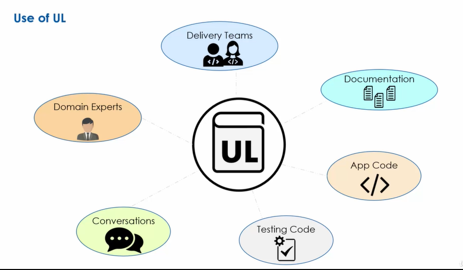

**Ngôn ngữ phổ biến (Ubiquitous Language)**

Trong quá trình xây dựng mô hình miền, cần có đối thoại trao đổi giữa những người thiết kế phần mềm và chuyên gia nghiệp vụ để hiểu đúng về miền. Tuy nhiên, nhóm kinh doanh sử dụng ngôn ngữ kinh doanh và nhóm công nghệ có xu hướng sử dụng các thuật ngữ kỹ thuật trong giao tiếp của họ. Lập trình viên tập trung vào lớp, phương thức, thuật toán, trong khi chuyên gia nghiệp vụ thường sử dụng ngôn ngữ chuyên ngành của họ. Sự khác biệt về ngôn ngữ giữa các nhóm có thể dẫn đến những thách thức về giao tiếp.

Thách thức đặt ra khi một thuật ngữ có thể xuất hiện trong bối cảnh của các lĩnh vực kinh doanh khác nhau. Đối với ngôn ngữ kinh doanh được sử dụng trong nhiều miền, cùng một thuật ngữ có thể có ý nghĩa khác nhau gây ra nhầm lẫn.

<!--=> Thiết kế hướng miền đề xuất sử dụng ngôn ngữ phổ biến để giải quyết những thách thức ngôn ngữ này.-->

Ngôn ngữ phổ biến là một trong những mô hình chiến lược của thiết kế hướng miền, thiết lập một ngôn ngữ chung trong từng bối cảnh kinh doanh.

<!--Một số đặc điểm:-->

Có nhiều ngôn ngữ phổ biến trong một tổ chức được mỗi nhóm sẽ tạo và quản lý một cách độc lập.

Ngôn ngữ phổ biến được sử dụng bởi cả chuyên gia kinh doanh và chuyên gia công nghệ.

Ngôn ngữ phổ biến phát triển theo thời gian thông qua sự cộng tác giữa doanh nghiệp và các chuyên gia công nghệ.

Việc tạo ra ngôn ngữ phổ biến là một quá trình liên tục.

Đồng nhất trong mọi phần của hệ thống: Không chỉ giới hạn trong phạm vi của một module hay một thành phần cụ thể, mà được áp dụng đồng nhất trong toàn bộ hệ thống.

<!--Hướng dẫn 5/7-->
<!---->
