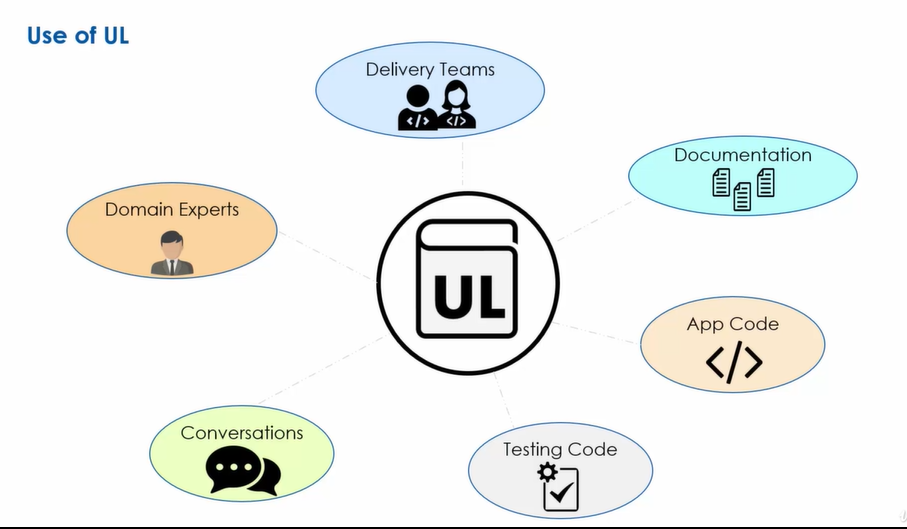
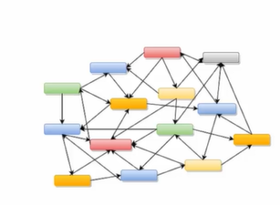
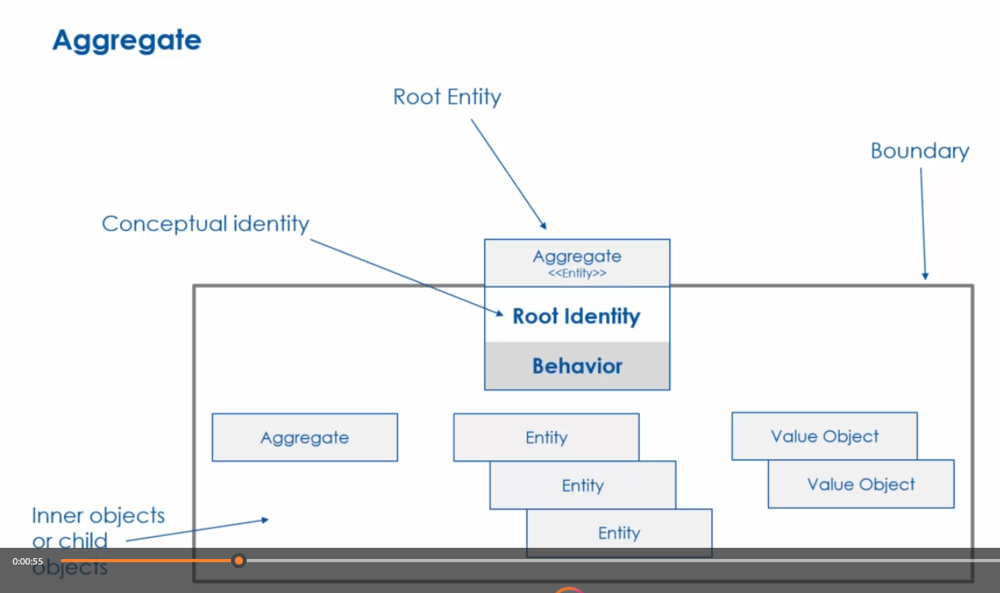
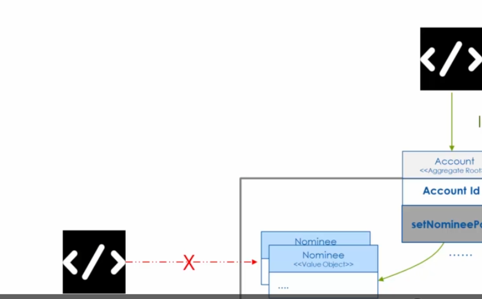

<!--Microserrvice= Microserrvice-->
<!---->
<!--# DDD: ( EventSourcing, Sagas, CQRS )-->

Phần mềm được tạo ra để giúp xử lý sự phức tạp trong cuộc sống hiện đại. Việc phát triển phần mềm liên kết chặt chẽ với một số khía cạnh cụ thể trong cuộc sống của chúng ta.

Thiết kế hướng miền (Domain-Driven Design - DDD) nhấn mạnh việc sử dụng lĩnh vực nghiệp vụ kinh doanh để thảo luận và đề xuất giải pháp đáp ứng nhu cầu, chứ không phải những chủ đề đặc thù kỹ thuật. Để tạo ra một phần mềm tốt, bạn cần phải hiểu rõ về chính phần mềm đó. Vì vậy, để đạt được kết quả mong muốn, chúng ta thường bắt đầu từ yêu cầu nghiệp vụ.

**Miền (Domain)**
Miền đề cập đến phạm vi kiến thức và vấn đề mà hệ thống hoặc dự án cụ thể đang xử lý.

Về góc độ kinh doanh: miền đại diện cho một lĩnh vực hoặc ngành mà doanh nghiệp hoạt động.
Về góc độ phần mềm: miền có thể coi là đại diện cho không gian vấn đề của phần mềm đó.

Trong một miền phức tạp, không có một chuyên gia duy nhất có thể có kiến thức tổng thể về tất cả các miền phụ.

Phần mềm cần phản ánh đúng miền và hiện thực hóa một cách chính xác quan hệ giữa các domain.

<!--$VD:-->
<!--domain, trường hợp này là theo dõi không lưu.-->

**Mô hình miền (Domain Models)**
Mô hình miền được định nghĩa là kiến thức có tổ chức và có cấu trúc về miền phù hợp để giải quyết vấn đề kinh doanh.

Mô hình miền không phải là kiến thức của chuyên gia ngành, mà nó là sự trừu tượng hóa của cả nhóm.

Trong suốt quá trình thiết kế, nhóm liên tưởng và đề cập tới mô hình này. Nhóm trao đổi thông qua mô hình, thể hiện mô hình, và giao tiếp với người khác.

**Tên miền phụ (Sub-Domain)**
Một miền doanh nghiệp bao gồm nhiều tên miền phụ.
Có nhiều yếu tố khác nhau góp phần tạo nên sự phức tạp của tên miền phụ.

<!--Phân loại các tên miền phụ.-->

Có ba loại tên miền phụ:
**Tên miền phụ chung (Generic Subdomain)**

Tên miền phụ chung cung cấp các giải pháp có sẵn mà doanh nghiệp có thể mua.

Không có gì đặc biệt về những tên miền phụ này và các phương pháp tốt nhất đã sẵn có cho những tên miền này.

Doanh nghiệp không thể đạt được bất kỳ lợi thế cạnh tranh nào bằng cách thực hiện những điều khác biệt trong tên miền phụ chung.

<!--$VD:-->

Ví dụ về các tên miền phụ như vậy là quản lý nguồn nhân lực và cơ sở vật chất. Vì vậy, bất kỳ ngành nào hoặc doanh nghiệp nào, các hoạt động quản lý nhân sự và quản lý cơ sở vật chất đều khá trưởng thành và không tạo thêm bất kỳ giá trị khác biệt nào cho doanh nghiệp.

**Tên miền phụ cốt lõi (Core Subdomain)**
Tên miền phụ cốt lõi là điểm khác biệt quan trọng cho doanh nghiệp.

Mỗi doanh nghiệp trong một ngành cụ thể hoạt động khác nhau trong các tên miền phụ cốt lõi để đạt được một số lợi thế so với đối thủ cạnh tranh.

Thành công của một doanh nghiệp nằm ở tên miền phụ cốt lõi.

Doanh nghiệp luôn tìm cách thực hiện những điều khác biệt trong các tên miền phụ cốt lõi này để có được một số lợi thế cạnh tranh.

<!--$VD:-->

**Tên miền phụ hỗ trợ (Supporting Subdomain)**
Các tên miền phụ cốt lõi phụ thuộc vào các tên miền phụ hỗ trợ.

Tên miền phụ hỗ trợ cung cấp các dịch vụ để tên miền phụ cốt lõi hoạt động hiệu quả.

Tên miền phụ hỗ trợ không có mức độ phức tạp cao về logic nghiệp vụ.

<!--$VD:-->
<!--phụ thuộc rất nhiều vào bộ phận hỗ trợ khách hàng-->
<!---->
<!---->
<!---->
<!--Xác định các tên miền phụ-->

Sơ đồ:

Diễn giải:
Bắt đầu bằng cách xem xét nghiệp vụ kinh doanh.

Nếu có sẵn giải pháp đã biết thì có khả năng là Tên miền phụ chung. Ngược lại, nghiệp vụ đó thêm bất kỳ giá trị kinh doanh nào không.

Nếu không có giá trị kinh doanh thì kiểm tra xem các tên miền phụ cốt lõi có phụ thuộc vào tên miền phụ này hay không? Và câu trả lời đó là có thì có khả năng là tên miền phụ hỗ trợ. Nếu câu trả lời là không thì đó là tên miền phụ chung.

Nếu tên miền phụ có tiềm năng bổ sung một số giá trị kinh doanh thì bước kiểm tra tiếp theo là xem liệu tên miền doanh nghiệp có độ phức tạp cao hay không?

Nếu miền doanh nghiệp không có độ phức tạp cao thì có khả năng là tên miền phụ hỗ trợ. Nếu không thì nó có khả năng là tên miền phụ cốt lõi.

<!--Tại sao cần phân loại các tên miền phụ?-->
Việc phân loại tên miền phụ giúp doanh nghiệp đưa ra quyết định với từng loại tên miền phụ khác nhau.

Doanh nghiệp có nguồn lực hạn chế như nguồn nhân lực và kinh phí dành cho các sáng kiến. Việc phân loại các tên miền phụ giúp ưu tiên các sáng kiến khác nhau.

Các doanh nghiệp mong muốn tối đa hóa lợi nhuận đầu tư. Do đó, các sáng kiến liên quan đến tên miền phụ cốt lõi sẽ được ưu tiên.

<!--$VD:-->
<!--Hướng dẫn: 5/3-->

**Ngôn ngữ phổ biến (Ubiquitous Language)**

Trong quá trình xây dựng mô hình miền, cần có đối thoại trao đổi giữa những người thiết kế phần mềm và chuyên gia nghiệp vụ để hiểu đúng về miền. Tuy nhiên, nhóm kinh doanh sử dụng ngôn ngữ kinh doanh và nhóm công nghệ có xu hướng sử dụng các thuật ngữ kỹ thuật trong giao tiếp của họ. Lập trình viên tập trung vào lớp, phương thức, thuật toán, trong khi chuyên gia nghiệp vụ thường sử dụng ngôn ngữ chuyên ngành của họ. Sự khác biệt về ngôn ngữ giữa các nhóm có thể dẫn đến những thách thức về giao tiếp.

Thách thức đặt ra khi một thuật ngữ có thể xuất hiện trong bối cảnh của các lĩnh vực kinh doanh khác nhau. Đối với ngôn ngữ kinh doanh được sử dụng trong nhiều miền, cùng một thuật ngữ có thể có ý nghĩa khác nhau gây ra nhầm lẫn.

<!--=> Thiết kế hướng miền đề xuất sử dụng ngôn ngữ phổ biến để giải quyết những thách thức ngôn ngữ này.-->

Ngôn ngữ phổ biến là một trong những mô hình chiến lược của thiết kế hướng miền, thiết lập một ngôn ngữ chung trong từng bối cảnh kinh doanh.

<!--Một số đặc điểm:-->

Có nhiều ngôn ngữ phổ biến trong một tổ chức được mỗi nhóm sẽ tạo và quản lý một cách độc lập.

Ngôn ngữ phổ biến được sử dụng bởi cả chuyên gia kinh doanh và chuyên gia công nghệ.

Ngôn ngữ phổ biến phát triển theo thời gian thông qua sự cộng tác giữa doanh nghiệp và các chuyên gia công nghệ.

Việc tạo ra ngôn ngữ phổ biến là một quá trình liên tục.

Đồng nhất trong mọi phần của hệ thống: Không chỉ giới hạn trong phạm vi của một module hay một thành phần cụ thể, mà được áp dụng đồng nhất trong toàn bộ hệ thống.

<!--Hướng dẫn 5/7-->
<!---->

**Bối cảnh giới hạn (Bounded Context)**

Một mô hình miền cần đủ nhỏ để nó phù hợp với một nhóm. Để làm được điều đó chúng ta cần vẽ ra ranh giới giữa các ngữ cảnh.
=> Bối cảnh giới hạn xác định ranh giới chia miền thành các phần độc lập giải quyết sự phức tạp trong mô hình doanh nghiệp.
<!--một số đặc điểm:-->
mỗi liên hệ bị giới hạn phải được thể hiện bằng mô hình miền riêng của nó. Tức là không có sự chia sẻ về mô hình.
<!--$VD:--> mỗi domain có mô hình riêng ... user ở domain1,user ở domain2
Các mô hình này được tạo ra và quản lý độc lập bởi các nhóm công nghệ được phân công cho từng đơn vị chức năng này.
<!--$VD:-->
Mô hình miền được xây dựng cho bối cảnh giới hạn chỉ được áp dụng trong phạm vi ranh giới của bối cảnh giới hạn đó.
<!--$VD:-->

<!--Hướng dẫn 5/10-->

<!---->
<!---->
<!---->
<!---->
<!--$VD:-->

Hãy giúp tôi sửa lỗi chính và ngữ pháp:
**Miền (Domain)**

<!--// C:\Users\ionships_VVN\000000001.srt-->

<!--Bối cảnh liên kết, các mối quan hệ, không liên kết với các liên hệ là độc lập, các liên hệ được liên kết trên cơ thể không bị cô lập với các liên hệ được liên kết khác xung quanh chúng, các mô hình trong các liên hệ được liên kết cộng tác để đáp ứng các yêu cầu của hệ thống.-->

<!--các dịch vụ vi mô, không tự đáp ứng tất cả các yêu cầu của hệ thống.-->

<!--Các dịch vụ vi mô này cần tương tác với các dịch vụ vi mô khác. Những mối quan hệ này ngụ ý một số loại phụ thuộc giữa các liên hệ được liên kết hoặc các dịch vụ vi mô.-->
<!--Vì vậy, trong trường hợp này, bối cảnh phụ thuộc vào ranh giới.-->

Có nhiều loại mối quan hệ: 1-1 đối xứng, 1 - nhiều không đối xứng.

<!--Symmetric Relationship : Separate ways , Partnership, Shared Kernel-->
<!--Mối quan hệ đối xứng: Cách riêng biệt, Quan hệ đối tác, Hạt nhân chung-->

<!--Asymmetric Relationship: Customer-Supplier, Conformist, Anti Corruption Layer-->
<!--Mối quan hệ bất đối xứng: Khách hàng-Nhà cung cấp, Người tuân thủ, Lớp chống tham nhũng-->

<!--One-to-Many Relationship: Open Host Service, Published Language-->
<!--Mối quan hệ một-nhiều: Dịch vụ máy chủ mở, ngôn ngữ được xuất bản-->

<!--// C:\Users\ionships_VVN\000000002.srt-->
<!--Quản lý mối quan hệ giữa các liên hệ liên kết trong bài học này, Alcoa và Antiproton được gọi là quả bóng bùn lớn, bạn cũng sẽ tìm hiểu về những thách thức liên quan đến các liên hệ liên kết, sự phụ thuộc và bạn tìm hiểu về các liên hệ, bản đồ có thể giúp quản lý BONARD sự phụ thuộc vào bối cảnh, các liên hệ bị giới hạn không được quản lý, mối quan hệ dẫn đến một cục bùn lớn.-->

<!--Bối cảnh bị ràng buộc - Phụ thuộc-->

Trong quá trình phát triển, nếu không kiểm soát sửa lỗi hợp lí dẫn tới mô hình phát triển không tốt
khó bảo trì, và thường là kết quả của quá trình phát triển không kiểm soát.
không có một chiến lược kiến trúc tổng thể hoặc kế hoạch dài hạn.

<!---->
<!--Bây giờ chúng tôi biết rằng các liên hệ ngoại quan không thể bị cô lập. Sẽ có những mối quan hệ phụ thuộc.-->
<!--Những mối quan hệ này cần được quản lý. Nếu không thì sẽ mất tính toàn vẹn và sẽ mất đi khả năng hoạt động độc lập của nhóm.-->
<!--mất đi những lợi ích mà bạn mong đợi nhận được từ kiến ​​trúc dịch vụ vi mô.-->
<!--Tác động tiêu cực đến tính toàn vẹn của mô hình-->
<!--Mất tính toàn vẹn của mô hình-->
<!--Sự phụ thuộc giữa bối cảnh bị ràng buộc cuối cùng được chuyển thành sự phụ thuộc giữa các dịch vụ vi mô.-->
<!--Vì vậy, tất cả các thay đổi sẽ yêu cầu một số hình thức hợp tác giữa các nhóm sở hữu các dịch vụ vi mô này.-->
<!--Và điều đó có nghĩa là các nhóm sẽ mất khả năng hoạt động độc lập và điều đó sẽ dẫn đến mất đi tính linh hoạt, điều này trái ngược với một trong những lý do khiến kiến ​​trúc dịch vụ vi mô được áp dụng.-->

<!--Vì vậy, đề xuất là quản lý các liên hệ, mối quan hệ được liên kết này bằng cách sử dụng các mẫu thiết kế hướng miền thích hợp.-->
<!--Các đội phải nỗ lực phải ghi lại mối quan hệ giữa các điểm tiếp xúc được liên kết bằng cách sử dụng Bản đồ bối cảnh (Context Maps)-->
<!--Bản đồ bối cảnh là sự thể hiện trực quan của các hệ thống, các liên hệ và mối quan hệ giữa chúng.-->

<!--Có nhiều lợi ích của việc sử dụng bản đồ:-->
<!--giúp các thành viên trong nhóm dễ dàng hiểu được bức tranh toàn cảnh hơn.-->
<!--giúp hiểu được sự phụ thuộc lẫn nhau giữa các liên hệ bị ràng buộc.-->
<!--giúp các nhóm đánh giá mức độ hợp tác cần thiết với các nhóm khác.-->
<!--giúp sàng lọc các liên hệ được giới hạn và các mô hình.-->

<!--xác định mối quan hệ giữa các liên hệ bị ràng buộc của mình.-->

<!--// C:\Users\ionships_VVN\000000003.srt-->
<!--! Mối quan hệ đối xứng-->
<!--! Separate Ways-->
<!--! Các cách riêng biệt-->

<!--các liên hệ được liên kết thực sự độc lập-->
<!--Điều đó có nghĩa là không có sự chia sẻ mô hình giữa hai địa chỉ liên hệ được liên kết này vì các nhóm độc lập của họ có thể tự động làm việc trên hai địa chỉ liên hệ được liên kết này.-->
<!--Nói cách khác, các nhóm này không phải cộng tác hay phối hợp cho bất kỳ nhiệm vụ nào.-->
<!--Không có mối quan hệ nào giữa các ranh giới liên hệ được gọi là các cách riêng biệt từ góc nhìn hiện thực hóa.-->
<!--Điều đó có nghĩa là chúng sẽ là tập hợp các ứng dụng hoặc dịch vụ độc lập cho từng điểm tiếp xúc được liên kết.-->

<!--! Partnership pattern-->
<!--! Mô hình hợp tác-->

<!--Sự phụ thuộc lẫn nhau này dẫn đến mức độ kết hợp cao giữa bối cảnh gắn kết và loại mối quan hệ này được gọi là Quan hệ đối tác và Thiết kế theo nhu cầu.-->
<!--Từ góc độ hiện thực hóa, mô hình hợp tác chuyển thành các dịch vụ có sự phụ thuộc lẫn nhau.-->
<!--Vì vậy, điều đó có nghĩa là các dịch vụ có thể được phát triển bởi các nhóm khác nhau, nhưng do sự phụ thuộc lẫn nhau giữa các dịch vụ nên các nhóm không thể hoạt động độc lập.-->
<!--Không chỉ vậy, mỗi nhóm tham gia vào loại mối quan hệ này sẽ cần phải tìm hiểu các mô hình kinh doanh và ngôn ngữ phổ biến đó cho các mối liên hệ gắn kết do nhóm kia quản lý.-->
<!--Cuối cùng, điều này có nghĩa là các nhóm trong mối quan hệ kiểu này sẽ cần phối hợp các thay đổi, triển khai và phát hành của họ, và điều đó sẽ làm hỏng mục đích áp dụng kiến ​​trúc dịch vụ vi mô.-->

<!--Bây giờ, câu hỏi hiển nhiên mà bạn có thể có vào thời điểm này là làm cách nào để giải quyết vấn đề này? Một cách để giải quyết vấn đề này là phân định ranh giới cho các mô hình dùng chung.-->
<!--Vì vậy, giả sử hai nhóm độc lập đang làm việc trên bối cảnh hỗn hợp và bối cảnh tự nguyện. B, họ có thể tạo ranh giới xung quanh các mô hình được chia sẻ giữa hai điểm tiếp xúc được liên kết.-->
<!--Ý tưởng là quản lý các mô hình chia sẻ này một cách độc lập với phần còn lại của bối cảnh liên kết. Vì vậy, điều đó có nghĩa là nếu cần thay đổi và thay đổi này không phải là một phần của mô hình được chia sẻ thì nhóm được chỉ định cho các liên hệ bị giới hạn có thể đưa ra quyết định độc lập.-->
<!--Tương tự, nếu có những thay đổi cần thiết bên ngoài các mô hình được chia sẻ và các liên hệ bị ràng buộc, hãy là nhóm được chỉ định cho các liên hệ liên kết.-->
<!--B có thể đưa ra những quyết định đó một cách độc lập. Nhưng bất cứ lúc nào, nếu có nhu cầu thay đổi mẫu dùng chung thì 2 đội sẽ phối hợp.-->

<!--! Shared Kernel-->
<!--! Hạt nhân dùng chung-->
<!--Việc chia sẻ mô hình giữa các liên hệ bị chặn được gọi là mẫu mục tiêu chung. Điều quan trọng cần ghi nhớ đối với Kernel được chia sẻ là các phần chồng chéo của các liên hệ thể hiện mô hình miền chung, các khái niệm được chia sẻ và ngôn ngữ kinh doanh được chia sẻ giữa hai liên hệ được liên kết.-->
<!--Thông thường, hạt nhân dùng chung được hiện thực hóa bằng Labrys dùng chung, chẳng hạn như Java, Java, Gói Python và Ruby Gems.-->

<!--Các nhóm có thể phát triển độc lập các dịch vụ sử dụng các thư viện dùng chung này. Các nhóm có thể sử dụng kernel dùng chung và Labrys dùng chung miễn là phạm vi chia sẻ.-->

<!--Giữa các tiếp điểm liên kết được giới hạn ở một tập hợp nhỏ các mô hình cho các tình huống liên quan đến việc chia sẻ quá nhiều mô hình giữa các tiếp điểm được liên kết, việc duy trì tính toàn vẹn của ranh giới của các tiếp điểm biên sẽ trở nên khó khăn.-->

<!--Và đó là lý do gợi ý chỉ sử dụng kernel dùng chung nếu chúng ta đang nói về một tập hợp nhỏ các khái niệm được chia sẻ giữa các liên hệ bị chặn.-->

<!--!Trong bài học này, tôi đã đề cập đến ba mô hình chiến lược. Cách đầu tiên là những cách riêng biệt trong đó không có mối quan hệ nào giữa các liên hệ bị chặn.-->
<!--!Kết quả là, các nhóm làm việc trên hai điểm tiếp xúc liên kết có thể làm việc thực sự độc lập. Tiếp theo là mô hình hợp tác trong đó có sự phụ thuộc lẫn nhau giữa các liên hệ bị ràng buộc.-->
<!--!Do đó, các đội phải phối hợp với nhau để thực hiện các thay đổi đối với các liên hệ giới hạn của riêng mình. Thứ ba là Kamna được chia sẻ, trong đó đề xuất rằng ranh giới của các khái niệm và mô hình được chia sẻ phải được phân định rõ ràng và chỉ những thay đổi đối với các mô hình chung này mới cần được các nhóm điều phối.-->
<!--!Nói cách khác, nếu nhóm đang thực hiện những thay đổi không liên quan đến các mô hình hoặc khái niệm được chia sẻ thì nhóm có thể thực hiện những thay đổi đó mà không cần ý kiến ​​đóng góp của nhóm khác.-->

<!--// C:\Users\ionships_VVN\000000004.srt-->
<!--các ký hiệu bản đồ ngữ cảnh.-->

<!--Mối quan hệ bất đối xứng-->

<!--Loại mối quan hệ này được mô tả bằng cách gán vai trò cho bối cảnh bị ràng buộc.-->

Bối cảnh A ràng buộc với bối cảnh B thì:
Bối cảnh A đóng vai trò là bối cảnh ranh giới hạ lưu (Downstream)
Bối cảnh B đóng vai trò là bối cảnh ranh giới thượng nguồn (Upstream)
Bối cảnh bị ràng buộc A có kiến thức về các mô hình trong Bối cảnh bị ràng buộc B
Bối cảnh B không có bất kỳ kiến ​​thức nào về mô hình trong bối cảnh bị chặn A

<!--D-U-->
<!--!Mô hình khách hàng-nhà cung cấp (Customer-Supplier Pattern)-->

Trong trường hợp Upstream đáp ứng một số nhu cầu cụ thể của Downstream
Từ góc độ hiện thực hóa, nhóm nhà cung cấp luôn tham khảo ý kiến ​​​​của nhóm khách hàng để đảm bảo rằng máy chủ của nhà cung cấp đáp ứng được nhu cầu dịch vụ khách hàng.

<!--!mẫu phù hợp (Conformist Pattern)-->
<!--mô hình tuân thủ-->

Trong trường hợp Upstream hiển thị các mô hình mà không liên quan đến bất kỳ yêu cầu hoặc nhu cầu của Downstream

<!--CF-U-->
<!--!Mẫu lớp chống tham nhũng (Anti Corruption Layer Pattern)-->

bối cảnh giới hạn xuôi dòng quyết định không tuân theo bối cảnh giới hạn ngược dòng.
quyết định tạo ra mô hình của riêng mình thay vì áp dụng các mô hình cho ngữ cảnh bị giới hạn.

<!--Trong trường hợp đó, các mô hình từ ngữ cảnh bị chặn sẽ được hiển thị trong ngữ cảnh bị chặn. Nó sẽ yêu cầu một số loại bản dịch để chuyển đổi các mô hình từ bối cảnh bị ràng buộc sang bối cảnh bị ràng buộc.-->

<!--Đề xuất là tách logic dịch thuật này thành một lớp riêng biệt. Cấp độ này của bản dịch được gọi là trực tiếp chống tham nhũng-->

<!--Ý tưởng đằng sau luật sư chống tham nhũng là bảo vệ bối cảnh ngoại quan khỏi tham nhũng.-->
<!--ACL-U-->

trong mỗi bối cảnh liên kết này, có mô hình riêng. Họ không có kiến ​​thức gì về mô hình của nhau.
ACL có kiến ​​thức cần thiết về cả hai mô hình của A và B và thực hiện việc chuyển đổi từ B sang mô hình của A là lớp chống tham nhũng cần phải có kiến ​​thức về cả mô hình hạ nguồn cũng như mô hình thượng nguồn.
Nhưng hạ lưu không có kiến ​​thức về bối cảnh giới hạn thượng nguồn, và đó là cách lớp chống tham nhũng bảo vệ hạ lưu khỏi những thay đổi ở thượng nguồn.

<!--!Trong bài học này, bạn đã tìm hiểu về mối quan hệ bất đối xứng giữa bối cảnh ranh giới và mối quan hệ bất đối xứng.-->
<!--!Bối cảnh ranh giới hạ nguồn phụ thuộc vào bối cảnh ranh giới thượng nguồn trong mẫu nhà cung cấp khách hàng.-->
<!--!Bối cảnh giới hạn ngược dòng điều chỉnh các mô hình theo nhu cầu của bối cảnh giới hạn xuôi dòng, trong khi ở mẫu tuân thủ, bối cảnh giới hạn ngược dòng không liên quan đến nhu cầu của bối cảnh giới hạn xuôi dòng.-->
<!--!Và do đó, bối cảnh ranh giới phía hạ nguồn phù hợp với các mô hình thượng nguồn. Để bảo vệ bối cảnh ranh giới hạ nguồn, các đội sẽ quyết định sử dụng lớp chống tham nhũng.-->
<!--!Lớp chống tham nhũng này có logic để dịch các mô hình từ định dạng ngược dòng sang định dạng xuôi dòng.-->
<!--!Formic, theo hướng đó xuôi dòng. Bối cảnh bị ràng buộc không có kiến ​​thức về bối cảnh mô hình ngược dòng và do đó không có sự phụ thuộc trực tiếp.-->

<!--// C:\Users\ionships_VVN\000000005.srt-->
<!--One to Many Relationship-->

Bối cảnh ranh giới cung cấp các dịch vụ chung được gọi là dịch vụ nguồn mở

<!--Mở dịch vụ máy chủ Open Host Service-->

mô tả dịch vụ chung này dưới dạng mẫu được đặt trước bối cảnh giới hạn ngược dòng cung cấp các dịch vụ chung, bối cảnh giới hạn ngược dòng hoặc nhà cung cấp dịch vụ được lưu trữ mở trong mối quan hệ này cung cấp một ngôn ngữ chung để tích hợp.
Đối tác đầu tiên, mẫu dịch vụ được lưu trữ mở, trong đó bối cảnh kết hợp ngược dòng cung cấp một tập hợp các dịch vụ chung hoặc khả năng chung cho bối cảnh giới hạn xuôi dòng.

<!--D-OHS-->
<!--Published Language-->
<!--Ngôn ngữ được xuất bản-->

Ngôn ngữ chung này được các nhóm làm việc trong bối cảnh giới hạn ở hạ lưu chấp nhận. Ngôn ngữ chung này được gọi là ngôn ngữ được xuất bản và mẫu này được gọi là mẫu ngôn ngữ được xuất bản.

<!--D-OHS|PL-->

Ngôn ngữ thứ hai là ngôn ngữ được xuất bản, đi đôi với dịch vụ lưu trữ mở. Trở lại ngược dòng, các liên hệ được giới hạn trên nhà cung cấp dịch vụ được lưu trữ mở sẽ hiển thị ngôn ngữ chung cho các dịch vụ chung và ngôn ngữ này được quản lý bởi nhóm chịu trách nhiệm về dịch vụ được lưu trữ mở, các liên hệ được giới hạn ở hạ nguồn ngoại trừ ngôn ngữ được xuất bản này.

<!--Hướng dẫn 6/6-->
<!--! mẫu chiến lược (Strategic patterns)-->
<!--!Phân rã các miền phức tạp (Decomposition of complex domains)-->

<!--các mẫu chiến thuật có thể được sử dụng để lập mô hình và hiện thực hóa các dịch vụ vi mô.-->
<!--Thiết kế hướng mô hình (model drivern design) cung cấp một khuôn khổ để hiện thực hóa mô hình hệ thống và sử dụng phương pháp thiết kế hướng miền, các mẫu chiến thuật là các khối xây dựng và thiết kế hướng mô hình.-->

<!--Entities ,Value Objects ,Aggregate được gọi là các đối tượng miền, các đối tượng miền này được sử dụng để mô hình hóa dữ liệu trong mô hình miền.-->
<!--Các nhà máy (factori) là để tạo ra miền phức tạp.-->
<!--Các reporitori được sử dụng để quản lý tính bền vững của các đối tượng miền.-->
<!--Các dịch vụ được sử dụng để mô hình hóa sự tương tác của các đối tượng miền với các đối tượng miền khác, với cơ sở hạ tầng và với các thành phần bên ngoài khác.-->

<!--Entities (thực thể)-->
<!--!Đối tượng thực thể-->
<!--!Đặc điểm của các thực thể-->

<!--!Logic kinh doanh-->
<!--Một thực thể đại diện cho một đối tượng kinh doanh có thể nhận dạng duy nhất, bao gồm các thuộc tính và hành vi miền được xác định rõ ràng.-->
<!--Các thực thể này và danh tính của chúng chỉ có ý nghĩa trong bối cảnh giới hạn tương ứng của chúng.-->
<!--Một thực thể có một tập hợp các thuộc tính được xác định bởi ngôn ngữ phổ biến cho ngữ cảnh bị chặn.-->
<!--Một thực thể có một hành vi, nghĩa là nó đóng gói logic nghiệp vụ. Và logic kinh doanh này được thể hiện qua cách thức hoạt động.-->

<!--Khi các hoạt động này được thực hiện đối với thực thể, nó sẽ dẫn đến sự thay đổi trạng thái của thực thể.-->
<!--Tương tự, thao tác này là sở hữu đối tượng vào cơ sở dữ liệu. Vì vậy, nhìn từ bề ngoài, có vẻ như thực thể này không bao gồm bất kỳ hoạt động kinh doanh nào.-->
<!--Trong trường hợp RDBMS, một bảng biểu thị một tập hợp các thực thể. Các quy tắc trong bảng biểu thị các thực thể được xác định duy nhất bằng cột khóa chính.-->
<!--Điều đầu tiên là các thực thể là các đối tượng kinh doanh chỉ có ý nghĩa trong một bối cảnh giới hạn.-->

<!--Nơi chúng được xác định là các thực thể được xác định duy nhất trong bối cảnh bị giới hạn. Tiếp theo là định nghĩa của thực thể bao gồm thuộc tính và hành vi.-->
<!--Hành vi này triển khai logic nghiệp vụ có thể thay đổi trạng thái của thực thể. Các thực thể được lưu trữ lâu dài.-->

<!--!Đối tượng giá trị (Value Objects)-->

<!--!Đặc trưng-->

<!--!Vòng đời-->

<!--Đối tượng giá trị, không giống như thực thể, các đối tượng không có nhận dạng khái niệm trong ngữ cảnh bị ràng buộc.-->

<!--Nói cách khác, giá trị, thuộc tính đối tượng và hành vi không ánh xạ trực tiếp tới các khái niệm cốt lõi trong bối cảnh bị chặn.-->

<!--bạn sẽ đặt logic xác thực cho địa chỉ email ở đâu?-->
<!--xác nhận kỹ thuật không liên quan đến bất kỳ khái niệm kinh doanh nào.-->
<!--tạo một đối tượng giá trị để xác thực địa chỉ email.-->
<!--Kết quả là, thực thể khách hàng sẽ sạch hơn và đơn giản hơn nhiều trong việc thực hiện.-->

<!--Nói cách khác, đối tượng giá trị được tạo trong bộ nhớ tiến trình và sau đó bị hủy sau khi nó đã phục vụ mục đích của nó.-->
<!--đối tượng giá trị không có danh tính duy nhất.-->

<!--Một điểm khác biệt quan trọng giữa các thực thể và đối tượng giá trị là đối tượng giá trị không tồn tại lâu dài trong cơ sở dữ liệu.-->

Đã đến lúc xem xét nhanh. Trong bài học này bạn đã học về các đối tượng giá trị. Các đối tượng giá trị không có nhận dạng khái niệm trong bối cảnh bị giới hạn.
Các đối tượng giá trị không được tồn tại trong cơ sở dữ liệu như một đối tượng độc lập. Nó được lưu trữ như một phần của đối tượng thực thể hoặc thậm chí nó không được lưu trữ trong cơ sở dữ liệu, một thực thể trong một ngữ cảnh bị chặn, có thể là một đối tượng giá trị trong một ngữ cảnh bị chặn khác và ngược lại.

<!--Hướng dẫn 7/4-->
<!--Hướng dẫn 7/5-->
<!--tổng hợp và mẫu nhà máy (Aggregates & Factories)-->
<!--!Tổng hợp là gì?-->

<!--!Các bộ phận của một tập hợp-->

<!--định nghĩa về tổng hợp:-->
<!--Đối tượng tổng hợp là một nhóm các thực thể và đối tượng giá trị được xem như một tổng thể thống nhất từ ​​góc độ dữ liệu và khái niệm miền.-->
<!---->

Hãy để tôi giải thích điều này bằng một minh họa.
Một tập hợp bao gồm một nhóm tổng hợp còn được gọi là thực thể gốc.
Thực thể gốc này có một danh tính duy nhất từ ​​phối cảnh miền.
Phần thứ hai của tập hợp là cụm, được hình thành bởi ranh giới của tập hợp.
Trong ranh giới này, có thể không có hoặc nhiều thực thể tổng hợp và đối tượng giá trị. Các đối tượng trong cụm này hoặc đối tượng trong ranh giới được gọi là đối tượng bên trong hoặc đối tượng con.

<!--Aggregate phải cung cấp các giao diện để vận hành trên các đối tượng bên trong.-->
<!--Aggregate provides interfaces for operations on Inner objects-->

<!--đảm bảo rằng tất cả hành vi cần thiết để vận hành trên đối tượng bên trong được hiển thị dưới dạng các hàm của đối tượng gốc tổng hợp.-->

<!--!Mẫu nhà xưởng (Factory Pattern)-->
<!--Mẫu thiết kế nhà máy là một mẫu phổ biến để xây dựng các tập hợp miền phức tạp. Cách thức hoạt động là bạn xác định một đối tượng có tất cả logic để tạo tổng hợp miền.-->

Nhà máy này hiển thị một chức năng có thể được gọi bằng mã và hiển thị chức năng để tạo các bộ tổng hợp có liên quan trong nhà máy, nhà máy đọc.
Dữ liệu tổng hợp từ bộ lưu trữ liên tục sẽ tạo tổng hợp và trả về cột.
Vì vậy đây là mẫu thiết kế rất phổ biến, không nhất thiết chỉ dành riêng cho các dịch vụ của Mikoto.

<!--Đã đến lúc xem xét nhanh. Tổng hợp có thể chứa các thực thể tổng hợp và đối tượng giá trị khác. Tổng hợp phải gói gọn hành vi để quản lý trong đối tượng bên trong.-->
<!--Tất cả các thay đổi đối với tổng hợp đều được lưu. Các đối tác nguyên tử và nhà máy thường được sử dụng để tạo các tập hợp miền phức tạp.-->

<!--Hướng dẫn 7.7-->
<!--Hướng dẫn 7.8-->

<!---->
<!---->
<!---->
<!---->
<!---->
<!---->
<!---->
<!---->
<!---->
<!---->

<!--mẫu kho lưu trữ (Repository Pattern)-->

các đặc điểm của kho lưu trữ
một số tùy chọn hiện thực hóa cho kho lưu trữ

<!--Đối tượng kho lưu trữ hoạt động như một tập hợp các đối tượng tổng hợp trong bộ nhớ.-->

<!--Tất cả logic để tương tác với bộ lưu trữ dữ liệu được gói gọn bởi đối tượng kho lưu trữ.-->
<!--kho lưu trữ đóng vai trò là nơi chứa tập hợp các đối tượng tổng hợp.-->

<!--đối với mỗi tổng hợp được xác định trong mô hình miền, bạn có một và chỉ một kho lưu trữ.-->
<!--Các đối tượng kho lưu trữ được quản lý như một phần của lớp miền. Ngoài các chức năng thẻ điển hình, kho lưu trữ cũng có thể hiển thị các chức năng cấp cao hơn, chủ yếu dành cho truy vấn.-->

<!--Nhìn chung, lợi ích chính của việc sử dụng kho lưu trữ là nó giữ cho mô hình miền độc lập với lớp lưu trữ.-->

<!--Mô hình miền độc lập với mô hình lưu trữ. Vì vậy, ví dụ: nếu bạn đang sử dụng RDBMS thì mô hình miền không cần phải biết về cấu trúc bảng và cột.-->
<!--Nó giữ cho mô hình miền độc lập với công nghệ bạn có thể đang sử dụng và RDBMS không bằng nhau-->

<!--Kho lưu trữ giữ cho mô hình miền độc lập với cơ sở hạ tầng-->
<!--giúp kiểm tra và mô phỏng đơn vị.-->
<!--Phản hồi cơ sở dữ liệu tĩnh được sử dụng rộng rãi làm cơ chế xây dựng mô hình vì nó giúp tôi di chuyển nhanh hơn mà không phụ thuộc vào sự sẵn có của cơ sở dữ liệu thực.-->

<!--Việc hiện thực hóa kho lưu trữ yêu cầu nhà phát triển phải ánh xạ giữa đối tượng miền và cơ sở dữ liệu và ngược lại.-->

Trong bài học này, bạn đã tìm hiểu về các đối tượng kho lưu trữ mẫu kho lưu trữ làm cho mô hình miền độc lập với lớp cơ sở dữ liệu.
Các hoạt động cơ sở dữ liệu trên tổng hợp phải là nguyên tử, đối tượng kho lưu trữ và các lực lượng. Các đối tượng kho lưu trữ nguyên tử cũng có thể được sử dụng để thử nghiệm và mô phỏng đơn vị.
Có một số mối quan tâm chung liên quan đến các đối tượng kho lưu trữ, nhưng những mối quan tâm chung này liên quan đến chức năng truy vấn có thể được giải quyết bằng cách hiển thị các hàm truy vấn cấp cao trong đối tượng kho lưu trữ bằng cách sử dụng các giải pháp bộ nhớ đệm như Radice và Memcache cũng như bằng cách tạo và hiển thị các hàm truy vấn bên ngoài của đối tượng kho lưu trữ.

<!--hướng dẫn 7/11-->

<!--@ \07DomainDrivenDesignTacticalPatterns_VVN\000000012.srt-->
<!--Domain Services dịch vụ miền-->
<!--Domain Service Pattern-->
<!--Characteristics of Domain Services đặc điểm-->

<!--Một định nghĩa chính thức hơn về dịch vụ miền là đối tượng miền thực hiện chức năng hoặc khái niệm miền có thể không được mô hình hóa một cách tự nhiên như một hành vi trong bất kỳ dịch vụ miền, thực thể hoặc đối tượng giá trị nào như một phần của mô hình miền, vì có các loại dịch vụ khác nhau.-->

<!--Điều quan trọng là bạn phải hiểu các đặc điểm của dịch vụ tên miền.-->
<!--Dịch vụ miền luôn thực hiện hành vi kinh doanh cho miền.-->
<!--Dịch vụ miền không có trạng thái, dịch vụ miền có tính gắn kết cao.-->
<!--Dịch vụ miền có thể tương tác với các dịch vụ miền khác.-->
<!--Chúng ta hãy đi qua các chi tiết của từng một trong số này. Vì dịch vụ miền có hành vi kinh doanh nên đối tượng dịch vụ miền nhận thức được các đối tượng miền khác.-->

Một dịch vụ miền có thể tương tác với các dịch vụ miền khác.

Trước khi kết thúc bài học này, tôi muốn nhấn mạnh một điểm quan trọng.

Dịch vụ tên miền là bất khả tri về công nghệ. Có một quan niệm sai lầm phổ biến rằng dịch vụ của người bán hàng rong nên được coi là một hoạt động kinh doanh là không đúng.

Dịch vụ miền độc lập với công nghệ được sử dụng để gọi. Ví dụ: hoạt động dịch vụ miền, có thể chỉ là lệnh gọi hàm Java đơn giản hoặc có thể được thực hiện qua giao thức mạng như HTTP hoặc MQ.

Thông tin thêm về chủ đề này khi chúng ta tiến bộ trong suốt khóa học. Đã đến lúc bắt đầu với những điểm chính mà chúng ta đã đề cập trong bài học này.

Tôi đã nói về dịch vụ miền và bạn cần phải biết những đặc điểm của dịch vụ miền giúp phân biệt nó với các loại dịch vụ khác.
Đầu tiên là dịch vụ miền thực hiện hành vi miền không phù hợp một cách tự nhiên với các thực thể và đối tượng giá trị khác trong mô hình miền.
Các đặc điểm khác là dịch vụ miền không có trạng thái, dịch vụ miền có tính Cohasset cao và dịch vụ miền với các dịch vụ miền khác.

<!--@ \07DomainDrivenDesignTacticalPatterns_VVN\000000013.srt-->
<!--Dịch vụ ứng dụng (app sẻvice)-->

Chúng ta hãy xem lại định nghĩa về dịch vụ tên miền. Nó tuyên bố rằng dịch vụ miền là một đối tượng miền thực hiện chức năng miền.
Và vì dịch vụ danh mục khách hàng sẽ không triển khai bất kỳ chức năng miền nào nên chúng tôi không thể triển khai nó dưới dạng dịch vụ miền.
Và đây là nơi các dịch vụ ứng dụng xuất hiện. Đó là một định nghĩa chính thức hơn về một dịch vụ ứng dụng.
Nó là một đối tượng miền không triển khai bất kỳ chức năng miền nào mà phụ thuộc vào các đối tượng miền khác để hiển thị chức năng miền cấp cao cho bên ngoài của người tiêu dùng đối với mô hình.
Sự khác biệt chính giữa dịch vụ miền và dịch vụ ứng dụng là dịch vụ ứng dụng không triển khai bất kỳ loại logic nghiệp vụ hoặc chức năng miền nào.
Sự khác biệt lớn khác là dịch vụ ứng dụng được tiếp xúc với người tiêu dùng bên ngoài như ứng dụng Web, ứng dụng di động hoặc dịch vụ ứng dụng.

Chúng ta hãy đi qua các đặc điểm của một dịch vụ ứng dụng. Dịch vụ ứng dụng không có logic miền và đây là điểm khác biệt chính giữa dịch vụ ứng dụng và dịch vụ miền.
Các dịch vụ ứng dụng như dịch vụ miền đều không có trạng thái. Các dịch vụ ứng dụng có thể xác định giao diện bên ngoài, các dịch vụ ứng dụng được hiển thị hoặc một số loại giao thức mạng.

Chúng ta hãy đi qua các chi tiết của từng trong số này. Một dịch vụ ứng dụng không có logic miền. Nó phụ thuộc vào đối tượng miền khác cho logic miền.

Đây là điểm khác biệt chính giữa dịch vụ miền và dịch vụ ứng dụng. Dịch vụ ứng dụng điều phối việc thực thi logic miền.

Giống như dịch vụ miền và dịch vụ ứng dụng cũng không có trạng thái. Không có quản lý nhà nước được thực hiện trong dịch vụ ứng dụng.

Không có biến trạng thái hoặc sự tồn tại lâu dài của các đối tượng miền được triển khai trong dịch vụ ứng dụng. Dịch vụ ứng dụng phụ thuộc vào đối tượng miền để tồn tại lâu dài và dịch vụ ứng dụng hiển thị giao diện được thế giới bên ngoài sử dụng.

Nói cách khác, lược đồ yêu cầu và phản hồi cho dịch vụ ứng dụng không cần phải liên kết với bất kỳ đối tượng miền nào khác.

Dịch vụ ứng dụng hiển thị giao diện bên ngoài hoặc giao thức mạng trong mô hình miền. Dịch vụ ứng dụng có thể được coi như một đối tượng ranh giới bảo vệ tất cả các đối tượng trong mô hình miền.

Dịch vụ ứng dụng có thể được hiển thị dưới dạng API và API này được các thành phần bên ngoài sử dụng qua giao thức mạng.
Giao thức mạng này, có thể là SCDP, MQ hoặc thậm chí có thể là giao thức độc quyền. Định dạng dữ liệu giữa năng lực bên ngoài và API rất linh hoạt.
Nó có thể là Jason Ximo, CSFI hoặc bất kỳ định dạng nào khác. Tùy thuộc vào việc thực hiện dịch vụ ứng dụng.

Các thành phần bên ngoài có thể có hoặc không có kiến ​​thức về đối tượng miền hoặc cấu trúc của chúng. Tiếp theo, tôi sẽ thảo luận về mối quan hệ giữa dịch vụ ứng dụng và dịch vụ miền và dịch vụ ứng dụng có thể hiển thị dịch vụ miền với thành phần bên ngoài.

Dịch vụ miền để cung cấp giao diện cho các thành phần bên ngoài. Đã đến lúc đi vào những điểm chính trong bài học này bạn đã học về các ứng dụng, dịch vụ, ứng dụng, dịch vụ không triển khai bất kỳ hành vi miền nào.
Chúng cung cấp các dịch vụ cấp cao bằng cách phối hợp thực thi logic miền trong các đối tượng miền.
Các dịch vụ ứng dụng hiển thị giao diện cho các thành phần bên ngoài. Nghĩa là, các thành phần nằm ngoài mô hình miền thông qua giao thức mạng như HTP và NQ.

<!--@ \07DomainDrivenDesignTacticalPatterns_VVN\000000014.srt-->
<!--Dịch vụ cơ sở hạ tầng-->

là dịch vụ tương tác với tài nguyên bên ngoài để giải quyết một vấn đề mối quan tâm không thuộc phạm vi vấn đề chính.
Nó xác định một hợp đồng được các đối tượng miền sử dụng để tương tác với các dịch vụ bên ngoài. Từ khóa ở đây là nguồn lực bên ngoài.
VD:

<!--Logging system e.g., Fluentd, ElastiSearch-->
<!--Ví dụ: thông báo qua email hoặc SMS-->
<!--cơ sở dữ liệu bên ngoài hoặc thậm chí là hệ thống tệp-->
<!--Google Map.-->

Dịch vụ cơ sở hạ tầng không có logic miền.

Dịch vụ cơ sở hạ tầng tuân theo nguyên tắc trách nhiệm duy nhất

8
00:01:39,420--> 00:01:50,760

<!--Chúng ta hãy đi qua các chi tiết của từng một trong số này. Dịch vụ cơ sở hạ tầng không có logic miền vì nó cung cấp, như tên cho thấy, dịch vụ cơ sở hạ tầng chứ không phải dịch vụ kinh doanh.-->

9
00:01:50,970--> 00:02:08,000

<!--Nó không có bất kỳ sự phụ thuộc trực tiếp nào vào đối tượng miền và dịch vụ cơ sở hạ tầng được đối tượng miền và các dịch vụ sử dụng để tương tác với các tài nguyên bên ngoài và dịch vụ cơ sở hạ tầng tuân theo nguyên tắc trách nhiệm duy nhất.-->

10
00:02:08,040--> 00:02:18,640

<!--Ý tưởng là dịch vụ này cung cấp chức năng cho một và chỉ một thứ. Mục đích của họ là đơn giản hóa việc triển khai và làm cho dịch vụ trở nên dễ hiểu.-->

11
00:02:18,660--> 00:02:29,100

<!--Ví dụ: chúng tôi có ba dịch vụ này, mỗi dịch vụ chuyên cung cấp một chức năng cụ thể. Ví dụ: dịch vụ email chỉ để gửi email.-->

12
00:02:29,130--> 00:02:38,520

<!--Dịch vụ ghi nhật ký chỉ để ghi nhật ký tin nhắn và dịch vụ cơ sở dữ liệu là để tương tác với cơ sở dữ liệu và cơ sở hạ tầng.-->

13
00:02:38,520--> 00:02:52,140

<!--Dịch vụ xác định một hợp đồng tiêu chuẩn giữa mô hình và các tài nguyên bên ngoài. Hãy nghĩ về nó giống như một API, dành cho các đối tượng và dịch vụ mô hình sử dụng.-->

14
00:02:52,620--> 00:03:03,990

<!--Và nó cũng sẽ thực hiện bất kỳ loại chuyển đổi nào cần thiết trên dữ liệu. Bây giờ hãy xem cơ chế này làm cho miền độc lập hơn với tài nguyên bên ngoài như thế nào.-->
<!--Giả sử chúng ta phải triển khai một dịch vụ email. Dịch vụ e-mail này sẽ cung cấp chức năng tiêu chuẩn để gửi email.-->
<!--Ban đầu, dịch vụ e-mail được triển khai bằng cách sử dụng sendmail của Linux. Nhưng giả sử trong một khoảng thời gian, số lượng email được gửi đi từ ứng dụng tăng lên và do đó cần có một giải pháp mạnh mẽ hơn và Sendmail đã được thay thế bằng MailChimp.-->

Thay đổi này sẽ chỉ yêu cầu thay đổi trong dịch vụ email và sẽ không có tác động đến bất kỳ dịch vụ miền nào sử dụng dịch vụ email nội dung hiển thị theo hợp đồng tiêu chuẩn và do đó mô hình miền được cách ly khỏi các thay đổi tài nguyên bên ngoài.

Trong bài giảng này, bạn đã tìm hiểu về các dịch vụ cơ sở hạ tầng. Các dịch vụ cơ sở hạ tầng như dịch vụ ứng dụng không thực hiện bất kỳ hành vi miền nào.
Các dịch vụ cơ sở hạ tầng cung cấp các tài nguyên bên ngoài thông qua giao diện tiêu chuẩn hoặc hợp đồng tiêu chuẩn và cơ chế hợp đồng tiêu chuẩn này bảo vệ mô hình miền khỏi những thay đổi trong dịch vụ bên ngoài.

<!--Hướng dẫn 7/15-->
<!--Hướng dẫn 7/16-->

<!--có các mối quan hệ giữa các liên hệ được liên kết. các liên hệ được liên kết này được chuyển thành các dịch vụ vi mô và các mối quan hệ này được chuyển thành các tương tác giữa các dịch vụ vi mô.-->

<!--Các dịch vụ vi mô cũng tạo ra nhiều loại sự kiện khác nhau. Những sự kiện này được sử dụng bởi các dịch vụ vi mô khác cũng như các thành phần trong bối cảnh liên kết nơi sự kiện được tạo ra.-->
